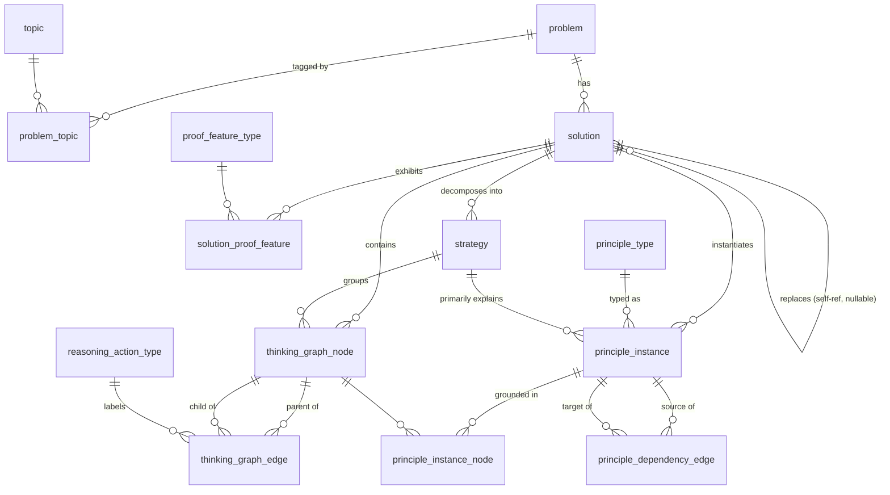

# DNA Table — Version 1.0

Relational schema for Problem DNA + Solution DNA. DDL: `schemas/dna_schema_v1.sql`.

This design is not a fresh proposal — it is Validations 001–003's actual working
vocabulary (node_type, importance, strategy boundaries, principle instances,
principle dependency edges, reasoning actions) normalized into tables, checked
against `OlympiadAI_Constitution_v1.0.md`'s field list, and reconciled against
the columns already committed in `schemas/thinking_graph_v1.schema.json` and
`schemas/olympiad_problem_v1.schema.json`. Where the Constitution's raw field
list and the validation reports disagreed or overlapped, the disagreement is
resolved explicitly below (§4) rather than carrying both.

---

## 1. Entity-Relationship Overview

**Table list, one line each:**

| Table | Role |
|---|---|
| `topic` | Controlled vocabulary of mathematical topics (Problem DNA alphabet) |
| `principle_type` | Controlled vocabulary of reusable mathematical principles (Solution DNA alphabet — the layer future generation queries against) |
| `reasoning_action_type` | Controlled vocabulary of edge-level reasoning moves (Constitution: attribute, not a layer) |
| `proof_feature_type` | Controlled vocabulary of proof-shape tags (Direct/Contradiction/Extremal/…) |
| `problem` | One row per Olympiad problem — Problem Information + Problem DNA |
| `problem_topic` | Many-to-many: a problem can span topics |
| `solution` | One row per **official solution document** (a problem may have several) |
| `solution_proof_feature` | Many-to-many: a solution can combine proof features |
| `strategy` | One row per strategy span inside one solution's Thinking Graph |
| `thinking_graph_node` | One row per Thinking Graph node |
| `thinking_graph_edge` | One row per Thinking Graph edge — carries the Reasoning Action |
| `principle_instance` | One row per (solution × principle) application |
| `principle_instance_node` | Optional: which nodes evidence a principle instance |
| `principle_dependency_edge` | Edges of the Principle Dependency Graph, typed requires/enables/motivates |

---

## 2. Why `solution` is a separate table from `problem`

Per the Constitution: *"A problem may admit multiple fundamentally different
official solutions... ONE problem may generate MULTIPLE Thinking Graphs."*
Confirmed concretely in Validation 002/003: 2006-A3, 2007-A1 and 2008-A1 all
had at least one alternate official text; 2009-A1 had none. `solution` is
therefore `problem_id`-scoped 1:N, not folded into `problem` — otherwise the
schema could not represent 2006-A3/2007-A1/2008-A1's multiple Thinking Graphs
at all, only a single-solution assumption.

`solution.replaces_solution_id` encodes the **modular swap** pattern found in
3-for-3 validations to date: an alternate official text (a "Comment", a
"Solution 2") typically replaces exactly one span of the main solution and
leaves the opening anchor and closing assembly untouched. `is_complete = FALSE`
flags partial alternates like 2008-A1's Comment, which only re-derives one
intermediate equation and explicitly hands the rest back to the main Solution.

---

## 3. Data Dictionary — mandatory/optional, auto/human, searchable/reusable

Legend: **M** = mandatory, **O** = optional · Extraction: **auto** (mechanical),
**semi** (NLP/heuristic + human check), **human** (judgment call), **comp**
(computed from other tables, never hand-entered).

### `problem`

| Field | Purpose (why it's DNA) | M/O | Extraction | Searchable | Reusable for generation |
|---|---|---|---|---|---|
| problem_id | Stable key across all joins | M | auto | Y (PK) | Y — join anchor |
| contest, year, round, problem_number | Provenance / dedup key | M | auto | Y (indexed) | Low — metadata, not technique signal |
| source | Traceability to the PDF | M | auto | Y (text) | Provenance only |
| statement_text | The problem itself, for re-display and re-parsing | M | auto | Y (full-text) | Y — input to any re-verification step |
| difficulty | Coarse filter for generation targets | O | human | Y (numeric range) | Y — generation can target a difficulty band |
| objects_text | Surface mathematical objects (functions, triangles, sequences...) | M | semi | Y (full-text / tags) | Y — recombination needs to know what object types are compatible |
| hidden_structure | The deep isomorphism/analogy (e.g. "Zeckendorf in disguise") | O | human | Y (full-text) | **Highest-value field for generation** — flagged repeatedly across validations as the best top-level DNA candidate, but the hardest to automate, hence optional not mandatory |
| expected_insight | The intended "aha" | O | human | Y (full-text) | Y — generation quality-control signal |
| problem_family | Cross-links related problems | O | human | Y | Y — direct recombination grouping key |
| problem_template | Parameterizable skeleton | O | human | Y | Y — direct generation input |

### `problem_topic` / `topic`

| Field | Purpose | M/O | Extraction | Searchable | Reusable |
|---|---|---|---|---|---|
| topic.area | Top-level discipline filter | M | auto/semi | Y (enum) | Y — generation scoping |
| topic.name | Fine-grained topic tag | M | semi | Y (enum) | Y — cross-problem topic queries |

Kept as a many-to-many junction, not a free-text column on `problem`, because
problems routinely span topics (e.g. 2009-A1 is simultaneously
combinatorics-flavored ordering and a geometric triangle-inequality fact) and
a free-text field would not be reliably searchable.

### `solution`

| Field | Purpose | M/O | Extraction | Searchable | Reusable |
|---|---|---|---|---|---|
| solution_id, problem_id | Identity / FK | M | auto | Y | Y — join anchor |
| label | Distinguish 'Solution' / 'Comment' / 'Solution 2' | M | auto | Y | Low |
| is_primary | Which solution is canonical | M | human | Y (bool) | Y — default choice for generation seeding |
| is_complete | Flags partial alternates (2008-A1 Comment) | M | human | Y (bool) | Y — filters out partial texts from full-graph comparisons |
| replaces_solution_id / replaces_span_note | Encodes the modular-swap pattern | O | human | Y / limited | Y — tells the generator which principle "slot" is swappable, the concrete mechanism behind DNA recombination |
| construction_type | Direct/inductive/etc. proof architecture | O | human | Y (enum-ish) | Y |
| source_reference | Provenance | M | auto | Y | Provenance only |
| node_count … has_cycle | Graph Features (Constitution) | M | **comp** | Y (numeric) | Y — structural fingerprint for matching problems by graph shape, independent of mathematical content |
| graph_shape | Narrative shape label | O | human | Limited (free text) | Y but low-precision — flagged in Validation 002 as analyst-dependent, not a canonical invariant |

### `strategy`

| Field | Purpose | M/O | Extraction | Searchable | Reusable |
|---|---|---|---|---|---|
| subgoal_text | What this span is trying to achieve | M | human | Y (full-text) | Y — reusable "move" description |
| is_framing | Is this span pre-proof setup, not a real strategy? | **O (nullable = contested)** | human | Y (bool/null) | Limited — see §4 |
| is_bookkeeping | Is this span pure assembly, not new content? | **O (nullable = contested)** | human | Y (bool/null) | Limited — see §4 |

`is_framing`/`is_bookkeeping` are deliberately nullable rather than forced
booleans: every validation to date (A3's S0/S7, 2007-A1's Strategy 1/5,
2008-A1's S1/S3, 2009-A1's S1/S5) hit the identical ambiguity at the identical
two locations (proof start, proof end) and resolved it differently each time.
Forcing a boolean would silently manufacture false precision on a question the
evidence says is genuinely unsettled.

### `thinking_graph_node`

| Field | Purpose | M/O | Extraction | Searchable | Reusable |
|---|---|---|---|---|---|
| node_type | Logical/structural kind of the step | M | semi | Y (enum) | Y — structural fingerprint |
| statement_text | The mathematical content | M | auto (transcription) | Y (full-text) | Y — re-verification, re-display |
| purpose | Free-text rationale | O | human | Y (full-text) | Low — narrative, not structured |
| importance | Saliency ordinal (critical/important/supporting) | M | human | Y (ordinal) | Y — lets generation preserve only "critical" nodes when compressing a proof skeleton |
| source_span | Page/quote provenance | O | semi | Y (text) | Provenance only |
| strategy_id | Strategy membership | O (nullable) | human | Y (FK) | Y |

### `thinking_graph_edge`

| Field | Purpose | M/O | Extraction | Searchable | Reusable |
|---|---|---|---|---|---|
| parent_node_id, child_node_id | Adjacency (single source of truth, see §4 R1) | M | auto | Y | Y |
| relation | Logical role of the edge in the argument | M | human | Y (enum) | Y |
| action_type_id | **Reasoning Action** — the cognitive move | M | human | Y (enum, FK) | **Highest-reuse field in the whole schema** — Validation 003's core finding: every edge got exactly one action with no existence-ambiguity (contrast strategy boundaries), making this the most stable, most transferable unit for generation to imitate |

### `principle_type` / `principle_instance`

| Field | Purpose | M/O | Extraction | Searchable | Reusable |
|---|---|---|---|---|---|
| principle_type.generic_form | Proof-independent statement of the technique | M | human | Y (full-text) | **This is the DNA payload** — the whole point of the Constitution's "DNA should be proof-independent whenever possible" |
| principle_type.generality_class | universal / common_technique / specialized | M | human | Y (enum) | Y — Validation findings show universal principles are poor discriminators for problem-family matching; this field lets generation filter them out when looking for a problem's *distinctive* signature |
| principle_instance.is_problem_intrinsic | intrinsic / solution_specific / mixed | M | human | Y (enum) | Y — only intrinsic (or the intrinsic half of "mixed") ideas are safe to recombine across different solution techniques; solution-specific ideas are tied to one proof path |
| principle_instance.intrinsic_confidence | high / low | M (default high) | human | Y (enum) | Y — 'low' means the classification was made without a confirming alternate solution (2008-A1 ideas 6–7); generation should discount low-confidence DNA relative to high-confidence |
| principle_instance.is_cross_cutting | Not owned by a single strategy | M (default false) | human | Y (bool) | Y — these were repeatedly the *last* principles found, only by deliberate extra scrutiny; worth flagging structurally so future extraction doesn't skip the search for them |
| justification_text | Evidence for the assignment | M | human | Y (full-text) | Provenance / audit |

### `principle_dependency_edge`

| Field | Purpose | M/O | Extraction | Searchable | Reusable |
|---|---|---|---|---|---|
| relation_type | requires / enables / motivates | M | human | Y (enum) | **Every validation independently had to invent this exact 3-way distinction** to avoid conflating "logically necessary" with "happens to feed it in this proof" with "heuristically predicts it." Making it a first-class enum instead of re-deriving it per study is the single most load-bearing normalization in this schema. |
| justification_text | Must cite a specific node, not narrative order | M | human | Y (full-text) | Audit — the dependency test used across all three validations explicitly rejected narrative-order edges |

---

## 4. Redundancy Eliminations

Six explicit merges/drops, each backed by a concrete finding rather than
taste:

**R1 — Dropped `thinking_graph_node.depends_on`** (present in the current
`schemas/thinking_graph_v1.schema.json`). Fully redundant with
`thinking_graph_edge.parent_node_id/child_node_id`, which is already the
richer, single source of truth (it additionally carries `relation` and
`action_type_id`, which a bare id-array cannot). Recommend deriving "what does
node X depend on" via a query against `thinking_graph_edge`, not maintaining a
second parallel array that can drift out of sync.

**R2 — Did not add the Constitution's "Edge Classification"**
(Logical/Algebraic/Structural/Computational/Creative) as its own column. It is
a coarser aggregation of the exact same axis as
`reasoning_action_type.category` (Construction/Deduction/Structural/
Logical-Closing/Framing), which Validation 003 derived bottom-up from real
edges rather than assumed. Storing both invites silent drift. Recommend:
`reasoning_action_type.category`, reached by joining through
`thinking_graph_edge.action_type_id`, is the only home for this information.

**R3 — Did not add the Constitution's "Node Classification"**
(Core Idea/Supporting Lemma/Routine Computation/Observation/Construction/
Conclusion) as its own column. Three of its six values (Observation/
Construction/Conclusion) already exist verbatim in `node_type`; the remaining
three (Core Idea/Supporting Lemma/Routine Computation) are a saliency ordinal
that duplicates `importance` (critical/important/supporting), which is
already in production use in every validation report and the existing JSON
schema. `node_type` + `importance` jointly cover this with no new column.

**R4 — No `strategy.start_node_id`/`end_node_id`.** Fully redundant with
`thinking_graph_node.strategy_id` membership, which is the finer-grained
source of truth and also handles the (not-yet-observed but structurally
possible) case of a non-contiguous strategy.

**R5 — Consolidated the existing JSON schema's separate
`problem_information` and `problem_dna` objects into one `problem` table.**
They share the same 1:1 key, and the queries this schema exists to answer
("problems with difficulty > X whose hidden_structure mentions Y") need both
halves together; splitting them forces a join with no compensating benefit.

**R6 — `solution`'s graph-feature columns (`node_count`, `edge_count`,
`max_depth`, `branch_count`, `merge_count`, `has_cycle`) are explicitly marked
computed, not independently authored** — populated from
`thinking_graph_node`/`thinking_graph_edge` by trigger or ETL. Storing them as
ordinary hand-entered fields would recreate the exact drift risk R1–R4 were
written to avoid, just one level up.

---

## 5. Deliberately Left Open (not a gap, a scoping decision)

- No `generated_problem` / recombination-output table. The user's ask was to
  design the DNA *extraction* schema from Validations 001–003; the generation
  side (Constitution §"DNA Recombination") reads this schema but is a
  separate future deliverable, not designed here.
- `principle_dependency_edge` has no confidence field, unlike
  `principle_instance.intrinsic_confidence`. The evidence base for that
  addition (explicit "(lower confidence)" tags in Validation 002) exists for
  intrinsic/specific classification but was not observed for dependency edges
  specifically — added if/when a future validation surfaces the same pattern
  there, not speculatively now.
