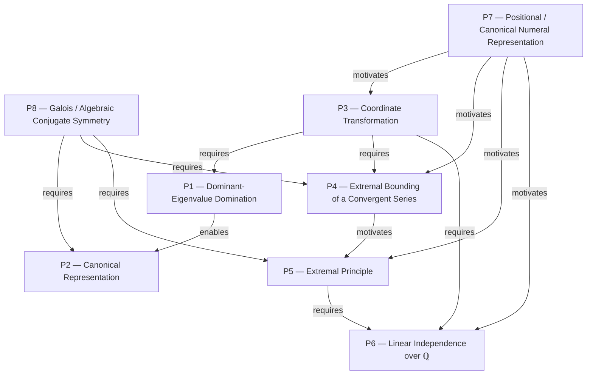

Grouping the current 23-node graph only — no node changes, no files touched.

## Grouping criterion

Two nodes belong to the same strategy iff they share **both** (a) the same immediate sub-goal and (b) the same proof technique being applied toward it. A new strategy boundary is drawn wherever either changes: a technique switch (e.g. "bound geometrically" → "construct an extremal object"), a pivot between the two halves of the iff (⇒ vs ⇐), or a genuine decision point (a `construction` node where the proof *chooses* rather than *derives* — these get their own boundary because they are categorically different moves, not because they're small).

## The strategies

**S0 — Coordinate setup** `N1–N5`
Not yet a proof move. Fixes the objects (φ, ψ, Binet) everything else is built from. Ends at N5 because N6 is the first node that actually *uses* this machinery toward a goal.

**S1 — Force the line via a stress test** `N6–N8`
Technique: exploit one known infinite subfamily of S to extract a necessary linear constraint from boundedness. Begins at N6 (the family), ends at N8 (the constraint αφ+β=0) — a self-contained technique with a clean input and output.

**S2 — Normalize the witness** `N9`
A singleton by design. This is the first `construction`-type decision point — S1 produces a 1-parameter family, not a value, so picking α=ψ, β=1 is categorically a choice, not a derivation. Grouping it with either neighbor would blur strategy from claim.

**S3 — Recode membership as a power-sum identity** `N10–N11`
Technique: algebraic substitution that converts a two-sequence combinatorial statement into a single ψ-power sum. Ends at N11 because that's the object every subsequent strategy (both ⇒ and ⇐) operates on.

**S4 — Bound the recoded object (⇒ direction)** `N12–N13`
Technique: geometric-series bounding. This closes the entire forward direction — a complete, independent sub-proof, hence its own strategy.

**S5 — Existence via extremal representative (⇐ direction)** `N14–N21`
The largest group, deliberately not split further: every node in it serves one technique — *don't construct J directly; take the extremal (minimal) representation and show minimality itself forces the wanted property, by contradiction*. N14 (state the target), N15 (build the extremal object), N16 (a reusable fact about extremal objects), N17–N20 (the contradiction, case by case), N21 (discharge). All eight nodes are sub-steps of one technique, not eight techniques — splitting further would fragment a single argument at its joints rather than at real strategy boundaries.

**S6 — Uniqueness via irrationality** `N22`
A different tool from S5 (algebraic independence of {1,ψ} over ℚ, used once) applied to S5's output. Its own strategy because the technique itself is unrelated to extremal arguments.

**S7 — Assemble** `N23`
Not a proof strategy — a bookkeeping step conjoining S4's and S6's outputs.

## Why 6 real strategies (S0/S7 aren't proof techniques)

Stripping the framing (S0) and the bookkeeping (S7) leaves **S1 → S2 → S3 → S4 | S5 → S6** as the actual argument: three chained techniques to get the forward direction, then two chained techniques for the converse, meeting at S3's identity. Notice the asymmetry: the forward direction (S1–S4) is four small, single-purpose techniques in a straight line; the converse (S5–S6) is one large technique (extremal contradiction) plus one small closing tool. That asymmetry is real, not an artifact of node granularity — it reflects that the ⇐ direction is where the actual difficulty of the problem lives.

## Critical ideas of the problem (5–10, not a node list)

1. **The recurrence's own characteristic roots are the right coordinates.** φ, ψ aren't a computational trick — they're the basis in which the whole problem becomes linear.
2. **A linear form bounded on an unboundedly growing family must annihilate the dominant eigendirection.** This one fact collapses a 2-parameter search to a line.
3. **Swap the growing root for the shrinking one.** Picking the *conjugate* root ψ as the coefficient — not an arbitrary normalization, but the specific choice that turns an unbounded quantity into a convergent geometric one.
4. **Composing with ψ collapses a set-indexed sum into a power sum.** A two-dimensional combinatorial object (x, y) becomes one-dimensional (ψx+y) through a single identity.
5. **This is Zeckendorf's theorem in disguise.** Distinct-index sums of powers of ψ fill an interval, exactly as distinct-index Fibonacci sums biject onto ℕ — recognizing this analogy predicts both bounds before computing them.
6. **Existence by extremal choice, not construction.** Never build J directly — take the minimal representation and show minimality forces the property; the single most transferable idea in the solution.
7. **1+ψ=ψ² is the carrying rule.** The exact analogue of F_n+F_{n+1}=F_{n+2}; every contradiction in the hard direction reduces to this one identity.
8. **Irrationality is what lets integers be recovered from a real equation** — the only point where x,y being integers (not just reals) is actually used.
9. **The necessity bound and the sufficiency bound are forced to coincide.** That coincidence — not a separate argument — is what makes a single two-sided inequality answer an "if and only if."

---

# Task 004 — Critical Ideas: Solution-specific vs. Problem-intrinsic

**Test used:** an idea is **problem-intrinsic** if *any* correct proof — regardless of technique — would have to run into the same fact, because it's true of the mathematical objects the problem defines (S, c_n, φ, ψ), not of this proof's path through them. An idea is **solution-specific** if a different valid technique could sidestep it entirely. Where a proof line in this repo's own materials (`reports/IMO-SL-2006-A3_solution_comparison.md`, the official Comment) gives direct evidence either way, it is cited.

**1. Characteristic roots φ, ψ as coordinates → Problem-intrinsic**
φ, ψ are eigenvalues of the recurrence's own transition matrix. Any analysis of c_n's growth — via Binet, generating functions, or matrix powers — surfaces the same two roots, because they're roots of t²−t−1=0, not an artifact of how this solution proceeds.

**2. Bounded linear form on a growing family ⇒ αφ+β=0 → Problem-intrinsic**
This is a necessary condition on the *answer itself*: any (α,β,m,M) that actually solves the problem must satisfy αφ+β=0, because (c_n,c_{n−1})∈S for all n and c_n grows like φ^n. A different proof might derive this fact differently, but the fact — that valid (α,β) lie on this specific line — is forced by the problem's own asymptotics, not chosen by the proof.

**3. Swap the growing root for the shrinking one (choose α=ψ specifically) → Solution-specific**
Here the classification splits. That valid (α,β) must lie *on the line* αφ+β=0 is intrinsic (idea 2). But that line is a 1-parameter family {(t, −tφ) : t≠0}: for general t, αc_n+βc_{n−1} = t·(c_n−φc_{n−1}) = t·ψ^{n−2} for *every* nonzero t, not just t=ψ. So picking exactly α=ψ (rather than, say, t=1, giving α=1, β=−φ) is a normalization convenience of this proof, not forced by the problem. The *family* is intrinsic; the *representative* is solution-specific.

**4. Composing with ψ collapses the set-indexed sum into a power sum → Solution-specific**
The identity c_nψ+c_{n−1}=ψ^{n−1} is a true fact about any root of the characteristic equation (the symmetric identity holds for φ too). But *using* it to recode "(x,y)∈S" as a closed power-sum formula is this proof's architectural choice. A proof via generating functions (∑c_j z^j) or direct strong induction on x+y would never need to build this specific reformulation.

**5. Zeckendorf's theorem in disguise → Problem-intrinsic**
This isn't a technique — it's an observation about what S and the strip inequality *actually are*: a positional numeral system in base ψ with a no-adjacent-digit rule, mirroring how Fibonacci sums with distinct indices biject onto ℕ. Any correct characterization of S, proved by any method, is a statement about this same underlying structure.

**6. Existence via extremal representative, not construction → Solution-specific**
Strongest case in the set. The source material itself contains a second official proof of the *same* lemma (the "Comment," documented in `reports/IMO-SL-2006-A3_solution_comparison.md`) that proves existence by induction on n=3x+2y instead — no minimal-length representation, no case split on repeated indices. Since an alternative technique demonstrably proves the identical result, this idea is a property of *this* proof path, not of the problem.

**7. 1+ψ=ψ² as the "carrying rule" → Solution-specific**
The raw identity 1+ψ=ψ² is intrinsic (it's just t²−t−1=0 rearranged — true regardless of any proof). But its *role* here — collapsing two consecutive exponents into one, driving the contradiction in N16/N18–N20 — only exists because this proof chose the minimal-representation technique (idea 6). The alternate Comment proof, working by induction on 3x+2y, doesn't need this collapsing mechanism at all. So the identity is intrinsic; the "carrying rule" *use* of it is solution-specific.

**8. Irrationality recovers integers from a real equation → Problem-intrinsic**
For *every* valid t in the family from idea 3, αc_n+βc_{n−1} = t·ψ^{n−2} — an expression that unavoidably features the irrational ψ, regardless of normalization. So any correct converse proof, under any valid (α,β), ends up needing to separate integer coordinates from a ψ-linear combination — i.e., needing irrationality (or an equivalent ℚ-linear-independence argument). This is forced by the problem's own structure (φ, ψ being irrational), not chosen by this proof.

**9. The necessity bound and the sufficiency bound are forced to coincide → Problem-intrinsic**
This is the actual content of the theorem, not a proof device: that the interval obtained from boundedness (⇒) and the interval needed for the converse construction (⇐) are the *same* (−1, φ) is what makes an "if and only if" with a single strip possible at all. Any correct proof, by any method, is ultimately establishing this same coincidence — it's what the problem is asserting is true.

## Summary

| # | Idea | Classification |
|---|---|---|
| 1 | φ,ψ as coordinates | Problem-intrinsic |
| 2 | Boundedness ⇒ αφ+β=0 | Problem-intrinsic |
| 3 | Choose α=ψ specifically | Solution-specific |
| 4 | Collapse to power sum | Solution-specific |
| 5 | Zeckendorf structure | Problem-intrinsic |
| 6 | Extremal-representative technique | Solution-specific |
| 7 | 1+ψ=ψ² as carrying rule | Solution-specific |
| 8 | Irrationality recovers integers | Problem-intrinsic |
| 9 | Bounds forced to coincide | Problem-intrinsic |

**Pattern:** the problem-intrinsic ideas (1, 2, 5, 8, 9) are all facts about *what's true* — necessary conditions, structural characterizations, or the theorem's own content. The solution-specific ideas (3, 4, 6, 7) are all *how this particular proof gets there* — and three of the four (3, 4, 7) turn out to have an intrinsic fact underneath a solution-specific application, which is why idea 6 (confirmed solution-specific by the existence of the alternate Comment proof) is the cleanest example of the category.

No files or JSON other than this analysis log were modified.

---

# Task 005 — Mathematical Principle Extraction

*Research analysis only. No Thinking Graph, Strategy Layer, JSON, or Mermaid file was modified.*

## S1 — Force the line via a stress test (`N6–N8`)

**1. Strategy Summary**
An infinite family of points already known to lie in S — (c_n, c_{n−1}) — is used to stress-test any candidate linear form. Demanding boundedness on this family forces one linear constraint on the coefficients.

**2. Mathematical Principle**
**Dominant-Eigenvalue / Growth-Rate Domination** (an instance of decomposing a linear-recurrence sequence into its eigen-components and analyzing the fastest-growing one in isolation).

**3. Justification**
The algebra (φ>1, −1<ψ<0, therefore αφ+β=0) is only the computation. The *reason* it works is structural: the solution space of a linear recurrence is spanned by its characteristic roots, and any sequence in that space that must stay bounded cannot have a nonzero component along a root of magnitude >1. This is true independent of which specific recurrence or which specific bound is involved — it is a statement about linear operators and their spectra, not about c_n or S.

**4. Generality: Common Olympiad Technique**
Not universal (it needs a linear recurrence with a dominant real eigenvalue), but it recurs constantly whenever a problem defines a sequence recursively and demands some functional of it stay bounded or convergent.

**5. Related Examples**
- Problems proving a linear combination of Fibonacci-like sequences converges (forces the "wrong" root's coefficient to vanish).
- Diophantine-approximation problems using convergents of continued fractions of quadratic irrationals (same φ/ψ eigenstructure).
- "Prove the recurrence a_{n+1}=f(a_n) has a unique bounded solution" style functional-equation problems.
- Matrix-power / linear-algebra flavored olympiad problems where boundedness of Mⁿv forces v to lie in a specific eigenspace.

## S2 — Normalize the witness (`N9`)

**1. Strategy Summary**
Among a one-parameter family of valid (α,β) satisfying the necessary constraint, one representative is fixed by an arbitrary but convenient scaling choice.

**2. Mathematical Principle**
**Canonical Representation via Gauge/Scale Fixing.**

**3. Justification**
The family {(t, −tφ) : t≠0} is literally an orbit of ℝ\*, a scaling group action. Choosing t=ψ is not a mathematical necessity — it's a choice of representative from an equivalence class, justified purely by downstream convenience. The true mathematical content is that a *degree of freedom exists and can be fixed without loss of generality* — the specific fixing is bookkeeping, not the reason anything is true.

**4. Generality: Universal**
"Fix a representative of a symmetry orbit" (WLOG normalization) is used in essentially every branch of mathematics; only the specific choice here is problem-flavored.

**5. Related Examples**
- WLOG-ing a triangle's circumradius to 1, or a side to length 1, in geometry inequalities.
- Normalizing a homogeneous polynomial equation by setting one variable to 1.
- Choosing WLOG a≤b≤c in symmetric-inequality problems.
- Fixing a gauge/basis vector in linear-algebra olympiad problems (e.g., choosing an orthonormal basis aligned with a given vector).

## S3 — Recode membership as a power-sum identity (`N10–N11`)

**1. Strategy Summary**
Composing the sequence with the chosen linear functional collapses a two-sequence, set-indexed combinatorial sum into a single closed-form sum of powers of ψ.

**2. Mathematical Principle**
**Coordinate Transformation (change of basis to the natural/eigenbasis of the problem).**

**3. Justification**
c_n simplifies against ψ specifically because Binet's formula already expresses c_n *in* the {φⁿ, ψⁿ} eigenbasis; projecting via ψ is literally reading off one coordinate in that basis. The simplification is not an algebraic coincidence — it is what "choosing the right coordinates" always produces: a problem that looks two-dimensional and combinatorial becomes one-dimensional and analytic because the chosen coordinate is aligned with the object's own natural structure.

**4. Generality: Common Olympiad Technique**
Distinct from S1 (which uses the *transformation's existence* to derive a constraint); here the transformation is *applied* to reformulate the whole problem. This "diagonalize, then work in the diagonal coordinates" move is extremely standard.

**5. Related Examples**
- Roots-of-unity filters in combinatorics (projecting onto eigenspaces of the cyclic shift operator).
- Complex-number or trigonometric substitutions that turn geometric constraints into algebraic ones.
- Generating-function substitutions that turn recurrence relations into functional equations.
- Barycentric/areal coordinate substitutions in triangle geometry.

## S4 — Bound the recoded object (`N12–N13`)

**1. Strategy Summary**
Because the recoded object is a finite sub-sum of an absolutely convergent geometric series, it is trapped between the two extremal configurations (all available odd-indexed terms vs. all even-indexed terms).

**2. Mathematical Principle**
**Extremal Bounding of a Convergent Series** (a bounding argument that is a discrete cousin of compactness: the image of "all finite subsets" under summation is contained in the interval spanned by the two extreme infinite sums).

**3. Justification**
The bound −1<∑ψ^{j−1}<φ isn't proven by manipulating this specific sum — it's proven by noting that *any* finite selection from an absolutely summable sequence is squeezed between the sum of the whole even-indexed tail and the whole odd-indexed tail. The geometric-series arithmetic is incidental; the structural reason is that finite subselection from a convergent series can never exceed the extremal (full) selections.

**4. Generality: Common Olympiad Technique**
Recurs whenever a problem bounds a variable-length sum of decaying terms — closely related to, but distinct from, S1: S1 uses *divergence* of the dominant root to force cancellation; S4 uses *convergence* of the subdominant root to produce a bound. They are mirror uses of the same eigenstructure.

**5. Related Examples**
- Bounding arguments for binary/decimal expansions (any finite selection of 2^{−n} terms lies in [0,1)).
- The bounding step in Zeckendorf's theorem itself.
- Sturmian/Beatty-sequence bounding arguments using golden-ratio decay.
- Continued-fraction convergent error bounds (bounding a tail by a geometric estimate).

## S5 — Existence via extremal representative (`N14–N21`)

**1. Strategy Summary**
Rather than constructing the required index set J directly, take *any* representation, pass to one of minimal length and lexicographically minimal indices, and show that minimality itself rules out repeated exponents by contradiction.

**2. Mathematical Principle**
**Extremal Principle** (minimal-counterexample / well-ordering argument).

**3. Justification**
This is the principle in its purest textbook form: existence of a well-behaved object is proved not by building it, but by taking an extremal member of a nonempty set of candidates and showing any defect would contradict extremality. The specific identity 2ψ²=1+ψ³ is only the *mechanism* used to exhibit the improved representation; the *reason* the argument succeeds is that a discrete, well-ordered quantity (representation length, then lexicographic index) cannot be improved forever, so a minimal element must already lack the flaw.

**4. Generality: Universal**
One of the most broadly load-bearing techniques in all of olympiad mathematics, applicable across number theory, combinatorics, and geometry alike.

**5. Related Examples**
- Fermat's infinite descent (e.g., no nontrivial integer solutions to x⁴+y⁴=z²).
- Vieta jumping (IMO 1988 Problem 6): take a minimal solution pair, derive a smaller one, contradiction.
- Extremal graph theory arguments (take an edge-maximal/minimal counterexample).
- "Smallest counterexample" proofs of well-ordering-based number theory statements.
- Zeckendorf's theorem's own standard proof (greedy = minimal representation).

## S6 — Uniqueness via irrationality (`N22`)

**1. Strategy Summary**
Two integer linear combinations of {1, ψ} being numerically equal forces their coefficients to match individually, because ψ is irrational.

**2. Mathematical Principle**
**Linear Independence over ℚ (unique representation in a ℚ-basis).**

**3. Justification**
The mechanism (ψx+y=ψa+b ⟹ x=a, y=b) works because {1, ψ} is a basis of a 2-dimensional ℚ-vector space, and coefficients in a basis representation are unique. Irrationality of ψ is exactly the statement "{1,ψ} is linearly independent over ℚ" — the true reason coefficients can be recovered is uniqueness-of-basis-representation, not "irrational numbers are special" in some vaguer sense.

**4. Generality: Common Olympiad Technique**
Extremely standard whenever a problem mixes rational unknowns with a fixed irrational quantity.

**5. Related Examples**
- The classic a+b√2=c+d√2 (a,b,c,d∈ℚ) ⟹ a=c, b=d trick.
- Uniqueness arguments in Pell-equation and ℤ[√d]-type number theory problems.
- "Prove this expression is rational/irrational" problems that hinge on separating rational and irrational parts.
- Algebraic-number-theory olympiad problems using unique representation in a ring of integers' integral basis.

## Cross-Strategy Analysis

### A. Shared Principles

**S1 and S4 are structurally paired, not identical.** Both exploit the same φ/ψ eigen-decomposition from S3, but in opposite roles: S1 uses the *divergence* of the dominant root φ to force a coefficient to vanish; S4 uses the *convergence* of the subdominant root ψ to produce a two-sided bound. They should remain separate strategies — one discharges a necessary condition on the coefficients (a one-time, upfront constraint), the other discharges the entire forward direction of the theorem (an ongoing bound applied to every element of S). Same underlying spectral fact, different logical role.

**S2 and S5 share only a surface resemblance.** Both "pick a specific representative from a family of candidates," but for opposite reasons: S2's choice is *arbitrary* (any t≠0 would work equally well — Canonical Representation is a bookkeeping convenience); S5's choice is *load-bearing* (minimality is precisely what makes the argument true — the Extremal Principle uses the choice itself as the proof mechanism). These must **not** be merged; conflating "convenient normalization" with "extremal argument" would erase the difference between a proof-simplifying choice and a proof-carrying one.

### B. Missing Principles

Two principles are implicitly present but not attached to any single strategy, because they operate *across* S3–S5 rather than within one:

- **Positional / Canonical Numeral Representation.** The deeper reason S3 (recode as power sum), S4 (bound the sum), and S5 (distinct-exponent representation) work together at all is that S is secretly a Zeckendorf-style base-ψ numeral system. No single strategy "owns" this — it's the structural fact that makes the *combination* of S3–S5 coherent, not a property of any one of them.
- **Galois / Algebraic Conjugate Symmetry.** The φ↔ψ conjugation (the nontrivial automorphism of ℚ(√5)) underlies Vieta's identities used in S1, S3, and S6, and is visible in the mirrored structure of the two boundary contradiction cases (j_r=0 vs j_r=1) inside S5. It's never named as a principle in its own right, though it explains *why* the proof has the mirror-image structure it does.

### C. One-to-one?

Strictly one-to-one is too rigid. S5 in particular actually composes **two** principles — the Extremal Principle (why a minimal representative exists and is worth examining) and a supporting **algebraic collapsing identity** (1+ψ=ψ², the specific tool that produces the contradiction once you have the extremal object). The Extremal Principle explains *why the strategy is aimed correctly*; the identity explains *why the specific contradiction closes*. Advantage of a strict 1:1 mapping: clean, teachable, good for indexing (a future tagging system wants one crisp label per strategy). Disadvantage: it hides secondary machinery that a reader would need to actually verify the argument. The practical resolution used above is a **primary/supporting split**: name one dominant principle per strategy (for classification), but note supporting principles in the justification (for completeness) — without formalizing that as a schema field.

### D. Alternate Official Solution (the Comment)

The Comment only replaces S5; S1, S2, S3, S4, and S6 are all untouched, because they concern parts of the proof the Comment never touches (the forward direction, the witness choice, the recoding, and the final irrationality-matching step, which is needed regardless of *how* the Lemma itself gets proved).

- **Unchanged:** S1 (Dominant-Eigenvalue Domination), S2 (Canonical Representation), S3 (Coordinate Transformation), S4 (Extremal Bounding of a Convergent Series), S6 (Linear Independence over ℚ) — none of these are touched by the Comment.
- **Disappears:** The Extremal Principle (S5's principle) is entirely absent from the Comment — it never takes a minimal representation or argues by contradiction from minimality.
- **New principles that appear:** (1) **Well-Founded Descent / Monovariant Induction** — the measure n=3x+2y strictly decreases along each recursive branch, guaranteeing termination, replacing "minimal representative" with "strictly decreasing recursive measure." (2) **Covering / Partition Argument** — showing (−1,−ψ)∪(0,φ)=(−1,φ) so at least one of the two recursive branches always applies is a structural-decomposition argument with no counterpart in the extremal proof.

This is a direct, concrete confirmation of Task 004's finding: since two *entirely different* principles (Extremal Principle vs. Monovariant Descent + Covering) both prove the same Lemma, neither principle is the "true" reason the Lemma is true — the Lemma's truth is problem-intrinsic, and S5's specific principle is genuinely solution-specific, exactly as classified in Task 004.

### E. Future Problem DNA candidates

Not proposing structure — only flagging which ideas are fundamental enough to be worth tracking:

- **Extremal Principle** — very high value; recurs across huge swaths of unrelated olympiad problems, strong discriminating power.
- **Well-Founded Descent / Monovariant** — equally high value, and specifically useful because it's the *alternative* to Extremal Principle for the same class of existence problems — tracking both lets a future system recognize "this problem's converse direction could go either way."
- **Linear Independence over ℚ** — strong, specific, recognizable signature for the "quadratic-irrational recurrence" problem family.
- **Positional/Canonical Numeral Representation** — flagged in (B) as currently unassigned; likely the *single best* top-level candidate, since it's the structural fact that explains why the problem is true at all, independent of which of the two proof strategies (S5 or the Comment) is used to reach it.
- **Canonical Representation (normalization)** is a poor DNA candidate despite being a real principle: it's "Universal," meaning it's present in nearly every proof in some form and therefore has almost no discriminating power between problem families. This suggests generality classification itself is a useful filter — Universal principles are proof-hygiene, not problem fingerprints; Common-Olympiad-Technique and Specialized principles are where real discriminating signal lives.

No files or JSON other than this analysis log were modified.

---

# Task 006 — Principle Graph Construction

*Research analysis only. No Thinking Graph, Strategy Layer, JSON, or Mermaid Thinking Graph file was modified.*

## 1. Mathematical Principle List

Carried over from Task 005 without inventing new ones — six primary (one per strategy) plus the two cross-cutting principles Task 005 §B already flagged as present but unassigned to any single strategy:

| ID | Principle | Origin |
|---|---|---|
| P1 | Dominant-Eigenvalue / Growth-Rate Domination | S1 |
| P2 | Canonical Representation (gauge/scale fixing) | S2 |
| P3 | Coordinate Transformation | S3 |
| P4 | Extremal Bounding of a Convergent Series | S4 |
| P5 | Extremal Principle | S5 |
| P6 | Linear Independence over ℚ | S6 |
| P7 | Positional / Canonical Numeral Representation | Task 005 §B (cross-cutting) |
| P8 | Galois / Algebraic Conjugate Symmetry | Task 005 §B (cross-cutting) |

## 2. Dependency Table

Built by tracing, for each principle, exactly which other principle's *output* it needs as an *input* — not which Strategy came first in the official write-up.

| Source | Target | Type | Justification |
|---|---|---|---|
| P3 | P1 | requires | Growth-rate domination presupposes a decomposition into eigen-directions (Binet's formula, itself an instance of Coordinate Transformation) — you cannot compare "the φ-component" to "the ψ-component" until the sequence is expressed in that basis. |
| P1 | P2 | enables | P1 produces a *family* of valid (α,β); P2 selects a representative from it. Nothing exists to normalize until the family exists. |
| P8 | P2 | requires | Verifying the chosen witness (α=ψ, β=1) actually satisfies the constraint uses the Vieta identity φψ=−1. |
| P3 | P4 | requires | The object being bounded (a sum of powers of ψ) only exists after the recoding; there is nothing to bound beforehand. |
| P8 | P4 | requires | The bound's exact endpoint (φ) comes from 1−ψ=φ, a Vieta identity. |
| P3 | P6 | requires | Matching coefficients needs both sides of the equation already expressed in the {1,ψ} coordinate system that P3 establishes. |
| P4 | P5 | motivates | P5's target constants (−1, φ) are inherited from P4 so the two directions close on the same interval — but P5's own technique (extremal representative + contradiction) doesn't logically need P4's proof, only its numbers. |
| P8 | P5 | requires | The collapsing identity 1+ψ=ψ² is what makes every contradiction case (N16, N18–N20) work. |
| P5 | P6 | requires | The coefficient-matching argument needs a concrete J to already have been shown to exist — P6 has nothing to match against otherwise. |
| P7 | P3 | motivates | Recognizing "this is a numeral-system problem" predicts that a coordinate/basis recoding will be the right move. |
| P7 | P4 | motivates | Predicts that the range of representable values will need a bounding argument. |
| P7 | P5 | motivates | Predicts that uniqueness of representation will be established via a canonical/extremal digit expansion — exactly what Zeckendorf-style proofs always need. |
| P7 | P6 | motivates | Predicts that the system will need a uniqueness-of-digits argument, here supplied by irrationality. |

## 3. Mermaid Principle Graph

## 4. Edge-by-Edge Explanations

**P3→P1 (requires).** Why: dominant-eigenvalue reasoning is meaningless without a basis in which "dominant" has a sense. Without P3: P1 cannot be stated. Mathematical or proof-specific: mathematical — *any* proof of the necessary condition αφ+β=0, by any method, needs some way to isolate growth components, i.e. needs some eigen-decomposition.

**P1→P2 (enables).** Why: P2 normalizes a member of the family P1 produces. Without P1: P2 as *applied here* has nothing to act on. Mathematical or proof-specific: mostly proof-specific — Canonical Representation as a general principle doesn't need Growth-Rate Domination in general (you can normalize all sorts of things unrelated to eigenvalues); the two are coupled only in this instance.

**P8→P2 (requires).** Why: checking ψφ+1=0 is literally invoking φψ=−1. Without P8: the witness choice can't be verified correct. Mathematical: yes, but narrowly — this specific verification, not Canonical Representation in general.

**P3→P4 (requires).** Why: nothing to bound before the recoding produces the object. Without P3: P4 has no subject matter. Mathematical: yes, general — any bounding of "membership expressed as a ψ-power-sum" needs the recoding to exist first.

**P8→P4 (requires).** Why: the specific endpoint value φ is computed from 1−ψ=φ. Without P8: the bound could still be *shown to exist* (some interval), but not identified as exactly (−1, φ). Mathematical, but only for the exact constants — the qualitative bounding argument (Extremal Bounding as a principle) doesn't need P8.

**P3→P6 (requires).** Why: coefficient-matching needs a {1,ψ}-expression on both sides. Without P3: there's no ψ-linear-combination to compare in the first place. Mathematical and general.

**P4→P5 (motivates, not requires).** Why: P5's target constants are inherited from P4 so both halves of the theorem close on the same interval. Could P5 be applied without P4? Yes — the extremal-representative technique is logically self-contained; it just needs *some* target bounds to be handed to it. This mirrors the exact uncertainty flagged in the original Task 003 report about the N13→N14 edge — reproduced here at the principle level, and now resolved the same way: motivation, not necessity.

**P8→P5 (requires).** Why: every contradiction case in the extremal argument (N16, N18–N20) cites 1+ψ=ψ². Without P8: the specific contradiction mechanism this proof uses collapses; a different mechanism would be needed. Proof-specific — the Extremal Principle in general doesn't need this identity; this *instance* of it does.

**P5→P6 (requires).** Why: matching coefficients needs a concrete J already shown to exist. Without P5 (or something occupying its role): P6 has nothing to operate on. Mathematical at the abstract level ("some existence-argument must precede the uniqueness-matching argument") but proof-specific at the concrete level (specifically *Extremal Principle*, as opposed to some other existence technique) — see §B below, where this distinction becomes load-bearing.

**P7→{P3,P4,P5,P6} (all motivates).** Why: recognizing the Zeckendorf-type structure up front predicts the shape of the whole converse machinery — that a recoding, a bound, a canonical-representation argument, and a uniqueness argument will all be needed. Could the targets be applied without P7? Yes, entirely — the official solution never names this structure; it was reconstructed after the fact (Task 005 §B). These edges are heuristic/organizational, not logical necessities — hence "motivates" uniformly, never "requires."

## 5. Independent Principles

Not every pair is related. Notably:

- **P1 and P4** — mirror uses of the same underlying eigenstructure (one uses φ's divergence, the other ψ's convergence) but share no direct edge and no path in either direction through the graph. Confirms the "paired but not identical" observation from Task 005 §A at the structural level, not just descriptively.
- **P2 and P6** — no path exists between them in either direction. P2 is a pure upstream bookkeeping choice; P6 is a downstream closing argument; they never interact.
- **P1 and P6, P1 and P5, P2 and P4, P2 and P5** — all similarly unconnected.

More importantly, the graph splits into **two independent downstream arms once past P3**: an arm P3→P1→P2 (derives and normalizes the witness) and an arm P3→P4→P5→P6 (bounds, constructs, and closes uniqueness). These arms never rejoin. This matches the actual proof: once (α,β) is fixed, the forward-direction machinery and the converse-direction machinery never reference each other's internal steps again.

---

## Global Analysis

### A. Is the Principle Graph a DAG?

Yes — verified by explicit traversal, no back-edges. This required correcting an initial assumption: reading the graph in *Strategy chronological order* (S1→S2→S3→…) would suggest P1 precedes P3, but the *mathematical* dependency runs the other way (P3→P1, since Binet's formula — an instance of Coordinate Transformation — must already be in place before a growth-rate comparison is meaningful). No cycle results once this is corrected; the apparent conflict was purely an artifact of chronological narrative, not a true structural cycle. This is itself the central finding the task asked for: **the principle-dependency order is not the strategy chronological order.**

- **Roots (no incoming edges):** P7, P8. Notably, these are exactly the two principles Task 005 §B flagged as "missing" — not owned by any single Strategy. The Principle Graph reveals *why* they weren't strategy-specific: they aren't downstream of anything, they're the foundation everything else sits on.
- **Intermediate:** P3, P1, P4, P5.
- **Terminal (no outgoing edges):** P2, P6.

### B. Multiple Proofs

Comparing against the Comment (Task 005 §D): P1, P2, P3, P4, P6, P7, P8 all survive unchanged — none of their edges or roles are touched. Only P5 is replaced, by the two principles Task 005 §D already named: **Well-Founded Descent / Monovariant Induction** and a **Covering / Partition Argument**. Tracing their inputs the same way as above: both still require P8 (the recursive relations and interval endpoints still use φψ=−1-type identities), the descent still receives P4's bound as its base interval (motivates), and P7 arguably motivates the descent *more* naturally than it motivated the Extremal Principle — induction is the textbook way Zeckendorf-style results are usually proved. Critically, the replacement's output still feeds P6 exactly as P5's did — the alternate proof still needs irrationality-matching to finish the converse.

**The finding:** the graph's *topology* — a slot that receives from P4/P7/P8 and feeds into P6 — is invariant across both proofs, even though the specific principle occupying that slot changes entirely (Extremal Principle vs. Monovariant Descent + Covering). Everything else in the graph is not just similar but identical across both proofs.

### C. Toward Problem DNA

The evidence points toward **a graph, not a list or a strict hierarchy**:

- **Not a list:** the dependency table in §2 shows real directional structure (P3 must precede P1; P8 feeds three different downstream principles) — a flat, unordered list would erase exactly the information this report was asked to find.
- **Not a strict hierarchy (tree):** several nodes have more than one parent — P4 depends on P3, P7, *and* P8 simultaneously; P6 depends on P3, P5, *and* P7. A tree requires single-parent nodes; this structure genuinely doesn't fit one.
- **A graph, specifically:** §B's finding is the strongest evidence — the *topology* (roots → intermediate slots → terminals) stayed fixed across two different proofs while a specific node was swapped out and replaced. Only a graph representation can express "this slot in the architecture, regardless of which principle fills it" — a list or tree has no notion of an interchangeable slot with a fixed position and fixed neighbors.

### D. Generalization

**Likely to transfer broadly:** P5 (Extremal Principle) and P2 (Canonical Representation) are close to universal olympiad technique — they'd appear in the principle graph of countless unrelated problems, in combinatorics or geometry as readily as here.

**Specific to recurrence / algebraic-number-theory problems:** P1 (needs a linear recurrence with a dominant real eigenvalue), P3 and P8 (need an eigenbasis built from algebraic conjugates), and P6 (needs an irrational-coefficient setting) would simply not appear in the principle graph of, say, a pure combinatorics or Euclidean-geometry problem — they're tied to this problem's specific algebraic machinery, not to olympiad problems in general.

**What likely transfers is the shape, not the labels:** roots as deep recognition-level structural facts, intermediate nodes as the technique translations those facts make available, and terminal nodes as the closing arguments that consume everything upstream. That three-tier shape (root → intermediate → terminal, with possible multi-parent intermediate nodes) is plausibly a recurring architecture across many olympiad proofs, even when — as §D's first two bullets show — the actual principles occupying each tier are almost entirely domain-specific to this problem's recurrence/algebraic-number-theory flavor.

No files or JSON other than this analysis log were modified.
