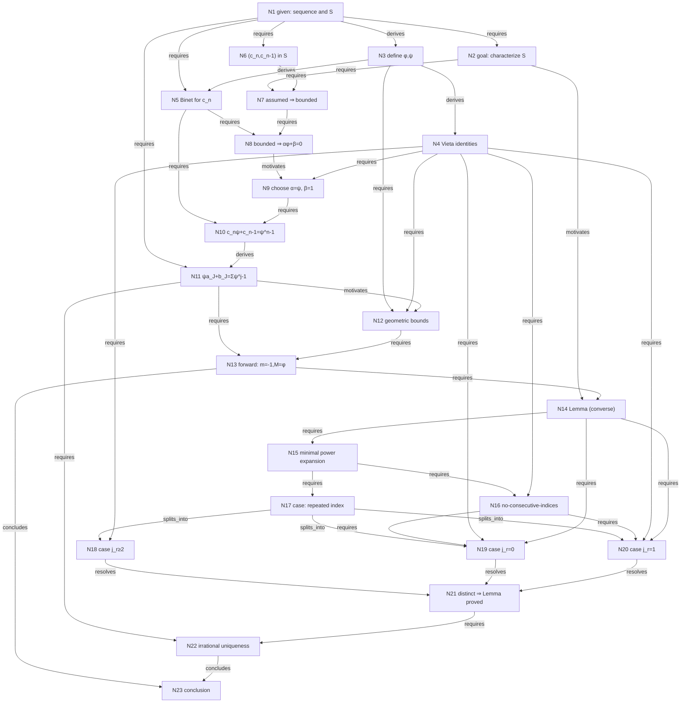

# IMO-SL-2006-A3 Thinking Graph

## 1. Problem statement

The sequence \(c_0, c_1, \ldots\) is defined by \(c_0=1\), \(c_1=0\), and \(c_{n+2}=c_{n+1}+c_n\). Let \(S\) be the set of ordered pairs \((x,y)\) for which some finite set \(J\) of positive integers satisfies
\[
x=\sum_{j\in J} c_j,\qquad y=\sum_{j\in J} c_{j-1}.
\]
Prove that there exist reals \(\alpha,\beta,m,M\) such that for nonnegative integers \((x,y)\),
\[
m < \alpha x + \beta y < M \quad\Longleftrightarrow\quad (x,y)\in S.
\]

## 2. Official solution summary

Introduce \(\varphi=(1+\sqrt5)/2\) and \(\psi=(1-\sqrt5)/2\). Because \((c_n,c_{n-1})\in S\) for every \(n\), boundedness forces \(\alpha\varphi+\beta=0\); choose \(\alpha=\psi\), \(\beta=1\). Then membership in \(S\) becomes \(\psi x+y=\sum\psi^{j-1}\), which always lies in \((-1,\varphi)\). Conversely, a lemma produces a distinct-exponent expansion of \(\psi x+y\), and irrationality of \(\psi\) identifies \((x,y)\) with a pair from \(S\).

## 3. Numbered graph nodes

| ID | Type | Statement | Importance |
|----|------|-----------|------------|
| N1 | given | Sequence and set \(S\) | supporting |
| N2 | goal | Exist \(\alpha,\beta,m,M\) characterizing \(S\) | critical |
| N3 | definition | \(\varphi,\psi\) roots of \(t^2-t-1=0\) | critical |
| N4 | observation | Vieta identities \(\varphi\psi=-1,\ \varphi+\psi=1,\ 1+\psi=\psi^2\) | critical |
| N5 | observation | Binet formula for \(c_n\) | important |
| N6 | observation | \((c_n,c_{n-1})\in S\) for every \(n\) | important |
| N7 | inference | Assumed property + N6 \(\Rightarrow\) \(\alpha c_n+\beta c_{n-1}\) bounded | critical |
| N8 | inference | Boundedness + growth \(\Rightarrow \alpha\varphi+\beta=0\) | critical |
| N9 | construction | Choose \(\alpha=\psi\), \(\beta=1\) | critical |
| N10 | calculation | \(c_n\psi+c_{n-1}=\psi^{n-1}\) | important |
| N11 | reformulation | \(\psi a_J+b_J=\sum\psi^{j-1}\) (1) | critical |
| N12 | calculation | Geometric bounds \(-1<\sum\psi^{j-1}<\varphi\) | important |
| N13 | inference | Forward direction: \(m=-1\), \(M=\varphi\) work | critical |
| N14 | lemma | Converse representation lemma (2) | critical |
| N15 | construction | Minimum-length, lexicographically-minimal power expansion | important |
| N16 | lemma | No-consecutive-indices sub-lemma | important |
| N17 | case_split | Assume a repeated index \(j_r=j_{r+1}\) | important |
| N18 | contradiction | Case \(j_r\ge2\) impossible | critical |
| N19 | contradiction | Case \(j_r=0\) impossible | critical |
| N20 | contradiction | Case \(j_r=1\) impossible | critical |
| N21 | inference | Indices pairwise distinct \(\Rightarrow\) Lemma N14 proved | critical |
| N22 | inference | Irrational uniqueness \(\Rightarrow x=a_J,\ y=b_J\) | critical |
| N23 | conclusion | \(\alpha=\psi,\beta=1,m=-1,M=\varphi\) work | critical |

Entry nodes: `N1`, `N2`. Terminal node: `N23`.

## 4. Dependency edges

- N1 → N2 (requires) — the goal's notation (\(S\)) is only meaningful given N1.
- N1 → N3 (derives) — the characteristic equation comes straight from the recurrence's coefficients.
- N3 → N4 (derives) — Vieta's formulas applied to the roots in N3.
- N1 → N5 (requires); N3 → N5 (derives) — Binet's closed form needs both the recurrence/initial values and the roots.
- N1 → N6 (requires) — \((c_n,c_{n-1})\in S\) follows directly from N1's definition of \(S\) with \(J=\{n\}\).
- N2 → N7 (requires); N6 → N7 (requires) — applying the assumed property to the points supplied by N6.
- N5 → N8 (requires); N7 → N8 (requires) — Binet gives the growth rate that boundedness rules out.
- N8 → N9 (motivates) — the constraint \(\alpha\varphi+\beta=0\) motivates, but does not force, this specific witness.
- N4 → N9 (requires) — verifying the witness uses \(\varphi\psi=-1\).
- N5 → N10 (requires); N9 → N10 (requires) — substitute the chosen \(\alpha\) into Binet's formula.
- N1 → N11 (requires); N10 → N11 (derives) — sum N10's identity over \(j\in J\) using N1's definition of \(a_J,b_J\).
- N3 → N12 (requires); N4 → N12 (requires) — the bound needs \(-1<\psi<0\) and the identity \(1-\psi=\varphi\).
- N11 → N12 (motivates) — N11 is why this particular sum is worth bounding, though N12's proof doesn't cite N11.
- N11 → N13 (requires); N12 → N13 (requires) — combine the identity and the bound.
- N2 → N14 (motivates); N13 → N14 (requires) — the converse half of N2 is what makes this lemma necessary, and it must reuse N13's exact constants.
- N14 → N15 (requires) — the construction targets exactly the hypothesis of N14.
- N15 → N16 (requires); N4 → N16 (requires) — the no-consecutive-indices fact is a general property of N15's minimality rule, proved via N4's identity \(1+\psi=\psi^2\).
- N15 → N17 (requires) — the case split is about repeats inside N15's canonical sequence.
- N17 → N18, N17 → N19, N17 → N20 (splits_into) — the three exhaustive sub-cases.
- N4 → N18 (requires) — uses \(2\psi^2=1+\psi^3\).
- N16 → N19 (requires); N4 → N19 (requires); N14 → N19 (requires) — excludes index 1 via N16, uses N4's identities, contradicts N14's upper bound.
- N16 → N20 (requires); N4 → N20 (requires); N14 → N20 (requires) — mirror image, contradicts N14's lower bound.
- N18 → N21, N19 → N21, N20 → N21 (resolves) — all three branches close the case split.
- N11 → N22 (requires); N21 → N22 (requires) — match equation (1) against the lemma's output \(J\).
- N13 → N23, N22 → N23 (concludes) — forward and converse directions finish the same theorem.

## 5. Mermaid flowchart

See also `reports/IMO-SL-2006-A3_thinking_graph.mmd`.

## 6. Key observations

1. \((c_n,c_{n-1})\in S\) for every \(n\) (take \(J=\{n\}\)), so any working linear form is tested against this whole growing family and must kill the \(\varphi\)-direction: \(\alpha\varphi+\beta=0\).
2. With \(\alpha=\psi\), \(\beta=1\), membership in \(S\) becomes exactly the identity \(\psi x+y=\sum_{j\in J}\psi^{j-1}\).
3. All such sums lie strictly in \((-1,\varphi)\), because \(-1<\psi<0\).
4. In a minimum-length power representation, two consecutive exponents can never both appear (\(1+\psi=\psi^2\) collapses them into a shorter one) — this single fact drives both boundary cases of the repeated-index argument.
5. The converse needs a lemma producing DISTINCT exponents, not a multiset of powers of \(\psi\).

## 7. Critical lemmas

1. If nonnegative integers \(x,y\) satisfy \(-1<\psi x+y<\varphi\), then some \(J\subset\mathbb{N}\) satisfies \(\psi x+y=\sum_{j\in J}\psi^{j-1}\).
2. A minimum-length representation of \(\psi x+y\) as a sum of powers of \(\psi\) never contains two consecutive exponents (since \(1+\psi=\psi^2\) would collapse them into one shorter term).

## 8. Why the graph matches the official solution

- Node order follows the official Solution text, not an independent solve.
- Every node cites a PDF/page span in the official writeup.
- Two facts the official text uses but states without dedicating a visible step to them — "\((c_n,c_{n-1})\in S\) for each \(n\)" (N6) and "a minimum-length representation cannot contain consecutive \(i_r\)'s" (N16) — are now explicit nodes instead of being folded silently into the inferences that rely on them.
- The single node that used to bundle all three repeated-index cases together has been split into N18/N19/N20, one node per contradiction mechanism (algebraic collapse; upper-bound overshoot; lower-bound undershoot), so each can be checked independently against the source text.
- Edges distinguish logical necessity (`requires`, `derives`) from narrative motivation (`motivates`) — e.g. N11 → N12 is `motivates` because N12's bound is a self-contained geometric-series fact that does not logically depend on N11's identity, even though N11 is the reason we care about it.
- N9 and N15, the two points where the proof makes a genuine choice rather than deriving a forced fact, are typed `construction` and their `purpose` fields say explicitly that the choice is strategic, not unique — to keep proof-strategy moves visually and semantically distinct from mathematical claims.
- The Comment's inductive lemma proof is intentionally excluded from this graph and documented in the solution-comparison report.

## 9. Uncertainties

- `pdftotext` omitted the radical in \((1\pm\sqrt5)/2\); restored from \(t^2-t-1=0\).
- Some superscripts/subscripts were reconstructed from layout text; meaning checked against the recurrence and displayed identities.
- Printed page numbers (10–12) differ from PDF page indices (11–13); both are recorded in source spans.
- The official text's extremal bound in the \(j_r=0\) and \(j_r=1\) cases ("the sum is forced past \(2+\psi^3+\psi^5+\cdots\)") is stated tersely without spelling out why that specific alternating configuration is extremal; N19/N20 reproduce the official claim rather than reconstructing the omitted combinatorial argument, since inventing that justification would go beyond what the official solution actually shows.
