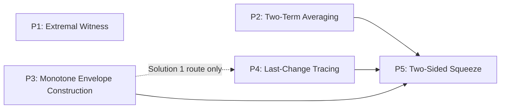

# Validation 001 — Independent Reconstruction

**Target problem:** IMO Shortlist 2007, Algebra A1
**Source:** `data/raw/imo/IMO2007SL.pdf`, pp. 7–9 (Algebra section, official Solutions 1 and 2)
**Status of this document:** Phases 1–4 below were written *before* any A3 material was
re-opened. The comparison in the Final Validation section was written afterward, in a
separate pass, and is marked accordingly.

---

## 0. Problem statement (verbatim, p. 7)

> Given a sequence $a_1, a_2, \ldots, a_n$ of real numbers. For each $i$ ($1 \le i \le n$) define
> $$d_i = \max\{a_j : 1 \le j \le i\} - \min\{a_j : i \le j \le n\}$$
> and let $d = \max\{d_i : 1 \le i \le n\}$.
>
> **(a)** Prove that for arbitrary real numbers $x_1 \le x_2 \le \ldots \le x_n$,
> $$\max\{|x_i - a_i| : 1 \le i \le n\} \ge \frac{d}{2}. \qquad (1)$$
>
> **(b)** Show that there exists a sequence $x_1 \le x_2 \le \ldots \le x_n$ of real numbers such
> that we have equality in (1). *(New Zealand)*

Two official solutions are given. **Solution 1** proves (a) via a witness/pigeonhole
argument and proves (b) via a greedy running-max construction. **Solution 2** reuses
Solution 1's proof of (a) unchanged and gives a different construction for (b).

---

## Phase 1 — Thinking Graph

### Graph 1 — `official_solution_1` (primary)

| id | node_type | statement | importance | source_span |
|---|---|---|---|---|
| G1 | given | sequence $a_1,\ldots,a_n \in \mathbb{R}$ | critical | p.7, problem statement |
| D1 | definition | $d_i = \max_{j\le i}a_j - \min_{j\ge i}a_j$ | critical | p.7, problem statement |
| D2 | definition | $d = \max_i d_i$ | critical | p.7, problem statement |
| GA | goal | $\max_i|x_i-a_i|\ge d/2$ for every nondecreasing $(x_i)$ | critical | p.7, part (a) |
| GB | goal | some nondecreasing $(x_i)$ attains equality | critical | p.7, part (b) |
| N1 | observation | $\exists\, q$ with $d=d_q$ (max over a finite set is attained) | important | p.7, "Let $1\le p\le q\le r\le n$..." |
| N2 | construction | pick $p\le q$ with $a_p=\max_{j\le q}a_j$ | important | p.7, same sentence |
| N3 | construction | pick $r\ge q$ with $a_r=\min_{j\ge q}a_j$ | important | p.7, same sentence |
| N4 | inference | hence $p\le q\le r$ and $d=a_p-a_r$ | critical | p.7 |
| N5 | calculation | $(a_p-x_p)+(x_r-a_r)=(a_p-a_r)+(x_r-x_p)$ | important | p.7, displayed equation |
| N6 | inference | $x_r-x_p\ge 0$ since $p\le r$ and $(x_i)$ nondecreasing | important | p.7 (uses given monotonicity of $x$) |
| N7 | inference | $(a_p-x_p)+(x_r-a_r)\ge a_p-a_r=d$ | critical | p.7 |
| N8 | lemma | if $u+v\ge S$ then $\max(u,v)\ge S/2$ | important | p.7, "we have either... or..." |
| N9 | inference | $\max(a_p-x_p,\,x_r-a_r)\ge d/2$ | critical | p.7 |
| N10 | conclusion | $\max_i|x_i-a_i|\ge d/2$ — **part (a) proved** | critical | p.7, final displayed line |
| N11 | construction | $x_1=a_1-\tfrac d2$; $x_k=\max\{x_{k-1},a_k-\tfrac d2\}$, $k\ge2$ | critical | p.8, "Define the sequence..." |
| N12 | observation | $(x_k)$ is nondecreasing by construction | supporting | p.8 |
| N13 | observation | $x_k-a_k\ge -d/2$ for all $k$ (immediate from def.) | important | p.8 |
| N14 | lemma | remains to show $x_k-a_k\le d/2$ for all $k$ | important | p.8, eq. (2) |
| N15 | construction | let $\ell\le k$ be the smallest index with $x_k=x_\ell$ | important | p.8, "Let $\ell\le k$..." |
| N16 | case_split | either $\ell=1$, or $\ell\ge2$ and $x_\ell>x_{\ell-1}$ | important | p.8 |
| N17 | inference | in both cases $x_\ell = a_\ell - d/2$ | critical | p.8, eq. (3) |
| N18 | calculation | so $x_k=x_\ell=a_\ell-d/2$ | important | p.8 |
| N19 | calculation | $a_\ell-a_k \le \max_{j\le k}a_j-\min_{j\ge k}a_j = d_k \le d$ | critical | p.8 |
| N20 | calculation | $x_k-a_k = a_\ell-a_k-d/2 \le d - d/2 = d/2$ | critical | p.8 |
| N21 | conclusion | $-d/2\le x_k-a_k\le d/2$ for all $k$, so $\max_i|x_i-a_i|\le d/2$ | critical | p.8 |
| N22 | observation | equality holds since $|x_1-a_1|=d/2$ exactly | important | p.8, last line |
| N23 | conclusion | combining N10, N21, N22: this $(x_k)$ attains equality — **part (b) proved** | critical | p.8 |

**Edges (selected; full dependency is recoverable from the `depends_on` column above).**
Representative relations: `G1→D1 requires`, `D1→D2 requires`, `D2→N1 motivates`,
`N1→N2 requires`, `N1→N3 requires`, `{N2,N3}→N4 derives`, `N4→N5 motivates`,
`N5→N7 derives`, `N6→N7 derives`, `{N7,N8}→N9 derives`, `N9→N10 concludes`,
`N10→GA concludes`, `D2→N11 motivates`, `N11→N12 derives`, `N11→N13 derives`,
`N13→N14 motivates`, `N14→N15 requires`, `N15→N16 splits_into`, `N16→N17 resolves`,
`N17→N18 derives`, `{D1,D2}→N19 requires`, `{N18,N19}→N20 derives`,
`{N13,N20}→N21 derives`, `N21→N23 supports`, `N22→N23 supports`, `N23→GB concludes`.

`entry_nodes = [G1, D1, D2]`; `terminal_nodes = [N10, N23]`. Acyclic (verified by
inspection — every edge points from a lower to a strictly later node in the table order
above, so a topological order exists trivially).

```mermaid
flowchart TD
    G1[Given: a_1..a_n] --> D1[Def: d_i]
    D1 --> D2[Def: d = max d_i]
    D2 --> GA[Goal a]
    D2 --> GB[Goal b]

    D2 --> N1[exists q: d=d_q]
    N1 --> N2[pick p: a_p = max_j<=q a_j]
    N1 --> N3[pick r: a_r = min_j>=q a_j]
    N2 --> N4[d = a_p - a_r]
    N3 --> N4
    N4 --> N5[identity: sum of two gaps]
    N5 --> N7[sum >= d]
    N6[x_r - x_p >= 0] --> N7
    N5 --> N6
    N7 --> N9[max of the two gaps >= d/2]
    N8[lemma: u+v>=S => max>=S/2] --> N9
    N9 --> N10[part a: max_i|x_i-a_i| >= d/2]
    N10 --> GA

    D2 --> N11[x_k = running max of a_k - d/2]
    N11 --> N12[x_k nondecreasing]
    N11 --> N13[x_k - a_k >= -d/2]
    N13 --> N14[need: x_k - a_k <= d/2]
    N14 --> N15[trace back to last reset index l]
    N15 --> N16{l=1 or fresh reset at l}
    N16 --> N17[x_l = a_l - d/2]
    N17 --> N18[x_k = a_l - d/2]
    N19[a_l - a_k <= d_k <= d] --> N20
    N18 --> N20[x_k - a_k <= d/2]
    N13 --> N21[-d/2 <= x_k-a_k <= d/2]
    N20 --> N21
    N21 --> N23[equality achieved]
    N22[|x_1-a_1| = d/2] --> N23
    N23 --> GB
```

### Graph 2 — `official_solution_2` (supplementary, part (b) only)

Solution 2 explicitly reuses part (a) unchanged ("Since the opposite inequality has been
proved in part (a)..."), so `official_solution_2` shares `G1, D1, D2, GA/N1–N10` with
Graph 1 and only replaces the part-(b) branch (`N11`–`N23`) with the following.

| id | node_type | statement | importance | source_span |
|---|---|---|---|---|
| M1 | construction | $M_i=\max_{j\le i}a_j$, $m_i=\min_{j\ge i}a_j$ | critical | p.8, "Solution 2." |
| M2 | inference | $(M_i)$ and $(m_i)$ are both nondecreasing in $i$ | important | p.8 |
| M3 | observation | $m_i \le a_i \le M_i$ for every $i$ | important | p.8 |
| M4 | construction | set $x_i = (M_i+m_i)/2$ | critical | p.8, "To achieve equality..." |
| M5 | inference | $(x_i)$ is nondecreasing (average of two nondecreasing sequences) | supporting | p.8 |
| M6 | calculation | $-\tfrac{d_i}2 = x_i-M_i \le x_i-a_i \le x_i-m_i = \tfrac{d_i}2$ | critical | p.9 |
| M7 | conclusion | $\max_i|x_i-a_i| \le \max_i d_i/2 = d/2$ | critical | p.9 |
| M8 | conclusion | with part (a)'s $\ge d/2$, equality holds — **part (b) proved (alt.)** | critical | p.9, last line |

`M1` depends on `D1`; `M8` depends on `{M7, N10}`. No case split, no backward-tracing
step analogous to N15–N19 appears anywhere in this branch — see Phase 3.

---

## Phase 2 — Strategy Layer

Five strategies emerge from Graph 1. Each boundary below is drawn on a *structural*
criterion (a change in the kind of reasoning move being made), not an arbitrary node
count.

**Strategy 1 — Witness Selection** (`N1–N4`).
Converts the definitional object $d=\max_i d_i$ into three concrete, nameable indices
$p\le q\le r$ and the equation $d=a_p-a_r$. Boundary: it starts exactly where the proof
must stop talking about $d$ as "a maximum" and start talking about it as "a difference
of two named numbers," and it ends the instant that concrete equation is in hand — no
further existence reasoning occurs afterward.

**Strategy 2 — Additive Two-Term Pigeonhole** (`N5–N10`).
A self-contained inequality argument: build a sum of two error terms forced to be
$\ge d$, then extract that one of the two terms is $\ge d/2$. Boundary: it is
demarcated from Strategy 1 because it no longer cares how $p,q,r$ were obtained — it
would run identically for *any* two indices $p\le r$ with $a_p-a_r=d$. It closes goal
(a).

**Strategy 3 — Greedy Running-Max Construction** (`N11–N13`).
Defines an explicit candidate sequence and reads off its two "free" properties.
Boundary: every node here is an immediate consequence of the definition (no case
analysis, no inequality manipulation beyond substitution) — this is what separates it
from Strategy 4.

**Strategy 4 — Last-Reset Tracing** (`N14–N20`).
The one part of the whole proof that requires case-based structural analysis of a
recursively defined object. Boundary: it begins exactly where "immediate from the
definition" reasoning runs out and a case split (`N16`) becomes necessary, and ends once
the harder one-sided bound is fully in hand.

**Strategy 5 — Two-Sided Squeeze** (`N21–N23`, drawing on `N10`).
Purely a combinator: no new mathematical content is produced, only assembly of two
one-sided bounds (from Strategies 2 and 4) plus a boundary-value check. Boundary: it is
the only strategy whose nodes contain no derivation, only combination — a clean
type-based cut from everything before it.

**Cross-check from Graph 2.** Solution 2 confirms this decomposition is not arbitrary:
it reuses Strategies 1–2 verbatim, replaces Strategy 3 with a *doubled* instance of the
same construction idea (`M1`, both a running max **and** a running min), and — this is
the interesting result — has **no analogue of Strategy 4 at all**. `M6` gets the
one-sided bound directly from the sandwich `M3`, with no backward tracing. Strategy 5
still appears (`M7–M8`). This shows Strategy 4 is not intrinsic to the problem; it is an
artifact of the specific single-envelope construction Solution 1 happens to choose.

---

## Phase 3 — Mathematical Principles

One principle per strategy, stated in a form that mentions no $a_i$, $d$, or $x_i$ —
each is tested by asking "would this sentence still be true if I deleted the problem and
kept only the principle."

**P1 — Extremal Witness Instantiation** (behind Strategy 1).
*Generic form:* a maximum/minimum of a nonempty finite set of reals is attained by some
element of the set; that element may be named and manipulated as an ordinary number.
*Proof-independence:* this is a fact about finite totally-ordered sets, provable without
reference to sequences, indices, or the quantity $d$. It is the standard first move of
the "extremal principle" family used across combinatorics (take the largest/smallest
violator, longest path, etc.).

**P2 — Additive Two-Term Averaging** (behind Strategy 2).
*Generic form:* for reals $u,v$, if $u+v\ge S$ then $\max(u,v)\ge S/2$ — immediate from
$\max(u,v)\ge (u+v)/2$.
*Proof-independence:* a one-line fact about any two reals; it never references $a_p$,
$x_p$, or the problem's monotonicity hypothesis. It recurs anywhere a bound must be
"pushed onto" one of two error terms.

**P3 — Monotone Envelope / Running-Extremum Construction** (behind Strategy 3, and its
double in `M1`).
*Generic form:* given target lower bounds $L_k$, the running maximum $x_k=\max(x_{k-1},
L_k)$ is the pointwise-smallest nondecreasing sequence with $x_k\ge L_k$ for all $k$
(symmetrically for running minimum / upper bounds).
*Proof-independence:* a standard envelope construction used in isotonic regression,
scheduling with release-time constraints, and monotone-stack algorithms — none of which
know about this problem.

**P4 — Last-Change (Freshness) Tracing on a Recursive Max** (behind Strategy 4).
*Generic form:* in a sequence defined by $x_k=\max(x_{k-1},L_k)$, every value $x_k$
equals $L_\ell$ for the *largest* $\ell\le k$ at which the max was freshly set (no
strictly earlier value dominates); reasoning about $x_k$ reduces to reasoning about that
one generating index.
*Proof-independence:* the same "find the last time the running max changed" argument is
standard in the analysis of prefix-maximum / monotonic-stack algorithms, independent of
what $L_k$ represents.

**P5 — Two-Sided Squeeze to Establish Tightness** (behind Strategy 5).
*Generic form:* to show $\inf f = B$ (or that an inequality is sharp), prove $f\ge B$
in general and exhibit one witness with $f=B$.
*Proof-independence:* the universal closing move of essentially every "find the best
constant" olympiad problem, with no dependence on what $f$ or $B$ are.

**Evidence for independence from the text itself, not just assertion:** P3 is
*instantiated twice* inside the same official-solution document (the shifted single
running-max in Solution 1, and the unshifted running-max/running-min pair in Solution
2) — a principle that reappears in two different guises within one document is good
evidence it is not tied to this problem's specific arithmetic. Symmetrically, P4 is
invoked once and is *avoidable* (Solution 2 reaches the same goal without it), which is
evidence that P4, while a genuine general-purpose technique, was not a *necessary*
principle for this theorem — only for this particular construction recipe.

---

## Phase 4 — Principle Graph

**Does a dependency graph emerge?** Yes, but only partially, and the honest answer
requires distinguishing two different senses of "dependency":

1. *Structural/necessary dependency* — principle $X$ cannot be applied at all until
   principle $Y$ has produced the object it needs. This is a real mathematical
   dependency between the principles as abstract tools.
2. *Incidental co-occurrence* — $X$ and $Y$ are both used in this proof, and $Y$'s
   inputs happen to be $X$'s outputs, but $X$ is not logically required to invoke $Y$
   in general (any two reals would do).

Sorting P1–P5 by this test:

- **P1 → P2 is incidental, not structural.** P2 (`max(u,v)≥S/2`) is true for *any* two
  reals; it does not require its inputs to be extremal witnesses. In this proof P2 is
  fed P1's outputs, but that is a fact about *this solution's* strategy order (already
  captured in Phase 2), not a dependency between the principles themselves.
- **P3 → P4 is structural.** Last-change tracing (P4) is not meaningful except as an
  analysis technique applied to an object that was itself built by a running-max
  recursion (P3). You cannot "find the last reset" of a sequence that wasn't built by
  resetting.
- **P4 → P5 and P2 → P5 are structural.** P5 (squeeze) is a combinator: by definition
  it needs one lower-bound-producing principle and one upper-bound-producing principle
  as inputs. In Solution 1, those are literally P2 (supplies $\ge d/2$) and P4 (supplies
  $\le d/2$).
- **P3 → P5 is also structural — and this is the interesting result.** Solution 2 shows
  P3 (in its doubled form) can feed P5 *directly*, without P4 as an intermediate. So the
  edge P3→P4→P5 that appears to be forced in Solution 1 is not forced by the
  mathematics; it is one specific route. The minimal, solution-independent skeleton is
  P3 → P5, with P4 as an optional refinement node that only appears when the P3
  instantiation is the single-envelope (shifted) construction rather than the
  double-envelope (sandwich) construction.

**Resulting graph** (solid edges = structural/necessary; the dashed edge is
construction-specific, not universal):



P1 is a source node feeding P2 only incidentally (no structural edge drawn from P1 at
all, since P2 does not require P1 in general). The graph is a DAG with two convergent
branches (mirroring the problem's own two-part structure: part (a)'s proof feeds one
input to P5, part (b)'s construction feeds the other), and one optional node (P4) whose
presence is a property of *which construction* was chosen, not of the theorem itself.

**Why not force more structure than this?** P1 and P2 do not admit a further
dependency on P3/P4 (the two halves of the proof — bound and construction — are
logically independent efforts that only meet at P5), so no single-chain total order
exists, and imposing one would misrepresent the proof. This is the honest amount of
graph structure the material supports.

---

## Final Validation — Comparison with IMO-SL-2006-A3

*(Written after re-opening the prior A3 materials — `reports/IMO-SL-2006-A3_thinking_graph.md`,
`reports/IMO-SL-2006-A3_solution_comparison.md`, and `ClaudeResponse.md`. None of this was
consulted while writing Phases 1–4 above.)*

A3, in brief, for readers of this section only: prove $\exists\,\alpha,\beta,m,M$ with
$m<\alpha x+\beta y<M \iff (x,y)\in S$, where $S$ is generated from a Fibonacci-type
recurrence. The official solution introduces the characteristic roots
$\varphi,\psi$ of $t^2-t-1=0$, forces $\alpha\varphi+\beta=0$ via an unbounded witness
family, picks $\alpha=\psi,\beta=1$, reduces membership in $S$ to a power-sum identity in
$\psi$, bounds it geometrically (forward direction), and proves a converse existence
lemma via a minimal-representation extremal argument plus an irrationality-based
uniqueness step. 23 nodes, 8 strategy groups (6 counted as "real"), 8 principles (6
one-per-strategy plus 2 cross-cutting), an 8-node Principle Graph.

### 1. Thinking Graph

**Similarities.** Both graphs are DAGs built from the same node/edge vocabulary and both
happen to land at 23 nodes for the primary official solution. Both split into a
"necessary-condition" direction and a "construction/existence" direction that only
merge at a single final node (A3: N13 & N22 → N23; 2007-A1: N10 & N21/N22 → N23). Both
use exactly one `case_split` node, and in both it sits inside the harder of the two
directions. Both problems' official material contains a second, modular official
argument that swaps out *only* one sub-piece while leaving the rest of the proof fixed
(A3's Comment replaces only the existence lemma; 2007-A1's Solution 2 replaces only the
part-(b) construction) — this "swap one branch, keep the rest" structure recurring
independently in both source documents is a genuine, non-forced similarity.

**Differences.** A3's graph has heavy fan-in (e.g. N19 has three parents: N16, N4, N14)
because nearly every step depends on the shared Vieta/Binet machinery set up at the
start; 2007-A1's graph is comparatively thin — once past the shared definitions, the
two directions barely reference each other's intermediate nodes at all, staying close
to two parallel chains that meet only at the end. A3 requires substantial upfront
machinery (defining $\varphi,\psi$, deriving Vieta identities, invoking Binet — a genuine
*change of representation*) before any goal-directed reasoning begins; 2007-A1 never
changes representation at all — every node stays in the original $a_i,x_i,d_i$
vocabulary the problem statement supplies. A3's two directions are wildly unbalanced (the
converse alone is 8 of 23 nodes, densely cross-referenced); 2007-A1's two directions are
close to balanced (10 vs. 13 nodes) and neither reads as obviously "the hard part" the
way A3's converse does. Finally, 2007-A1's own official material exhibits the *same*
principle instantiated twice with different shapes (single shifted running-max vs.
paired running-max/running-min); nothing analogous happens anywhere inside A3's graph.

### 2. Strategy Layer

**Similarities.** Both strategy layers are built on an explicit structural criterion,
not a node-count heuristic, and both explicitly refuse to over-split a strategy that is
"one technique with several sub-steps" (A3 keeps its 8-node S5 unsplit; this study keeps
a 7-node Strategy 4 unsplit) — the stated reason is the same in both cases: splitting
further would cut the argument at a non-joint. Both identify a strategy near the start
whose character differs from everything after it (A3's S0 "coordinate setup"; this
study's Strategy 1 "witness selection"), and both identify a strategy at the very end
that does no derivation, only combination (A3's S7; this study's Strategy 5).

**Differences — the sharpest one in the whole comparison.** A3 explicitly *excludes*
both its first group (S0) and its last group (S7) from the "6 real strategies," on the
grounds that S0 is framing (not yet a proof move) and S7 is bookkeeping (no new
mathematical content). This study's Strategy 1 was *kept* as a real strategy, because
unlike A3's S0 it already produces load-bearing content (the equation $d=a_p-a_r$ used
directly by the next strategy), not just notation. But this study's Strategy 5 was *also*
kept as a real strategy carrying its own principle (P5) — even though, by A3's own
stated criterion ("no new mathematical content, only assembly"), Strategy 5 is exactly
the kind of step A3 would have excluded. This is a genuine, unforced divergence in how
the same structural role (final combinator) gets classified — not a difference between
the problems, but a difference in how the boundary between "strategy" and "bookkeeping"
was drawn. Separately, A3's strategy sizes are highly uneven (one strategy carries 8 of
23 nodes); 2007-A1's are comparatively even (3–7 nodes each), reflecting that A3's
difficulty concentrates in one sub-argument while 2007-A1's is spread across four
roughly-equal moves.

### 3. Mathematical Principles

**Which reappear.** None of A3's eight principles reappear by name. At the family level,
A3's P5 (Extremal Principle) and this study's P1 (Extremal Witness Instantiation) are
cousins — both instantiate "pick an extremal element and exploit it" — but the
instances are of different depth: A3's usage is proof-*carrying* (minimality itself
produces the contradiction that proves the lemma); this study's usage is much lighter
(a maximum merely needs to exist and be named — no minimality-driven contradiction
occurs anywhere in 2007-A1). So the family recurs, but not at matched strength.

**Which are new.** All five of this study's principles are new labels; most notably P3
(Monotone Envelope Construction) and P4 (Last-Change Tracing) have no A3 counterpart at
all, because A3's existence argument is entirely non-constructive (extremal
representative + contradiction, never producing an explicit formula), while 2007-A1's
part (b) is thoroughly constructive (an explicit closed-form/recursive $x_k$). A3's
principle toolkit has nothing that plays this role — 2007-A1 exercises an entire branch
of technique A3 never needed.

**Which disappear.** A3's algebra-heavy principles — P1 (Dominant-Eigenvalue
Domination), P3 (Coordinate Transformation), P6 (Linear Independence over $\mathbb Q$), P7
(Positional Numeral Representation), P8 (Galois/Conjugate Symmetry) — have zero trace in
2007-A1. This is not a surprise, and it is worth stating explicitly: A3's own report
*predicted* this outcome in its Generalization section, calling these principles
"[s]pecific to recurrence / algebraic-number-theory problems" that "would simply not
appear in the principle graph of... a pure combinatorics or Euclidean-geometry problem."
2007-A1 — a pure order/real-analysis inequality problem with no recurrence and no
algebraic number theory — confirms that prediction out of sample. A3's P2 (Canonical
Representation / gauge-fixing) is the one interesting near-miss: A3 flagged P2 as
"Universal," implying it should recur across unrelated proofs. It does not appear in
2007-A1 at all — 2007-A1's witness choice (`p,q,r`) is forced by the extremal
definitions, not a free parameter being normalized, so there is no gauge-fixing step
anywhere in this proof. A principle self-labeled "Universal" failing to recur in a
second, independently chosen problem is a useful negative data point against trusting
that label too readily.

### 4. Principle Graph

**Does a Principle Graph naturally emerge?** Yes in both studies, independently — this
is a genuine, unforced agreement on the meta-level claim "principles admit *some*
dependency structure, not just a flat list," obtained by two separate reasoning passes
on unrelated problems.

**Is the topology similar?** Only at the loosest description ("a DAG with a source tier
and a closing tier"). Concretely the two graphs are closer to mirror images. A3's graph
has **two unassigned root principles** (P7, P8 — discovered only by a separate pass
explicitly looking for what's missing, not by the one-per-strategy loop) feeding
**two independent downstream arms that never rejoin** (P3→P1→P2 and
P3→P4→P5→P6), ending at **two terminal nodes**. 2007-A1's graph has **no unassigned
root** at all (every principle attaches cleanly to one strategy), starts from
**multiple independent sources**, and **converges to a single terminal node** (P5). A3:
one shared root, many sinks. 2007-A1: many sources, one shared sink. These are
structurally opposite shapes, not the same shape with different labels.

**Which parts appear universal?** The existence of *some* final combinator step is
universal — both proofs are two-part arguments (⇒/⇐ for A3; lower-bound/construction for
2007-A1) that must be assembled at the end. What is *not* universal is whether that
combinator step is promoted to a first-class Principle. A3 never attaches a principle to
its own analogous step (S7/N23) — its report calls S7 "not a proof strategy." This
study did attach one (P5). So "a combinator step exists" looks universal; "the
combinator step gets its own Principle-Graph node" does not — it is a choice, not a
mathematical fact, and the two studies made opposite choices without either being
obviously wrong.

**Which parts appear problem-specific?** Essentially everything else: every specific
principle label, the specific edges, and the specific tier assignment are tied to each
problem's own machinery (algebraic-number-theoretic for A3, order/real-analytic for
2007-A1). Only the abstract shape category — "small DAG, not a chain, not a tree,
sources/intermediate/sink tiers, multi-parent nodes allowed" — is shared, and even that
shared category was instantiated with opposite branching direction in the two studies.

---

## Research Questions

**1. Does the framework — Official Solution → Thinking Graph → Strategy Layer →
Mathematical Principles → Principle Graph — still hold?**

Yes, in the sense that matters most: it was fully executable on an unrelated problem
from a different area (order/real analysis vs. algebraic number theory) without forcing
any phase, without degenerating into a trivial list at Phase 4, and without needing any
ad hoc rescue of the schema. Every phase produced genuine, defensible content, and Phase
4 produced a real DAG rather than either a straight line or an empty relation — matching
A3's own finding that the right representation is "a graph, not a list."

**2. If not, where does it fail?**

It does not fail outright, but three specific points of underspecification surfaced,
visible only by comparing two independent runs:

- **The final-combinator classification is undetermined by the framework as stated.**
  The same structural role (assemble two one-sided results into the final theorem) was
  scored as "not a real strategy, no principle" in one run and "a real strategy with its
  own principle" in the other. Phase 2's instruction ("group nodes by shared sub-goal
  and technique... explain every boundary") does not say whether a pure-assembly group
  counts as a technique. Both scorings are internally consistent; the framework simply
  does not decide between them.
- **Cross-cutting principles are found by a step the framework doesn't name.** A3's two
  most structurally important principles (P7, P8 — the two *roots* of its Principle
  Graph) were only surfaced by an explicit extra pass asking "what principle is used
  across several strategies but owned by none," separate from the core "one principle
  per strategy" loop Phase 3 describes. This study did not run an analogous extra pass
  (because nothing was known to be missing until the graph was already built), and
  found no cross-cutting principle. It is not possible to tell, from this evidence
  alone, whether 2007-A1 genuinely has none, or whether one exists but was missed for
  want of that extra step. That ambiguity is itself the finding.
- **"Dependency" in Phase 4 is answering two different questions.** Both studies ended
  up mixing (a) abstract logical prerequisite between principles-as-general-tools and
  (b) producer/consumer relationships between principle-*instances* in this specific
  proof, and both had to invent ad hoc vocabulary to keep them apart (A3:
  `requires`/`enables`/`motivates` plus per-edge "mathematical vs. proof-specific"
  annotations; this study: an explicit "structural vs. incidental" split). The two
  studies converged on needing the same distinction independently, which suggests it is
  a real requirement of Phase 4, not a quirk of one problem — but the framework as
  stated doesn't ask for it explicitly.

**3. What modifications, if any, are required?**

None are made here — per the task's instruction, this section reports evidence only.
The evidence above motivates two candidate refinements for a future pass: (i) a
default rule for whether a pure-assembly final step is always in-scope or always
out-of-scope for the Strategy/Principle layers, rather than leaving it to the
individual pass; (ii) making the "search for principles not owned by any single
strategy" an explicit, named step of Phase 3 rather than an incidental discovery. Both
are flagged as evidence, not applied.

---

## Deliverables recap

- `reports/IMO-SL-2007-A1_validation_report.md` (this file) — Thinking Graph (2 graphs,
  primary + supplementary), Strategy Layer (5 strategies), Mathematical Principles (5,
  with proof-independence arguments), Principle Graph (5 nodes, justified DAG),
  Final Validation comparison against IMO-SL-2006-A3, and answers to the three research
  questions.
- Source used: `data/raw/imo/IMO2007SL.pdf`, pp. 7–9 (official Solutions 1 and 2 for
  Algebra A1) — read directly from the local PDF, no web lookup used.
- A3 comparison sources consulted only after Phases 1–4 were complete:
  `reports/IMO-SL-2006-A3_thinking_graph.md`,
  `reports/IMO-SL-2006-A3_solution_comparison.md`, `ClaudeResponse.md`.
