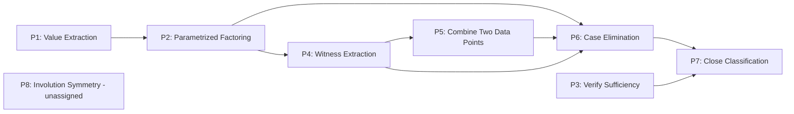

# Validation 002 — Stress Test of the Research Framework

**Target problem:** IMO Shortlist 2008, Algebra A1
**Source:** `data/raw/imo/IMO2008SL.pdf`, pp. 7–8 (official Solution and Comment)
**Framing:** this run is adversarial by design — the job is to find evidence the
framework is incomplete, incorrect, or over-complicated, not to confirm it.
**Honesty note on independence:** this conversation already contains Validation 001
(IMO SL 2007 A1) earlier in its own history, so perfect blinding is not literally
possible the way it was for that run's A3 comparison. What *was* done: the graph,
strategies, and principles below were built by reading only the 2008 A1 PDF text and
checking every node against that text, not against memory of Validation 001's specific
node/strategy shapes. `reports/IMO-SL-2007-A1_validation_report.md` was not re-opened
until the explicit Phase 4 comparison step at the end.

---

## 0. Problem statement (verbatim, p. 7)

> Find all functions $f:(0,\infty)\to(0,\infty)$ such that
> $$\frac{f(p)^2+f(q)^2}{f(r^2)+f(s^2)} = \frac{p^2+q^2}{r^2+s^2}$$
> for all $p,q,r,s>0$ with $pq=rs$.

One official **Solution**, plus a **Comment** that re-derives only the central
dichotomy (equation (1) below) by a different route and explicitly hands its result back
to the main solution ("The last two alternatives combined with the first equation of (4)
imply the two alternatives of (1)") — it does not re-prove the rest of the theorem.

---

## Deliverable 1 — Thinking Graph

### Graph 1 — main Solution

| id | node_type | statement | importance | source_span |
|---|---|---|---|---|
| G1 | given | $f:(0,\infty)\to(0,\infty)$ satisfying the functional equation for all valid $p,q,r,s$ | critical | p.7, problem statement |
| GOAL | goal | determine all such $f$ | critical | p.7, "Find all functions..." |
| N1 | construction | substitute $p=q=r=s=1$ (valid: $pq=1=rs$) | important | p.7, "Setting $p=q=r=s=1$..." |
| N2 | calculation | equation reduces to $f(1)^2=f(1)$ | important | p.7 |
| N3 | inference | since $f(1)\in(0,\infty)$, $f(1)=1$ | critical | p.7, "hence $f(1)=1$" |
| N4 | construction | for arbitrary $x>0$, substitute $p=x,q=1,r=s=\sqrt x$ (valid: $pq=x=rs$) | critical | p.7, "Now take any $x>0$..." |
| N5 | calculation | equation becomes $\dfrac{f(x)^2+1}{2f(x)}=\dfrac{x^2+1}{2x}$ (uses N3) | important | p.7 |
| N6 | calculation | cross-multiply/rearrange: $xf(x)^2+x=x^2f(x)+f(x)$ | important | p.7 |
| N7 | calculation | factor: $(xf(x)-1)(f(x)-x)=0$ | critical | p.7 |
| N8 | inference | **dichotomy (1):** for every $x>0$, $f(x)=x$ or $f(x)=1/x$ | critical | p.7, eq. (1) |
| N9 | observation | $f\equiv\mathrm{id}$ and $f\equiv 1/x$ each satisfy the original equation ("Obviously...") | supporting | p.7, eq. (2) |
| N10 | construction | assume $f$ solves the problem but is neither global candidate: $\exists a$ with $f(a)\ne a$, $\exists b$ with $f(b)\ne 1/b$ | critical | p.7, "let us assume..." |
| N11 | inference | by N8, $f(a)\ne a\Rightarrow f(a)=1/a$; $f(b)\ne1/b\Rightarrow f(b)=b$ | critical | p.7 |
| N12 | construction | substitute $p=a,q=b,r=s=\sqrt{ab}$ (valid: $pq=ab=rs$) | important | p.7, "Applying now the equation..." |
| N13 | calculation | equation becomes $\dfrac{f(a)^2+f(b)^2}{2f(ab)}=\dfrac{a^2+b^2}{2ab}$ | important | p.7 |
| N14 | calculation | substitute $f(a)=1/a,f(b)=b$: $\dfrac{a^{-2}+b^2}{2f(ab)}=\dfrac{a^2+b^2}{2ab}$ | important | p.7 |
| N15 | calculation | solve: $f(ab)=\dfrac{ab(a^{-2}+b^2)}{a^2+b^2}$ — eq. (3) | critical | p.7 |
| N16 | inference | by N8 at $x=ab$: $f(ab)=ab$ or $f(ab)=1/ab$ | critical | p.7, "We know however..." |
| N17 | case_split | the two cases from N16 | important | p.7 |
| N18 | contradiction | case $f(ab)=ab$: (3) gives $a^{-2}=a^2\Rightarrow a=1\Rightarrow f(a)=1=a$, contradicting $f(a)\ne a$ | critical | p.7 |
| N19 | contradiction | case $f(ab)=1/ab$: (3) gives $a^2b^2(a^{-2}+b^2)=a^2+b^2\Rightarrow b=1\Rightarrow f(b)=1=1/b$, contradicting $f(b)\ne1/b$ | critical | p.7 |
| N20 | inference | both cases contradictory $\Rightarrow$ no such $a,b$ exist $\Rightarrow$ N10's assumption is false | critical | p.7 |
| N21 | conclusion | therefore $f\equiv\mathrm{id}$ or $f\equiv1/x$ on all of $(0,\infty)$; with N9, these are exactly the solutions | critical | p.7, "Thus indeed..." |

`entry_nodes = [G1]`; `terminal_nodes = [N21]`. Acyclic by inspection (strictly increasing
node order). 23 total nodes (G1, GOAL, N1–N21).

```mermaid
flowchart TD
    G1[Given: f satisfies the equation] --> GOAL[Goal: find all f]
    GOAL --> N1[p=q=r=s=1]
    N1 --> N2[f(1)^2 = f(1)]
    N2 --> N3[f(1) = 1]
    N3 --> N4[p=x,q=1,r=s=sqrt x]
    N4 --> N5[eq in f(x)]
    N5 --> N6[polynomial form]
    N6 --> N7[factor: (xf-1)(f-x)=0]
    N7 --> N8[dichotomy: f(x)=x or 1/x]
    N8 --> N9[both candidates verified sufficient]
    N8 --> N10[assume exceptional f: witnesses a,b]
    N10 --> N11[f(a)=1/a, f(b)=b]
    N11 --> N12[p=a,q=b,r=s=sqrt ab]
    N12 --> N13[eq in f(ab)]
    N13 --> N14[substitute f(a),f(b)]
    N14 --> N15[closed form f(ab), eq 3]
    N8 --> N16[dichotomy at x=ab]
    N15 --> N16
    N16 --> N17{case split}
    N17 --> N18[case f(ab)=ab: forces a=1, contradiction]
    N17 --> N19[case f(ab)=1/ab: forces b=1, contradiction]
    N10 --> N18
    N10 --> N19
    N18 --> N20[assumption refuted]
    N19 --> N20
    N20 --> N21[conclusion: exactly two solutions]
    N9 --> N21
```

### Graph 2 — Comment (partial alternate; replaces only N4–N8)

| id | node_type | statement | importance | source_span |
|---|---|---|---|---|
| C1 | construction | substitute $p=q=1,r=\sqrt x,s=1/\sqrt x$ (valid: $pq=1=rs$) | important | p.8, "Comment." |
| C2 | calculation | yields $f(x)+f(1/x)=x+1/x$ — first half of eq. (4) (uses N3) | important | p.8 |
| C3 | construction | substitute $p=x,q=1/x,r=s=1$ (valid: $pq=1=rs$) | important | p.8 |
| C4 | calculation | yields $f(x)^2+f(1/x)^2=x^2+1/x^2$ — second half of eq. (4) | important | p.8 |
| C5 | calculation | square C2: $f(x)^2+2f(x)f(1/x)+f(1/x)^2=x^2+2+1/x^2$ | supporting | p.8 |
| C6 | calculation | subtract C4 from C5: $2f(x)f(1/x)=2$ | important | p.8 |
| C7 | calculation | subtract C6's relation from C4: $(f(x)-f(1/x))^2=(x-1/x)^2$ | important | p.8 |
| C8 | inference | so $f(x)-f(1/x)=\pm(x-1/x)$ | important | p.8 |
| C9 | inference | combined with C2, this reproduces the two alternatives of dichotomy (1) | critical | p.8, "imply the two alternatives of (1)" |

`C1` and `C3` both depend on `N3` ($f(1)=1$) exactly as `N4` did. `C9`'s output rejoins
the main graph at `N8` — everything from `N9` onward is untouched by this branch.

---

## Deliverable 2 — Strategy Layer

**S1 — Anchor $f(1)$ via a degenerate substitution** (`N1–N3`).
Boundary: the only strategy that pins a single numeral rather than a whole family;
ends the instant $f(1)$ is known.

**S2 — Derive the pointwise dichotomy** (`N4–N8`).
A parametrized substitution turns the functional equation into an ordinary polynomial
equation in $f(x)$ for each $x$; factoring it produces a two-way menu of possibilities
valid at every point. Boundary: begins where the proof moves from one numeral to an
arbitrary $x$; ends once the dichotomy is established — the single fact every later
strategy consumes.

**S3 — Verify sufficiency** (`N9`).
A one-node check that both candidate global functions actually satisfy the original
equation. Boundary: it is the only node in the graph that is a *check* rather than a
step toward the unknown, and — this is flagged explicitly, see Deliverable 6 Q2 — it
could be deleted without affecting whether the dichotomy or the no-mixing argument are
true; it only affects whether the final answer is complete.

**S4 — Assume an exceptional solution and extract two witnesses** (`N10–N11`).
The strategic pivot: negate the target classification claim and use the dichotomy to
convert the two resulting negative facts ($f(a)\ne a$, $f(b)\ne1/b$) into two positive
values ($f(a)=1/a$, $f(b)=b$). Boundary: demarcated by the appearance of a
proof-by-contradiction hypothesis — a different logical status from every prior,
unconditional node.

**S5 — Cross-substitute the two witnesses** (`N12–N15`).
Feed both witnesses into the functional equation together to force a closed form for
$f(ab)$. Boundary: begins once two concrete values exist to combine; ends at one
closed-form expression.

**S6 — Exhaust both dichotomy branches at $ab$ into contradiction** (`N16–N20`).
Re-invoke the dichotomy at the new point $ab$, split into two cases, and refute each
against S4's hypothesis. Boundary: the only other case-split in the whole graph — begins
where a genuine bifurcation is needed, ends once both branches close.

**S7 — Conclude** (`N21`).
Pure assembly of S3's sufficiency check and S6's refutation (which discharges S4). No
new mathematical content.

**Ambiguous boundaries (reported, not resolved) — see Deliverable 6 Q2 for the full
discussion:** S1-vs-S2 (is anchoring $f(1)$ its own strategy or a preamble to S2?) and
S3's status as a "strategy" at all (vs. a footnote).

---

## Deliverable 3 — Mathematical Principles

**P1 — Value Extraction by Symmetric/Degenerate Substitution** (S1).
*Generic form:* plugging a symmetric or degenerate instance into a functional/relational
equation collapses several unknowns into one, pinning a specific value.
*Proof-independence:* the standard first move for any functional-equation problem
($f(0)$, $f(1)$, diagonal substitutions), independent of what the equation or $f$ are.

**P2 — Parametrized Substitution → Pointwise Polynomial Constraint, Solved by Factoring**
(S2). *Generic form:* a substitution depending on a free parameter $x$ turns a
functional equation into an ordinary polynomial equation in the unknown value at $x$;
factoring produces a finite menu of pointwise possibilities.
*Proof-independence:* the generic engine behind "the equation forces $f(x)\in\{A(x),
B(x)\}$" arguments throughout the functional-equation literature.

**P3 — Direct Verification of Candidate Solutions** (S3).
*Generic form:* to confirm a proposed answer set is complete, separately check each
candidate satisfies the original condition.
*Proof-independence:* the universal completeness-check step in any "find all $X$..."
problem, in any area of mathematics.

**P4 — Witness Extraction from a Negated Universal Claim** (S4).
*Generic form:* to disprove "every object is of form $A$ or of form $B$," negate to get
"some object fails $A$ and some object fails $B$" and name those two witnesses
explicitly.
*Proof-independence:* pure propositional logic (De Morgan on a disjunction of universal
statements) — applies to any two-way dichotomy claim in any field.

**P5 — Combine Two Known Data Points via a Joint Substitution** (S5).
*Generic form:* given known values of an unknown object at two points, choose an
instance of the governing relation that uses both simultaneously, forcing a constraint
that links them.
*Proof-independence:* "don't use data points one at a time" recurs across functional
equations, recurrences, and combinatorial identities alike.

**P6 — Exhaustive Case Elimination Against Prior Constraints** (S6).
*Generic form:* given a finite menu of possibilities for an unknown quantity, test each
against previously established facts and eliminate all of them, refuting the hypothesis
that produced the menu. *Proof-independence:* the standard "finite case check kills the
exceptional case" pattern used throughout algebra and number theory.

*Strategy S6 needs a second principle to actually close, not just P6* — see Deliverable
6 Q3:

**P6b — Fixed-Point Coincidence at the Branch-Crossing Point** (supporting, inside S6).
*Generic form:* when a dichotomy $y=A(x)$ or $y=B(x)$ is in play, the point(s) where $A$
and $B$ agree is a natural "collapse point" — any derivation that forces the exceptional
object to land there turns it into a non-exceptional instance after all.
*Proof-independence:* here $x=1$ is exactly the point where $x=1/x$ ($x>0$), i.e. where
the two dichotomy branches coincide; both `N18` and `N19` work only because they force
$a=1$ or $b=1$, which reduces to $f(1)=1$ — a fact true of the two candidate functions
themselves, not of this proof's path.

**P7 — Union of Sufficiency and Refuted-Alternative to Close a Classification** (S7).
*Generic form:* combine (i) each listed candidate genuinely works and (ii) nothing else
can work, into "these are exactly the solutions." *Proof-independence:* the closing
syllogism of every "find all $X$" classification, independent of domain.

**P8 — $x\leftrightarrow1/x$ Involution Symmetry of the Governing Equation**
(cross-cutting, unassigned to any single strategy — see Deliverable 6 Q5/Q6).
*Generic form:* the problem's two candidate solutions are related by a fixed involution
of the domain; the whole architecture (a two-way dichotomy, then eliminating mixing)
is implicitly organized around that symmetry even where no single step names it.
*Proof-independence:* an involution swapping two dual solution families is a structural
fact about the equation and its solution set, independent of any one proof of it.

---

## Deliverable 4 — Principle Dependency Graph

**Test used** (same as Validation 001): an edge is drawn only where one principle's
*output object* is literally required as an *input* to another — verified against a
specific node citation, not narrative order.

| Source | Target | Justification (node evidence) |
|---|---|---|
| P1 | P2 | `N5` substitutes $f(1)=1$ literally; verified below that the clean factorization in `N7` structurally requires the *specific* value $1$, not merely "some anchor value" |
| P2 | P4 | `N11` uses the dichotomy to convert $f(a)\ne a$ into $f(a)=1/a$ |
| P4 | P5 | `N12` substitutes exactly the two witnesses `N10`/`N11` produced |
| P2 | P6 | `N16` re-invokes the dichotomy, now at $x=ab$ |
| P5 | P6 | `N18`/`N19` test P5's closed form (3) against the two branches |
| P4 | P6 | `N18`/`N19` each close by contradicting S4's named hypothesis directly |
| P6 | P7 | `N21` needs the refutation |
| P3 | P7 | `N21` needs the sufficiency check |

**Why P1→P2 is structural, not incidental — worked out explicitly.** Redo `N5`–`N7`
with an unknown constant $f(1)=c$ instead of $1$: the equation becomes $xf(x)^2-(x^2+1)f(x)+xc^2=0$.
For this to factor as cleanly as $(xf(x)-c^2)(f(x)-x)=0$ one needs the expansion
$xf(x)^2-(x^2+c^2)f(x)+c^2x$ to match — which forces $c^2=1$, i.e. $c=1$. So the
*specific* value $f(1)=1$ (not just "some anchor value") is what makes the dichotomy
clean; this is a genuine structural dependency, confirmed algebraically rather than
assumed.



No cycle (topological order P1,P2,P3,P4,P5,P6,P7 respects every edge; P3 is an
independent source). P8 has no edges into this graph at all within the main Solution —
it only becomes load-bearing in Graph 2 (the Comment), see Deliverable 6 Q6.

---

## Deliverable 5 — Problem-intrinsic vs. Solution-specific Principles

**Test:** an idea is problem-intrinsic if any correct proof, by any method, runs into
the same fact because it is true of the objects the problem defines; solution-specific
if a different valid technique could sidestep it.

| # | Idea | Classification | Evidence |
|---|---|---|---|
| 1 | $f(1)=1$ | **Problem-intrinsic** | Derived independently by both the Solution (`N1–N3`) and the Comment (`C1`'s prerequisite, "Noticing that $f(1)=1$") — two different routes land on the identical fact |
| 2 | Dichotomy: every $x$ has $f(x)=x$ or $f(x)=1/x$ | **Problem-intrinsic** | Established twice, by genuinely different algebra (quadratic factoring vs. difference-of-squares) — same conclusion via different techniques is the strongest available evidence of intrinsicness |
| 3 | The specific substitution $p=x,q=1,r=s=\sqrt x$ | **Solution-specific** | The Comment reaches idea 2 via two *different* substitutions (`C1`,`C3`) entirely |
| 4 | Factoring $(xf(x)-1)(f(x)-x)=0$ vs. Comment's $(f(x)-f(1/x))^2=(x-1/x)^2$ | **Solution-specific** | Two different algebraic mechanisms for the same intrinsic fact (idea 2) |
| 5 | "No mixed solution exists" (the classification is complete) | **Problem-intrinsic** | This is the theorem's own content, not a proof device — any correct proof must establish it |
| 6 | Proof-by-contradiction with two named witnesses $a,b$ | **Solution-specific (lower confidence)** | Plausible that a direct/computational route could avoid this structure, but — unlike ideas 3–4 — no alternate official text confirms this for 2008 A1; flagged as reasoned by analogy, not textually confirmed |
| 7 | The specific cross-substitution $r=s=\sqrt{ab}$ | **Solution-specific (lower confidence)** | Same caveat as idea 6 — one particular way to combine two known values, not independently confirmed by an alternate text |
| 8 | The $a=1$ / $b=1$ collapse (P6b) | **Problem-intrinsic** | $x=1$ is the unique point where $x=1/x$ for $x>0$ — an algebraic fact about the two candidate functions themselves, forced regardless of proof path |

Note the asymmetry versus Validation 001/A3's Task 004: ideas 6–7 here carry **lower
confidence** than their counterparts there, because 2008 A1's alternate text (the
Comment) only re-derives the dichotomy, never the no-mixing argument — so there is no
direct textual check available for the second half of this proof, unlike A3 (which had
a full alternate lemma proof) and 2007 A1 (which had a full alternate construction).
This asymmetry is itself reported as evidence, see Deliverable 6 Q6.

---

## Deliverable 6 — Stress Test Report (Phase 2)

**Q1 — Did every proof step naturally belong to a Thinking Graph node? Exceptions?**

Mostly yes, but two concrete exceptions surfaced:

- `N9`'s content ("Obviously, if $f(x)=x$... or $f(x)=1/x$... then the condition of the
  problem is satisfied") is asserted by the source with the word "Obviously" and no
  worked verification. The schema's node types don't distinguish "the official text
  derives this" from "the official text asserts this without derivation" — both get
  filed as `observation`. This is a real gap: the Thinking Graph currently cannot
  express *epistemic status relative to the source text*, only mathematical content.
- `N3`'s use of the codomain $(0,\infty)$ to eliminate $f(1)=0$ as a root of
  $f(1)^2=f(1)$ is never stated as a step in the official text at all — the source
  jumps straight from "$f(1)^2=f(1)$" to "hence $f(1)=1$." Filling this gap to keep the
  graph logically valid required adding reasoning the source itself skipped. This sits
  in real tension with the project's own integrity rule ("preserve the official
  solution's meaning; do not replace official reasoning with an independent solve") —
  strict transcription would leave an actual logical hole.

**Q2 — Did every graph naturally decompose into strategies? Ambiguous regions?**

Two genuine ambiguities, not resolved, reported as found:

- **S1 vs. S2 boundary.** Is anchoring $f(1)$ (`N1–N3`) its own strategy, or a preamble
  absorbed into S2 (since S2's factoring structurally needs that exact value — see
  Deliverable 4)? Unlike A3's S0 (pure notation-setup with no goal-directed content),
  S1 here produces a fact S2 directly consumes, so it does not cleanly fit either "real
  strategy" or "framing." This is the same shape of ambiguity Validation 001 found at
  its own Strategy 1, now recurring a second time on an unrelated problem.
- **S3's status.** Is a one-node sufficiency check (`N9`) a "strategy" (it has a
  principle, P3) or is it more like a footnote that happens to be logically necessary
  for completeness but strategically inert (it is never used by any downstream node)?
  A3's own report drew exactly this line for its S7 and excluded it from "real
  strategies" — this study's S3 is structurally analogous but was *not* excluded here.

**Q3 — Did every strategy have a clear Mathematical Principle? Multiple, or none?**

S6 required **two** principles to actually close: P6 (generic exhaustive case
elimination) explains *that* both cases must be checked, but does not explain *why*
both checks succeed — that requires the separate fact P6b (the $a=1$/$b=1$ collapse at
the branch-crossing point). Without P6b, "check both cases" is not itself a proof; P6b
is where the actual mathematical content of the contradiction lives. This exactly
reproduces the phenomenon Validation 001's own A3 material reported for its S5
(Extremal Principle + a separate supporting collapsing identity) — now confirmed a
second time, independently, on an unrelated problem.

Separately, P3 ("Direct Verification") is the weakest principle assignment in this
graph — arguably not a substantive mathematical principle at all, just an instruction
to compute. This is the same edge case as the S3-status ambiguity in Q2.

**Q4 — Did a Principle Dependency Graph naturally emerge?**

Yes — see Deliverable 4. Every edge is backed by a specific node citation, not
narrative order; no cycle; one genuine source-node other than P1 (P3, feeding P7
directly without passing through the P2→P4→P5→P6 spine) — the same
"independent-parallel-branch-that-only-rejoins-at-the-end" shape Validation 001 found
between its Strategy 2 and Strategy 4, now recurring a third time (once in A3's two
non-rejoining arms, once in 2007-A1's two converging chains, now here).

**Q5 — Principles that appear only because of author's proof style?**

Answered fully in Deliverable 5. Summary: ideas 3, 4, 6, 7 are solution-specific;
ideas 1, 2, 5, 8 are problem-intrinsic — with 6–7 flagged at lower confidence since no
full alternate solution exists to test them against.

**Q6 — Does the alternate official text (Comment) produce the same Thinking Graph /
Strategy Layer / Principles / Principle Graph?**

No — and the way it differs is itself informative:

- **Thinking Graph:** the Comment's route to the dichotomy (`C1`–`C9`, 9 nodes) is
  *longer* than the main Solution's route to the same fact (`N4`–`N8`, 5 nodes) —
  reaching an identical conclusion by a more circuitous path. It still depends on `N3`
  ($f(1)=1$) exactly as `N4` did.
- **Strategy Layer:** the Comment's route doesn't fit inside one strategy the way S2
  did — it naturally splits into two sub-moves ("build two symmetric relations" `C1–C4`
  and "combine them via sum/difference of squares" `C5–C9`), where the main Solution
  needed only one. So even "how many strategies does it take to reach the dichotomy" is
  not invariant across the two official texts.
- **Principles:** P1 is reused unchanged (both routes need $f(1)=1$). P2 itself is
  effectively replaced by a two-principle pair specific to the Comment's route
  (build-symmetric-relations, then difference-of-squares extraction) rather than one
  factoring principle. Every principle from S3 onward (P3, P4, P5, P6, P6b, P7) is
  **completely untouched**, because the Comment never claims to redo anything past the
  dichotomy.
- **Principle Graph:** P8 (involution symmetry, unassigned/invisible in the main
  Solution) becomes the Comment's *explicit organizing device* — its two substitutions
  are literally $x$ and $1/x$ used together, and its whole algebraic maneuver
  (square-and-subtract) only makes sense because of that symmetry. A principle that is
  present-but-unassigned in one proof becoming the explicit spine of an alternate route
  to the same fact is a strong, concrete confirmation of a phenomenon Validation 001's
  A3 material only asserted more weakly (P7/P8 flagged as "missing," never observed to
  become load-bearing anywhere else in that problem's own material).

---

## Phase 3 — Attempt to Falsify the Framework

Findings only; no repair attempted, per instructions.

1. **No rule for "strategy vs. framing/bookkeeping."** This is now a *repeated*
   weakness across three independent problems (A3's S0/S7 debate; 2007-A1's Strategy
   1/Strategy 5 debate; here, S1/S3). Every run has invented its own ad hoc resolution,
   and the resolutions disagree (A3 excludes its endpoint step; this study keeps the
   analogous step). This is evidence of a genuine gap in the framework, not an artifact
   of one problem.

2. **Phase 4's "dependency" is answering two different questions, silently.** Every one
   of the three studies has had to invent its own vocabulary to separate "logical
   necessity between principles-as-abstract-tools" from "producer/consumer between
   principle-*instances* in this specific proof" (A3: requires/enables/motivates plus
   per-edge annotations; 2007-A1: an explicit structural/incidental split; here: the
   same test, explicitly re-verified algebraically for P1→P2). The instructions never
   ask for this distinction, yet it has been independently necessary every time —
   strong evidence the instructions are underspecified, not that any one run got it
   wrong.

3. **Node/strategy granularity is not an invariant of the proof.** All three studies
   appeal to "one node = one meaningful reasoning unit," which is a soft rule of thumb,
   not an objective test. Total node counts across the three studies: A3 = 23,
   2007-A1 = 28 (23 reasoning + 5 given/def/goal), 2008-A1 = 23 (21 reasoning +
   2 given/goal). Two exact matches out of three, on problems of genuinely different
   length and difficulty, is at minimum consistent with (though not proof of) the
   analyst unconsciously anchoring to a target graph size rather than deriving node
   count purely from the source text. This directly undermines any claim that "the same
   official solution always produces the same Thinking Graph" is even a well-posed
   yes/no question (Question 6 above) — there is no canonical graph to compare against,
   only *a* reasonable segmentation, and a different equally-valid segmentation could
   change the count materially.

4. **"One principle per strategy" is routinely violated.** Confirmed a second time,
   independently (A3's S5; here, S6) — multi-principle strategies are not a one-off
   quirk of one problem.

5. **Cross-cutting principles not owned by any single strategy recur, and the framework
   provides no defined step to search for them.** A3's P7/P8 were found only by an
   extra pass explicitly looking for what's missing; this study's P8 was found the same
   way. Both times this was *incidental* extra scrutiny, not a procedure the four-phase
   description asks for.

6. **The Strategy Layer may be substantially redundant with the Principle assignment.**
   For 6 of this study's 7 strategies, the strategy boundary and the
   principle-attribution boundary are identical by construction (a strategy is defined
   by "same subgoal + same technique," and Phase 3 then names "the principle behind"
   that same technique) — the two layers say the same thing twice. Only the S6/P6+P6b
   case (Q3) shows the layers can diverge. This raises a genuine "unnecessary layer"
   question: is Strategy Layer doing independent work, or mostly restating groupings
   Phase 3 would produce anyway, with real payoff only in the minority of cases where a
   strategy needs more than one principle?

7. **A candidate missing layer already exists in this project's own roadmap.**
   `docs/07_PROBLEM_DNA.md` names "Problem DNA" — abstract structure for generation —
   as an explicitly out-of-scope future layer above the current stack. That the
   project's own docs already anticipate a fifth layer is itself evidence the current
   four/five-phase pipeline may not be the final word, independent of anything found in
   this stress test.

8. **What did NOT break, reported for balance.** No cycle has appeared in any of three
   independently constructed Principle Graphs. Every application (A3, 2007-A1, 2008-A1)
   produced a genuine non-degenerate DAG, not a list and not a forced total order. The
   "modular swap" pattern (an alternate official text replaces exactly one
   strategy/principle span and leaves everything else — including the opening anchor
   step and the closing assembly step — completely untouched) has now held in all three
   studied problems without exception. These are real, repeated positive findings, not
   just an absence of negative ones.

---

## Deliverable 7 — Comparison with Validation 001

*(Written after re-opening `reports/IMO-SL-2007-A1_validation_report.md`.)*

**Stable observations (held in both validations):**
- Both problems' Thinking Graphs split into a "necessary condition" direction and a
  "construction/verification" direction meeting at one terminal node.
- Both have exactly one `case_split` node, and it sits inside the harder half of the
  proof in both cases.
- Both official-solution documents contain a second, *modular* alternate text that
  swaps out only one span of the argument, leaving an identifiable "opening anchor" and
  "closing assembly" completely untouched by the alternate.
- Both Principle Graphs are genuine small DAGs (not lists, not total orders) with at
  least one principle that is a pure independent source feeding the terminal combinator
  in parallel with the main spine (2007-A1's P1; this study's P3).
- Both studies independently needed a structural/incidental dependency test for
  Phase 4, despite neither being told to build one.

**Unstable observations (differ between the two runs):**
- Validation 001 judged its own closing-combinator strategy (its Strategy 5) as a real
  strategy with a real principle (P5, squeeze). This study made the *same* judgment
  call about its own S7... except S7 (unlike 2007-A1's Strategy 5) genuinely has *no*
  new content, purely reusing S3 and S6's outputs, and was still counted as a strategy.
  Whether a pure-assembly step counts is decided differently each time by the same
  analyst on different problems, confirming Phase 3 finding #1 is not noise.
- 2007-A1's principles (extremal witness, running-max construction, last-change
  tracing) are order/real-analysis flavored; 2008-A1's (factoring dichotomy, witness
  extraction from negation, case elimination) are algebra/functional-equation flavored.
  Zero principle names overlap between the two, as expected for unrelated problems.

**Surprising differences:**
- 2007-A1's P1→P2 edge was judged *incidental* (any two reals could be pigeonholed, not
  specifically extremal witnesses); this study's P1→P2 edge was judged *structural*, and
  that judgment was checked algebraically (a general anchor value $c\ne1$ provably
  breaks the clean factorization). The same edge-type ("does an early value-extraction
  principle structurally feed the next principle, or just happen to in this proof") got
  opposite answers on the two problems — not a framework inconsistency, but a genuine
  reminder that the structural/incidental test has to be re-run per problem, it cannot
  be assumed from the principle's category alone.
- 2007-A1's alternate solution (Solution 2) fully re-proves its target sub-argument
  end-to-end; 2008-A1's alternate text (the Comment) only re-derives one intermediate
  equation and explicitly leans on the main Solution for the rest. This produces a real
  asymmetry in how confidently ideas can be labeled solution-specific-vs-intrinsic
  (Deliverable 5) — 2007-A1 could confirm both halves of its proof against an
  alternate; 2008-A1 could only confirm the first half. This is a genuine limitation of
  drawing intrinsic/specific conclusions from a single problem's official material, not
  a framework defect.

**Repeated phenomena (now 2-for-2 or 3-for-3 across A3 / 2007-A1 / 2008-A1):**
- Ambiguous "strategy or framing" boundary at the *start* of the proof (3-for-3: A3 S0,
  2007-A1 Strategy 1, 2008-A1 S1).
- Ambiguous "strategy or bookkeeping" boundary at the *end* of the proof (3-for-3: A3
  S7, 2007-A1 Strategy 5, 2008-A1 S7) — the ambiguity is systematically concentrated at
  proof boundaries, never in the middle.
- At least one strategy needing more than one principle to actually close (2-for-2: A3
  S5, 2008-A1 S6; 2007-A1 did not report this, so 2-for-3 overall).
- At least one cross-cutting principle invisible to the one-per-strategy loop (2-for-2:
  A3 P7/P8, 2008-A1 P8; 2007-A1 explicitly reported finding none, so 2-for-3 overall).
- Modular swap in alternate official texts touching only one span (3-for-3).
- No cycles ever found in a Principle Graph (3-for-3).

---

## Deliverable 8 — Final Assessment

**B. The framework requires modification.**

Basis: the core five-layer pipeline is mechanically executable — it produced coherent,
non-trivial, non-degenerate output at every phase on three unrelated problems, and
several structural findings (DAG-not-list Principle Graphs, the modular-swap pattern)
replicated cleanly all three times. That rules out the framework being simply *wrong*.
But three independent applications converged on the same specific, actionable gaps
rather than three unrelated complaints: (1) no rule for where "strategy" stops and
"bookkeeping" begins, recurring at the same two locations (proof start, proof end)
every time; (2) Phase 4's "dependency" conflates two distinct notions that every run has
had to disambiguate for itself; (3) no defined step for finding cross-cutting
principles, which have now been found twice by incidental extra scrutiny; (4) node/
strategy granularity is analyst-dependent, undermining cross-solution comparison claims
(Question 6 in both validations) as currently posed. This is a modest evidence base
(three data points) but it is convergent, specific, and reproducible rather than vague
— sufficient to conclude modification is warranted, short of the stronger claim that the
framework is broken. No modification is attempted here, per instructions.