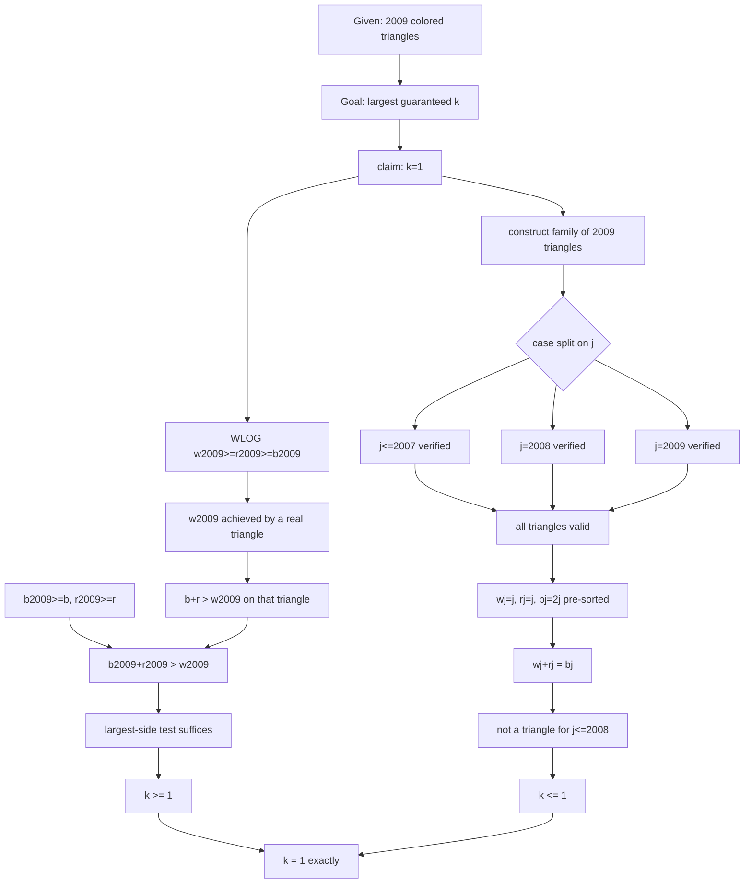
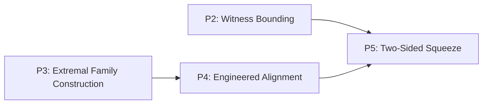

# Validation 003 — Reasoning Actions inside the Thinking Graph

**Target problem:** IMO Shortlist 2009, Algebra A1
**Source:** `data/raw/imo/IMO2009SL.pdf`, p. 12 (single, self-contained official solution
— no alternate solution or Comment is provided for this problem; confirmed by reading
through to the start of A2 on p. 13).
**Research question:** not "does the framework hold" (settled by Validations 001–002) —
here the question is what *kind of reasoning move* transforms each Thinking-Graph parent
node into its child.

---

## 0. Problem statement (verbatim, p. 12)

> Find the largest possible integer $k$ such that the following statement is true: Let
> 2009 arbitrary non-degenerate triangles be given. In every triangle the three sides
> are colored so that one is blue, one red, one white. For every color separately, sort
> the lengths, obtaining $b_1\le\cdots\le b_{2009}$, $r_1\le\cdots\le r_{2009}$,
> $w_1\le\cdots\le w_{2009}$. Then there exist $k$ indices $j$ such that $b_j,r_j,w_j$
> form a non-degenerate triangle.

The official solution proves the answer is $k=1$, in two independent halves: (i) index
$2009$ always works, for *any* collection of triangles; (ii) an explicit family of 2009
triangles exists for which no index below 2009 works.

---

## Deliverable 1 — Thinking Graph

| id | node_type | statement | importance | source_span |
|---|---|---|---|---|
| G1 | given | 2009 triangles, sides colored blue/red/white; sorted sequences $b,r,w$ | critical | p.12, problem statement |
| GOAL | goal | find the largest $k$ such that $k$ indices are always guaranteed | critical | p.12 |
| N1 | observation | claim: the answer is $k=1$ | critical | p.12, "We will prove that... is one" |
| N2 | construction | WLOG $w_{2009}\ge r_{2009}\ge b_{2009}$ | important | p.12, "Without loss of generality..." |
| N3 | observation | $w_{2009}$ is the white side of some actual triangle $\Delta$ in the collection | important | p.12, "Evidently, there exists a triangle..." |
| N4 | inference | $\Delta$'s own blue side $b$ and red side $r$ satisfy $b+r>w_{2009}$ (triangle inequality on $\Delta$) | critical | p.12 |
| N5 | inference | $b_{2009}\ge b$ and $r_{2009}\ge r$ (definition of $b_{2009},r_{2009}$ as maxima) | important | p.12, "$b_{2009}\ge b$ and $r_{2009}\ge r$" |
| N6 | calculation | $b_{2009}+r_{2009}\ge b+r>w_{2009}$ | critical | p.12 |
| N7 | inference | since $w_{2009}$ is (WLOG) the largest of the three, this one inequality suffices for the full triangle inequality | important | p.12 (implicit; standard fact used without restatement) |
| N8 | conclusion | $b_{2009},r_{2009},w_{2009}$ always form a non-degenerate triangle — **$k\ge1$** | critical | p.12 |
| N9 | construction | define $\Delta_j$, $j=1,\dots,2009$: blue $=2j$; red $=j$ ($j\le2008$) or $4018$ ($j=2009$); white $=j+1$ ($j\le2007$), $4018$ ($j=2008$), or $1$ ($j=2009$) | critical | p.12, "Let us define the sequence..." |
| N10 | case_split | verify non-degeneracy of $\Delta_j$ in three ranges: $j\le2007$, $j=2008$, $j=2009$ | important | p.12 |
| N11 | calculation | case $j\le2007$: $(j{+}1)+j>2j\ge j{+}1>j$ | important | p.12 |
| N12 | calculation | case $j=2008$: $2j+j>4018>2j>j$ | important | p.12 |
| N13 | calculation | case $j=2009$: $4018+1>2j=4018>1$ | important | p.12 |
| N14 | inference | all three cases confirm: every $\Delta_j$ is a genuine non-degenerate triangle | important | p.12, "such a sequence of triangles exists" |
| N15 | observation | by construction, $w_j=j$, $r_j=j$, $b_j=2j$ for $1\le j\le2008$ (the family is already self-sorted) | critical | p.12, "Moreover, $w_j=j,\,r_j=j$ and $b_j=2j$..." |
| N16 | calculation | substituting: $w_j+r_j = j+j = 2j = b_j$ | important | p.12 |
| N17 | conclusion | $b_j,r_j,w_j$ do **not** form a non-degenerate triangle for any $1\le j\le2008$ (equality, not strict inequality) | critical | p.12, "i.e., ... are not the lengths of the sides of a triangle" |
| N18 | conclusion | this example admits no guaranteed index below 2009 — **$k$ cannot exceed 1** | critical | p.12 (implicit conclusion of the construction) |
| N19 | conclusion | combining N8 and N18: the largest possible $k$ is exactly $1$ | critical | p.12 |

`entry_nodes = [G1]`; `terminal_nodes = [N19]`. 21 total nodes (G1, GOAL, N1–N19).
Acyclic by inspection.



---

## Deliverable 2 — Strategy Layer

**S1 — State the target value** (`N1`). Single node, asserts the claimed answer upfront;
organizes everything after it into two independent halves.

**S2 — Universal lower bound via an extremal witness** (`N2–N8`). WLOG order the three
maxima, extract the real triangle achieving the largest one, transfer its triangle
inequality upward using maximality, and close via a general ordering fact.

**S3 — Construct the sharp counterexample family** (`N9–N14`). Build an explicit family
of 2009 triangles and verify every one is genuinely non-degenerate.

**S4 — Exploit the construction's built-in order** (`N15–N17`). Recognize the family is
already self-sorted, substitute, and identify the resulting equality as a degenerate
(non-)triangle.

**S5 — Assemble** (`N18–N19`). Combine the universal bound (S2) with the sharp example
(S3–S4) into the exact extremal value.

(Consistent with Validations 001–002: S1's status as "framing vs. real strategy" and
S5's status as "bookkeeping vs. real strategy" are the same recurring ambiguity found
there — not re-litigated in depth here since Validation 003's focus is elsewhere.)

---

## Deliverable 3 — Mathematical Principles

**P1 (S1) — Guess-and-Verify Framing of an Extremal Claim.** State the conjectured
extremal value upfront, then split the proof into a universal bound and a matching
sharp example. *Proof-independent:* the standard organization of every "find the
largest/smallest $k$ such that..." problem.

**P2 (S2) — Bounding an Order Statistic via a Witness.** To lower-bound a property of
the maximum of a sorted list, find one real object achieving that maximum and transfer
its known properties, inflated by the fact that other maxima only dominate it.
*Proof-independent:* standard whenever reasoning about order statistics drawn from an
underlying collection.

**P3 (S3) — Explicit Extremal Family Construction.** To show a bound is not improvable,
exhibit a concrete family of instances realizing the boundary. *Proof-independent:* the
standard sharpness-construction move in any "best constant" problem.

**P4 (S4) — Engineered Alignment Between Local Construction and Global Order
Statistic.** Design a construction so each instance's own value already equals the
corresponding order statistic of the whole collection, avoiding a separate sorting
argument. *Proof-independent:* reusable whenever a construction must control order
statistics precisely, regardless of what the objects are.

**P5 (S5) — Two-Sided Squeeze to Establish an Extremal Value.** Combine a universal
bound and a matching sharp instance to pin down the exact extremal constant.
*Proof-independent:* the universal closing move of "find the best constant" problems.

*(Aside, offered with the caveat that this session already holds Validation 001 in
working memory rather than as a fresh finding: P5's generic form is identical to
Validation 001's own P5 for IMO SL 2007 A1 — the same closing principle recurring on an
unrelated problem is consistent with, not independent confirmation of, that earlier
result.)*

---

## Deliverable 4 — Principle Dependency Graph

| Source | Target | Justification |
|---|---|---|
| P3 | P4 | S4 analyzes exactly the family P3 built (`N15` reads off properties of `N9`'s construction) |
| P2 | P5 | S5's assembly (`N19`) needs P2's universal bound (`N8`) as one input |
| P4 | P5 | S5's assembly needs P4's degeneracy result (`N18`, itself built on `N17`) as the other input |

P1 is not wired into this graph as a producer/consumer node — it is organizational
framing with no object that downstream principles consume (same status as the
framing-strategy exclusions noted in Validations 001–002).



A DAG, two independent sources (P2, P3) converging on one terminal (P5) — the same
"multiple-sources-converge-on-one-sink" shape Validation 001 found for IMO SL 2007 A1,
noted here only as a passing structural echo, not claimed as new independent evidence
given the shared-session caveat above.

---

## Deliverable 5 — Edge-by-Edge Reasoning Action Annotation

*Reasoning action, not mathematical content — "what move was made," not "what was
proved."*

| Edge | Reasoning Action |
|---|---|
| G1 → GOAL | *(Framing — not a proof-reasoning action; see Deliverable 9.)* |
| GOAL → N1 | **Assert Target Value** |
| N1 → N2 | **Symmetry (WLOG)** |
| N2 → N3 | **Existence Instantiation** |
| N3 → N4 | **Invoke Given/Definitional Property** (triangle inequality on the witness) |
| G1 → N5 | **Invoke Given/Definitional Property** (maximality of $b_{2009},r_{2009}$) |
| N4, N5 → N6 | **Inequality Chaining (Transitivity)** |
| N6 → N7 | **Invoke Prior Lemma/Fact** (largest-side-vs-sum-of-others suffices) |
| N7 → N8 | **Conclude** |
| N1 → N9 | **Construct Auxiliary Object** |
| N9 → N10 | **Case Split** |
| N10 → N11 | **Direct Computation/Verification** |
| N10 → N12 | **Direct Computation/Verification** |
| N10 → N13 | **Direct Computation/Verification** |
| N11, N12, N13 → N14 | **Merge Cases** |
| N14 → N15 | **Structural/Invariant Identification** |
| N15 → N16 | **Substitution** |
| N16 → N17 | **Boundary/Equality Identification** |
| N17 → N18 | **Conclude** |
| N8, N18 → N19 | **Combine Bounds (Squeeze/Assemble)** |

Every reasoning edge (all but the framing edge G1→GOAL) received exactly one primary
action, as instructed.

---

## Deliverable 6 — Reasoning Action Taxonomy

Grouped after the fact, from the labels actually used above — not forced onto a
preset scheme.

**Construction** — brings a new object or a fixed choice into existence:
- Assert Target Value
- Symmetry (WLOG)
- Existence Instantiation
- Construct Auxiliary Object

**Deduction** — manipulates already-available expressions into new ones by direct
computation:
- Invoke Given/Definitional Property
- Inequality Chaining (Transitivity)
- Direct Computation/Verification
- Substitution

**Structural** — exploits or recognizes a global property of the objects, not a local
computation:
- Invoke Prior Lemma/Fact
- Structural/Invariant Identification

**Logical/Closing** — manages the logical shape of the argument:
- Case Split
- Merge Cases
- Boundary/Equality Identification
- Conclude
- Combine Bounds (Squeeze/Assemble)

**Framing** (edge case, kept separate rather than forced into the above four) —
problem setup with no proof content: `G1→GOAL`.

Note on judgment calls: "Boundary/Equality Identification" sits ambiguously between
Deduction (it is a direct algebraic recognition, $w_j+r_j=b_j$) and Logical/Closing (it
functions to close a case by exhibiting non-degeneracy failure). It is placed in
Logical/Closing here because its *purpose* in the proof is to terminate a branch, but
this is a genuine borderline case, reported rather than hidden.

---

## Deliverable 7 — Strategy → Action Sequence Mapping

```
S1 = Assert Target Value

S2 = Symmetry
     ↓
     Existence Instantiation
     ↓
     Invoke Given/Definitional Property  ⟍
                                           ⟩→ Inequality Chaining
     Invoke Given/Definitional Property  ⟋
     ↓
     Invoke Prior Lemma/Fact
     ↓
     Conclude

S3 = Construct Auxiliary Object
     ↓
     Case Split
     ↓
     Direct Computation/Verification  (×3, parallel branches)
     ↓
     Merge Cases

S4 = Structural/Invariant Identification
     ↓
     Substitution
     ↓
     Boundary/Equality Identification

S5 = Conclude, Conclude
     ↓
     Combine Bounds (Squeeze/Assemble)
```

**Do different Strategies share similar action sequences?** No two of the five are
identical, but S2 and {S3,S4} exhibit a systematic duality rather than being
unrelated: S2 draws entirely from Deduction/Structural actions (symmetry, witness
instantiation, chaining, lemma-invocation) — an *analytic/bounding* register — while
S3–S4 draws entirely from Construction/Logical actions (construct, split, verify,
merge, identify) — a *constructive/computational* register. This tracks the classic
olympiad duality "prove the general bound" vs. "construct the sharp example" exactly,
and the two halves of this single proof draw from visibly different sub-vocabularies of
the same taxonomy, not from overlapping ones.

**Honesty note on "sequence."** S3's internal shape is not a strict linear chain — the
three `Direct Computation/Verification` actions are parallel branches of one case
split, not a sequence. The `A→B→C` notation the task itself suggests is a mild
idealization; S3 is more accurately a shallow tree (split → 3 parallel leaves → merge).
This is reported as a genuine finding in Deliverable 9, Q3.

---

## Deliverable 8 — Comparison Between Official Solutions

No alternate official solution or Comment exists for this problem — the solution on
p. 12 is complete and self-contained, immediately followed by Problem A2 on p. 13, with
no "Solution 2" heading anywhere for A1. Phase 5 as specified (compare Reasoning Actions
across alternate official solutions of the *same* problem) is therefore not directly
executable here, and this is reported as a limitation rather than papered over — unlike
IMO SL 2006 A3, 2007 A1, and 2008 A1, which all had some form of alternate official
text, 2009 A1 does not, and this study cannot manufacture one without violating the
"official solutions only" rule.

As the best available substitute, Deliverable 7's comparison between this single
solution's two independent internal branches (S2 vs. S3–S4) stands in for a
cross-solution comparison: it shows that even *within one official solution*, reasoning
actions cluster into recognizably different registers depending on whether the local
goal is "bound" or "construct," which is itself informative for Deliverable 9's
meta-analysis, even without a second official text to test it against.

---

## Deliverable 9 — Meta Analysis

**Q1. Do certain reasoning actions appear repeatedly?**
Yes. `Conclude` appears twice (closing S2 and closing S4's branch before S5).
`Invoke Given/Definitional Property` appears twice (the witness's triangle inequality;
the maximality of $b_{2009},r_{2009}$). `Direct Computation/Verification` appears three
times (once per case in S3). Frequency is concentrated, not flat: of 18 reasoning edges,
only 12 distinct action types are used, and 5 of those 12 fire more than once.

**Q2. Are some reasoning actions always adjacent?**
Yes, two fixed local patterns recur exactly: `Case Split → Direct
Computation/Verification(×n) → Merge Cases` appears as an inseparable triple (S3), and
`Conclude, Conclude → Combine Bounds` appears as the fixed closing pattern (S5) whenever
two independently-derived bounds must be reconciled. `Conclude` itself is always a local
sink — no edge in this graph ever originates from a `Conclude` node except into a
`Combine Bounds` step.

**Q3. Can every Strategy be represented as a sequence of Reasoning Actions?**
Mostly, with one caveat already flagged in Deliverable 7: S1, S2, S4, S5 are genuinely
linear chains, but S3 is a shallow tree (one split fanning into parallel, independent
verifications before a merge). The task's own "`A → B → C`" notation is adequate for 4
of 5 strategies here but silently flattens S3's real branching structure. This is a
concrete, non-hypothetical limitation of representing strategies as flat sequences.

**Q4. Do different Strategies reduce to the same action sequence?**
No two are identical (Deliverable 7), but they are not independent either — S2 and
S3–S4 draw from two systematically different sub-vocabularies (analytic/bounding vs.
constructive/computational) tracking the bound-vs-construct duality of the underlying
theorem, rather than being arbitrary.

**Q5. Are there reasoning actions that belong to multiple Strategies?**
Within this graph, no single action instance spans two strategies (each edge sits
inside exactly one strategy by construction). But at the level of action *type* rather
than instance, several actions are generic enough that they would trivially recur in
almost any strategy of almost any problem — `Substitution`, `Direct
Computation/Verification`, and `Conclude` carry very little discriminating signal
(mirrors the "Universal principles are poor discriminators" finding already made about
Mathematical Principles in Validation 001), while `Existence Instantiation` and
`Structural/Invariant Identification` are comparatively rare and specific.

**Q6. Are Reasoning Actions more stable than Strategies?**
Along one axis, clearly yes: assigning *some* reasoning action to a given edge was
never ambiguous or contested while building this graph — unlike Strategy boundaries,
which required genuine judgment calls (is S1 real? is S5 bookkeeping?) in every
validation so far. Along a second axis, no: the *granularity* of a reasoning action is
just as analyst-dependent as Thinking-Graph node granularity was found to be in
Validation 002 — e.g., `N3→N4` ("Invoke Given/Definitional Property") could equally
have been split into "instantiate the witness's blue/red side values" and "apply the
triangle inequality to them" as two finer actions. So: more stable in *existence*
(every edge gets one), not obviously more stable in *definition* (where its boundaries
are drawn).

**Q7. Should Reasoning Actions become a new layer of the framework?**
See Deliverable 10.

---

## Deliverable 10 — Final Assessment

**B. Reasoning Actions clarify the Thinking Graph.**

Evidence for real, non-redundant value: every reasoning edge received an unambiguous
action label with no existence-ambiguity (contrast Strategy boundaries, which have
required judgment calls in every validation to date); the action vocabulary surfaced a
genuine structural finding — the bound-vs-construct duality — that is not simply a
restatement of the Strategy or Principle layers (Principles explain *why* a step is
mathematically valid; Reasoning Actions explain *how* the text moves from claim to
claim, a different and complementary axis of information); and two fixed local
adjacency patterns (`Case Split → Verify(×n) → Merge Cases`, `Conclude, Conclude →
Combine Bounds`) were identified with concrete edge evidence, not asserted.

Evidence against jumping straight to **C** (permanent layer): this is a single problem
with no second official solution to cross-check Phase 5 against, so the vocabulary's
transfer across *solutions* is untested here, and its transfer across *problems* rests
only on the passing, session-memory-caveated echo of Validation 001's P5. Mathematical
Principles only earned confidence as a framework layer after replicating across three
independent problems in Validations 001–002; Reasoning Actions have not yet had that
same multi-problem trial. The granularity concern from Q6 is also unresolved — a
permanent layer would need a stated rule for how fine-grained an action should be,
which this study, like the prior two on strategy/node granularity, was not able to
supply.

**A** is not supported: the action layer demonstrably added information (the duality
finding, the fixed adjacency patterns) that was not visible from the Thinking Graph,
Strategy Layer, or Principles alone. The honest middle verdict is **B**, with **C**
flagged as the natural next hypothesis pending replication on more problems and, ideally,
a second official solution of the same problem to run the originally-intended Phase 5
comparison against.