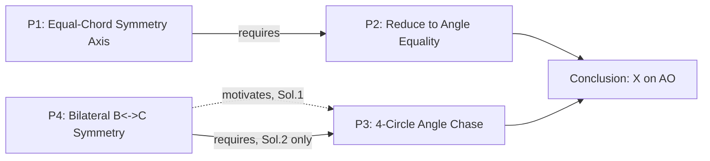

# DNA Extraction — IMO Shortlist 2015, Geometry G2

**Target problem:** IMO Shortlist 2015, Geometry G2 (proposed by Greece)
**Source:** `data/raw/imo/IMO2015SL.pdf` — statement p. 44; Solution 1 pp. 44–45; Solution 2 (alternate) p. 45; Comments 1–3 p. 45.
**Context:** one of 6 problems in "test 2" of the DNA pool (test 1 covered 2006-A3, 2007-A1,
2008-A1, 2009-A1 — all Algebra). This is the **first Geometry problem** run through the
pipeline; a sibling report (2019-G4) independently runs a second one. Where the existing
principle/topic/reasoning-action vocabulary (built entirely from algebra problems) breaks
down, that is flagged explicitly rather than papered over with a forced reuse.

---

## 0. Problem statement (verbatim, p. 44)

> Let $ABC$ be a triangle inscribed into a circle $\Omega$ with center $O$. A circle
> $\Gamma$ with center $A$ meets the side $BC$ at points $D$ and $E$ such that $D$ lies
> between $B$ and $E$. Moreover, let $F$ and $G$ be the common points of $\Gamma$ and
> $\Omega$. We assume that $F$ lies on the arc $AB$ of $\Omega$ not containing $C$, and
> $G$ lies on the arc $AC$ of $\Omega$ not containing $B$. The circumcircles of the
> triangles $BDF$ and $CEG$ meet the sides $AB$ and $AC$ again at $K$ and $L$,
> respectively. Suppose that the lines $FK$ and $GL$ are distinct and intersect at $X$.
> Prove that the points $A$, $X$, and $O$ are collinear.

Two independent official solutions are given (not a partial "Comment" — see §5).

---

## 1. Problem DNA

| Field | Value |
|---|---|
| `problem_id` | `IMO-SL-2015-G2` |
| `contest` / `year` / `round` / `problem_number` | IMO Shortlist / 2015 / Shortlist / G2 |
| `source` | `data/raw/imo/IMO2015SL.pdf, pp. 44-45` |
| `statement_text` | as above |
| `difficulty` | null (left unset, consistent with the existing 4 problems) |
| `objects_text` | Triangle $ABC$ inscribed in $\Omega$ (center $O$); circle $\Gamma$ centered at $A$ meeting $BC$ at $D,E$; $F,G$ = common points of $\Gamma,\Omega$; circumcircles $\omega_B=(BDF)$, $\omega_C=(CEG)$ re-meeting $AB,AC$ at $K,L$; $X = FK\cap GL$. |
| `hidden_structure` | $AF=AG$ (both radii of $\Gamma$) and $OF=OG$ (both radii of $\Omega$) force $A$ and $O$ to both lie on the perpendicular bisector of $FG$ — so line $AO$ is *already*, before any angle-chasing, the axis of an involutive symmetry of the whole configuration ($B\leftrightarrow C$, $D\leftrightarrow E$, $K\leftrightarrow L$, $\omega_B\leftrightarrow\omega_C$). The collinearity claim is a disguised statement that this symmetry maps line $FK$ to line $GL$. |
| `expected_insight` | Spot the free symmetry axis *before* touching any angle chase — it converts "prove 3 points collinear" into "prove one angle equality," at which point the problem is routine (if intricate) inscribed-angle chasing across four circles. |
| `problem_family` / `problem_template` | null |
| `topic` tags | **Gap** — no existing topic fits; see §7. |

---

## 2. Thinking Graph — Solution 1 (primary)

| id | node_type | statement | importance | source_span |
|---|---|---|---|---|
| N1 | given | Full configuration: $ABC,\Omega,O,\Gamma,D,E,F,G,\omega_B,\omega_C,K,L,X$ | critical | p.44, problem statement |
| GOAL | goal | Prove $A,X,O$ collinear | critical | p.44 |
| N2 | observation | $AF=AG$ (both radii of $\Gamma$) | critical | p.44, "the segments $AF$ and $AG$, being chords of $\Omega$ with the same length" (implicit: both are radii of $\Gamma$) |
| N3 | observation | $OF=OG$ (both radii of $\Omega$, since $F,G\in\Omega$) | critical | p.44 (implicit — used but not restated, since $F,G\in\Omega$ by construction) |
| N4 | inference | $A$ and $O$ both lie on the perpendicular bisector of $FG$ | critical | derived from N2, N3 |
| N5 | inference | Line $AO$ **is** the perpendicular bisector of $FG$, i.e. the axis of the isosceles triangle $AFG$; $AF,AG$ are symmetric about it | critical | p.44, "the segments $AF$ and $AG$ ... are clearly symmetric with respect to $AO$" |
| N6 | inference (strategic reduction) | It suffices to prove lines $FK$ and $GL$ are symmetric about $AO$ — then $X=FK\cap GL$ lies on the mirror axis automatically | critical | p.44, "It suffices to prove that the lines $FK$ and $GL$ are symmetric about $AO$" |
| N7 | inference (further reduction) | Given N5, this reduces to one angle equality: $\angle KFA=\angle AGL$ — labeled (1) | critical | p.44, "Hence it is enough to show $\angle KFA=\angle AGL$ (1)" |
| N8 | calculation | Via $\omega_B,\Gamma,\Omega$: $\angle KFA=\angle DFG+\angle GFA-\angle DFK=\angle CEG+\angle GBA-\angle DBK=\angle CEG-\angle CBG$ | important | p.44, displayed equation chain |
| N9 | calculation | Via $\omega_C,\Omega$: $\angle CEG-\angle CBG=\angle CLG-\angle CAG=\angle AGL$ | important | p.44, "Due to the circles $\omega_C$ and $\Omega$..." |
| N10 | conclusion | Combining N8, N9: $\angle KFA=\angle AGL$ — (1) proved | critical | p.44, "Thereby the problem is solved" |
| N11 | conclusion | By N5 (axis) + N10 (angle equality): lines $FK$, $GL$ are reflections of each other about $AO$ | critical | implicit closing of the reduction opened at N6 |
| N12 | conclusion | Reflected lines meet on the mirror axis $\Rightarrow$ $X\in AO$ $\Rightarrow$ $A,X,O$ collinear | critical | implicit — the statement being proved |

`entry_nodes = [N1]`; `terminal_nodes = [N12]`. **12 nodes** (N1, GOAL, N2–N12 — GOAL
counted separately from N1–N12, so 13 total including GOAL). Acyclic by construction — no
edge ever points back to an earlier node (verified by inspection, not just assumed).

```mermaid
flowchart TD
    N1[Given: full configuration] --> GOAL[Goal: A,X,O collinear]
    GOAL --> N2[AF=AG, both radii of Gamma]
    GOAL --> N3[OF=OG, both radii of Omega]
    N2 --> N4[A,O both on perp bisector of FG]
    N3 --> N4
    N4 --> N5[AO is the axis; AF,AG symmetric]
    N5 --> N6[Suffices: FK,GL symmetric about AO]
    N6 --> N7[Reduces to angle eq (1): KFA=AGL]
    N7 --> N8[B-side chase via wB,Gamma,Omega]
    N7 --> N9[C-side chase via wC,Omega]
    N8 --> N10[(1) proved: KFA=AGL]
    N9 --> N10
    N5 --> N11[FK,GL are reflections about AO]
    N10 --> N11
    N11 --> N12[X on AO => A,X,O collinear]
```

**Graph features:** node_count=13 (incl. GOAL), edge_count=15, entry=[N1],
terminal=[N12], branch_count=2 (GOAL, N7 each split two ways), merge_count=3 (N4, N10,
N11 each receive two edges), max_depth≈11 (N1→GOAL→N2→N4→N5→N6→N7→N8→N10→N11→N12),
has_cycle=false.

**Verification note (honesty, per instructions not to fabricate steps):** I checked the
overall *logical* structure of N8/N9 — that each substitution is a legitimate application
of the inscribed-angle theorem across the four circles named ($\omega_B$, $\Gamma$,
$\Omega$, $\omega_C$) at points that are genuinely concyclic by the problem's own
hypotheses — and that the displayed equation chains are internally consistent (each
rewrite eliminates exactly the angle it claims to, given the concyclicities). I did **not**
re-derive every individual inscribed-angle substitution from raw coordinates/trig — the
source (an official IMO Shortlist solution) is treated as authoritative for the
micro-algebra, matching the level of scrutiny prior validations gave to already-terse
official solution text. This is a real limitation of this report's rigor, stated rather
than hidden.

---

## 3. Strategy Layer

**S0 — Framing** (`N1, GOAL`). Not a proof move — states the configuration and target.

**S1 — Establish $AO$ as the symmetry axis** (`N2–N5`). Technique: two independent
"center of a circle through these two points" facts (one from $\Gamma$, one from $\Omega$)
jointly pin down a line as the perpendicular bisector of $FG$. Self-contained: clean input
(the two circles' centers), clean output (a mirror axis for the whole picture).

**S2 — Reduce collinearity to one angle equality** (`N6–N7`). Technique: recognize that,
given a known symmetry axis, "does a point defined by two curves' intersection lie on the
axis" reduces to "are the two curves mirror images," which for two *lines* reduces further
to a single angle condition. A pure logical-architecture move, no computation.

**S3 — Prove (1), $B$-side** (`N8`). Technique: chain inscribed-angle substitutions
through $\omega_B$, $\Gamma$, $\Omega$ to express $\angle KFA$ in $B$-side quantities.

**S4 — Prove (1), $C$-side** (`N9`). Technique: the mirror-image chain through $\omega_C$,
$\Omega$, expressing the same target value in $C$-side quantities. Structurally identical
in *shape* to S3 (a fact the proof discovers empirically rather than invoking as a
shortcut — see §6 finding).

**S5 — Assemble** (`N10–N12`). Bookkeeping: combine (1) with the axis fact (S1) to close
the proof.

Six spans (S0/S5 bookkeeping, S1–S4 real technique) — the same S0/S-last framing/bookkeeping
ambiguity flagged as a recurring, genuinely unsettled pattern in every prior validation
(`docs/12_DNA_TABLE_v1.0.md` §3, `strategy.is_framing`/`is_bookkeeping`) shows up here too,
at the identical two positions (start, end).

---

## 4. Mathematical Principles

**P1 (S1) — Equal-Chord Symmetry Axis via Two Independent Centers.**
*Generic form:* If two circles centered at distinct points $A,O$ both pass through the
same two points $F,G$, then $A,O$ both lie on the perpendicular bisector of $FG$, so line
$AO$ *is* that perpendicular bisector — the axis of the involution swapping $F\leftrightarrow G$.
*Generality:* common_technique (a standard configuration fact in circle-intersection
geometry, not a universal proof-strategy).
*Classification:* **mixed.** The raw fact $AF=AG$, $OF=OG$ is problem-intrinsic — true of
this configuration under *any* proof method (even a coordinate bash would have these two
equalities baked into its setup). But *promoting it to the organizing device of the whole
proof* — naming $AO$ as "the axis" and building the rest of the argument around it — is a
solution-specific architectural choice; Solution 2 needs the same fact (it reuses this
reduction "again," see §5) but a coordinate/trig-bash proof would never name an axis at
all. Same intrinsic-fact-vs-solution-specific-use split found for 2006-A3's ideas 3 and 7.

**P2 (S2) — Symmetry-Reduction of a Collinearity Claim to a Single Angle Equality.**
*Generic form:* Given two objects already known to be mirror images about a fixed axis, a
claim about their intersection point lying on that axis reduces to proving the objects are
mirror images — for two lines, to one angle equality with the axis.
*Generality:* common_technique (recurring move in symmetric-configuration olympiad
geometry).
*Classification:* solution-specific. A coordinate proof solves for $X$ directly and checks
collinearity numerically/algebraically — it never needs, or benefits from, this reduction.

**P3 (S3, S4) — Four-Circle Inscribed-Angle Substitution Chain.**
*Generic form:* Chase a target angle through a sequence of concyclic-point substitutions
across several circles sharing configuration-defined points, converting it into an
expression in the base triangle's "primitive" angles.
*Generality:* common_technique (classic olympiad angle-chasing).
*Classification:* solution-specific — confirmed by direct evidence: Solution 2 proves the
*same* lemma (1) via a genuinely different technique (named angles $\alpha,\varphi,\psi$
plus an isosceles-triangle exterior-angle relation, not this substitution chain). Same
"an alternate official solution replaces exactly this piece" test used for 2006-A3 idea 6.

**P4 (cross-cutting, not owned by one strategy) — Bilateral ($B\leftrightarrow C$)
Configuration Symmetry.**
The entire configuration is built symmetrically under swapping $B\leftrightarrow C$,
$D\leftrightarrow E$, $K\leftrightarrow L$, $\omega_B\leftrightarrow\omega_C$ — the
hypotheses of the problem are themselves invariant under this relabeling.
*Generic form:* If a configuration admits an involutive symmetry swapping labeled objects
pairwise, a claim about one object translates verbatim into the mirrored claim about its
image under that symmetry.
*Generality:* universal (a general symmetry-argument principle, not geometry-specific).
*Classification:* **problem-intrinsic** — the $B\leftrightarrow C$ symmetry is a structural
fact about the problem's own hypotheses, true regardless of proof method (any correct
proof's equations would come out symmetric under relabeling $B,C$).
*Finding:* Solutions 1 and 2 use P4 **differently** — Solution 1 never invokes it, instead
re-deriving the $C$-side (S4) from scratch by the same method as the $B$-side (S3);
Solution 2 explicitly invokes it as a shortcut ("due to the symmetry between $B$ and $C$
alluded to above") to skip deriving its analogue of S4 entirely. Same principle, same
problem, different dependency *type* depending on which solution is asked — see §5's
dependency-graph note on this exact edge.

---

## 5. Alternate Solution (Solution 2) — a "replaces one span" pattern

Solution 2 opens: *"Again, we denote the circumcircle of $BDKF$ by $\omega_B$... Again, we
reduce our task to proving (1)."* This "again" is explicit textual evidence that Solution 2
**reuses** Solution 1's reduction (this report's N1–N7 / S0–S2) by reference rather than
re-deriving it, and supplies only a different proof of (1) itself.

Its own novel content (own Thinking Graph, abbreviated — same target (1) as N7):

| id | statement | source_span |
|---|---|---|
| M1 | Define $\alpha=\angle BAC$, $\varphi=\angle ABF$, $\psi=\angle EDA=\angle AED$ | p.45 |
| M2 | $AF=AG\Rightarrow\varphi=\angle GCA$ (both angles "respect the symmetry between $B,C$") | p.45 |
| M3 | $2\angle KFA=2(\angle DFA-\angle DFK)$ | p.45 |
| M4 | $\angle DFA=\angle ADF=\angle EDF-\psi=\angle BFD+\angle EBF-\psi$ (triangle $AFD$ isosceles: $AF=AD$, both radii of $\Gamma$) | p.45 |
| M5 | Via $\omega_B$: $\angle DFK=\angle CBA$ | p.45 |
| M6 | Combine M3–M5: $2\angle KFA=\angle BFA+\varphi-\psi-\angle CBA$ | p.45 |
| M7 | $AFBC$ cyclic (on $\Omega$) $\Rightarrow 2\angle KFA=\alpha+\varphi-\psi$ | p.45 |
| M8 | **By P4 (explicit invocation)**, symmetrically: $2\angle AGL=\alpha+\varphi-\psi$ | p.45, "due to the 'symmetry' between $B$ and $C$ alluded to above" |
| M9 | Combine M7, M8: $\angle KFA=\angle AGL$, i.e. (1) | p.45 |

`solution.is_primary = false`, `solution.is_complete = false`,
`replaces_solution_id = SOL1`, `replaces_span_note = "replaces only the proof of (1)
(N8–N10 of Solution 1's graph); reuses Solution 1's axis reduction (N2–N7) and closing
argument (N11–N12) by explicit textual reference ('Again, we reduce our task to proving
(1)')."` — the identical modular-swap pattern `docs/12_DNA_TABLE_v1.0.md` §2 documents for
2006-A3's and 2008-A1's Comments, now confirmed on a fifth, unrelated (geometry) problem.

Comment 3 (p.45) additionally notes the Problem Selection Committee weakened the original
proposal (which asked to prove $FK, GL, AO$ *concurrent*, requiring a separate
non-parallelism argument) — a genuine piece of problem-DNA provenance, not solution
content, worth preserving in `problem.expected_insight`/a future `problem_family` note if
this project ever tracks proposal-vs-shortlist deltas.

---

## 6. Principle Dependency Graph

| Source | Target | Type | Justification |
|---|---|---|---|
| P1 | P2 | requires | P2's reduction ("suffices to show symmetric") is only meaningful once P1 has established *which* line is the axis to test symmetry about. |
| P4 | P3 | **motivates** (Solution 1) | S4 (N9) is derived independently by the same method as S3, not by invoking P4 as a shortcut — Solution 1 never writes "by symmetry" for this step. |
| P4 | P3 | **requires** (Solution 2, at M8 only) | Solution 2 explicitly invokes P4 to skip re-deriving its S4-analogue entirely — here P4 is load-bearing, not just suggestive. |
| P2 | (conclusion, N11–N12) | requires | The leap from "angle equality holds" to "$X\in AO$" is licensed by P2's reduction argument, not re-derivable from P3 alone. |
| P3 | (conclusion, N10) | requires | (1) *is* P3's two chased expressions combined — nothing to combine without both. |



DAG: yes, no back-edges. **Finding:** the same principle-pair (P4→P3) genuinely changes
*edge type* depending on which official solution is consulted — the first documented case
in this project where the requires/enables/motivates classification is not just
analyst-uncertain but **solution-dependent as a matter of fact**, not judgment. This
sharpens (rather than undermines) the `docs/12_DNA_TABLE_v1.0.md` §3 finding that this
3-way distinction is load-bearing: it is precise enough to register a real difference
between two proofs of the same lemma, not just a fuzziness analysts argue about.

---

## 7. Vocabulary check against `scripts/load_dna_seed_v1.py`

**Topics** (`TOPICS`, 6 entries, all `area` ∈ {algebra, combinatorics, number_theory}):
**no existing topic fits.** This problem needs a new topic, e.g.
`{"topic_id": "circle_configurations", "area": "geometry", "name": "Circle
Configurations", "description": "Multi-circle configurations (radical axes, common
chords, re-intersecting circumcircles) and the symmetry/angle-chase arguments they
support."}` — a genuine, expected gap, not a modeling failure (all 6 existing topics were
built from 4 algebra problems).

**Principle types** (`PRINCIPLE_TYPES`, 30 entries, all algebra/combinatorics-flavored):
**no direct reuse candidates.** The closest conceptual cousin is
`galois_conjugate_symmetry` ("The nontrivial automorphism swapping a quadratic irrational
and its conjugate underlies the proof's identities and mirror-image case structure") —
structurally analogous to P4 here (an involutive symmetry driving mirror-image proof
structure) but a **different domain** (field automorphism vs. geometric reflection) and a
different specific object being swapped. Recommend keeping them as **separate**
principle_types for now (conservative, per instructions), but flagging both as candidate
children of an unmodeled, more abstract parent — "Involutive Structural Symmetry" — worth
watching for a third instance before introducing a new abstraction layer. All four of
P1–P4 here are new entries; none merge into the existing 30.

**Reasoning action types** (`REASONING_ACTION_TYPES`, 27 entries): mostly reusable
(`invoke_given_definitional_property`, `structural_invariant_identification`,
`substitution`, `conclude` all appear naturally above), **except** the move at N5→N6 and
N6→N7 — "having established a symmetry axis, use it to shrink a proof obligation from a
global claim to a single local equality" — has no clean existing label. Nearest is
`structural_invariant_identification`, but that undersells the *goal-transformation*
character of the move (it doesn't just recognize a structure, it re-poses the theorem).
**Candidate new reasoning_action_type:** `goal_reduction_via_symmetry` (category:
`structural`) — "Recognize a known symmetry of the configuration and use it to replace a
global claim (e.g. collinearity, concurrency) with a strictly local one (e.g. one angle or
one length equality) that the symmetry shows is equivalent." Used twice in this proof
(N5→N6, N6→N7) and structurally distinct from the 27 existing labels.

---

## 8. Conclusion — does the algebra-derived vocabulary hold up for geometry?

**No, not without extension**, and this should be expected rather than treated as a
modeling defect: `topic` (0/6 geometry entries), `principle_type` (0/30 geometry entries),
and `reasoning_action_type` (26/27 reusable, 1 gap) were all built exclusively from four
algebra solutions. This report's concrete findings:

1. **One new topic is unavoidable** (`circle_configurations` or similar) — geometry has no
   representation at all in the current 6-topic vocabulary.
2. **All 4 principles extracted here are new** — none merge into the 30 existing entries,
   though P4 (Bilateral Configuration Symmetry) and the existing `galois_conjugate_symmetry`
   look like they could share a deeper, currently-unmodeled parent abstraction. Recommend
   not forcing that merge yet (only 2 data points).
3. **Reasoning actions transferred almost cleanly** (26/27 direct reuse) — the one gap
   (`goal_reduction_via_symmetry`) is a real, specific, and reusable addition, not a
   sign the layer needs rethinking.
4. **The requires/enables/motivates distinction got sharper, not weaker**, on this
   problem — §6's P4→P3 finding is genuine new evidence for that layer's value, and it
   came specifically from having two official solutions to compare, the same condition
   that produced the strongest findings on 2006-A3, 2007-A1, and 2008-A1.

No files other than this report were created or modified. No JSON gold record, schema, or
Supabase table was touched (report-only round, per instructions).
