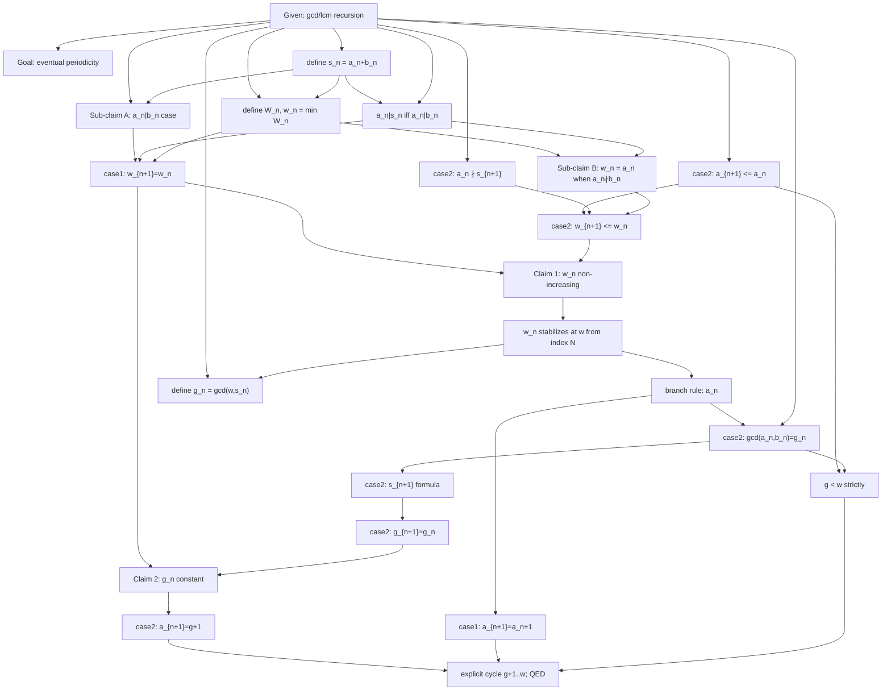
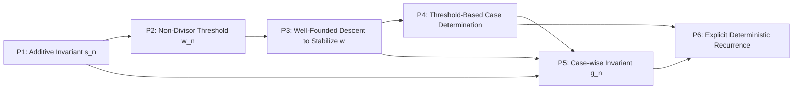

# DNA Extraction — IMO Shortlist 2015, N4

**Target problem:** IMO Shortlist 2015, Number Theory N4
**Source:** `data/raw/imo/IMO2015SL.pdf` — statement p.7 (verified against N1–N8 list; no substitution needed, N4 exists), official solutions pp.68–69 (Solution 1 primary, Solution 2 alternate, plus a non-solution "Comment" enumerating the actual possible cycles).

---

## 0. Problem statement (verbatim, p.68)

> Suppose that $a_0,a_1,\dots$ and $b_0,b_1,\dots$ are two sequences of positive integers satisfying $a_0,b_0\ge2$ and
> $$a_{n+1}=\gcd(a_n,b_n)+1,\qquad b_{n+1}=\operatorname{lcm}(a_n,b_n)-1$$
> for all $n\ge0$. Prove that the sequence $(a_n)$ is eventually periodic; in other words, there exist integers $N\ge0$ and $t>0$ such that $a_{n+t}=a_n$ for all $n\ge N$.
> *(France)*

---

## 1. Problem DNA

| Field | Value |
|---|---|
| problem_id | IMO-SL-2015-N4 |
| contest / year / round / problem_number | IMO Shortlist / 2015 / Shortlist / N4 |
| source | data/raw/imo/IMO2015SL.pdf, statement p.7; solutions pp.68–69 |
| difficulty | null |
| objects_text | Two interleaved positive-integer sequences $(a_n),(b_n)$ governed by a gcd/lcm recursion; derived quantities $s_n=a_n+b_n$, a minimal-non-divisor threshold $w_n$, and a gcd-based invariant $g_n$. |
| hidden_structure | The recursion is a disguised finite-state process: $a_n$ climbs by $+1$ each step while it divides $b_n$, until it hits a "capacity" $w$ (the least integer $\ge a_n$ not dividing the locally-conserved sum $s_n$); at that point it resets to a floor $g+1$ and climbs again. Both the ceiling $w$ and the floor $g$ are themselves shown to stabilize, so the long-run behavior is an exact repeating cycle $g+1\to g+2\to\cdots\to w\to g+1\to\cdots$ — i.e. eventual periodicity is not incidental but the visible trace of a genuine finite automaton hiding inside an a priori unbounded recursion. |
| expected_insight | Don't track $(a_n,b_n)$ directly — track the coarser sum $s_n=a_n+b_n$, which is provably unchanged exactly while $a_n\mid b_n$. This collapses the two-variable recursion to a one-variable question ("how far can $a_n$ climb before hitting a non-divisor of $s_n$?"), and that threshold can only move downward, forcing eventual stabilization and, from there, an explicit cycle. |
| problem_family / problem_template | null / null |
| topic | Number Theory — gcd/lcm-driven recursive sequences; eventual periodicity / finite-state arguments |

---

## 2. Solution 1 — Thinking Graph

| id | node_type | statement | importance | source_span |
|---|---|---|---|---|
| N1 | given | $a_0,b_0\ge2$; $a_{n+1}=\gcd(a_n,b_n)+1,\ b_{n+1}=\operatorname{lcm}(a_n,b_n)-1$ | critical | p.68, problem statement |
| N2 | goal | prove $(a_n)$ is eventually periodic | critical | p.68 |
| N3 | construction | define $s_n=a_n+b_n$ | critical | p.68, "Let $s_n=a_n+b_n$" |
| N4 | inference | Sub-claim A: if $a_n\mid b_n$ then $a_{n+1}=a_n+1$, $b_{n+1}=b_n-1$, $s_{n+1}=s_n$ | critical | p.68, "Notice that if $a_n\mid b_n$..." |
| N5 | construction | define $W_n=\{m\ge a_n: m\nmid s_n\}$, $w_n=\min W_n$ | critical | p.68, "Define $W_n=\dots$" |
| N6 | observation | $a_n\mid s_n \iff a_n\mid b_n$ (since $s_n=a_n+b_n$) | important | p.68 (implicit, used throughout) |
| N7 | inference | Sub-claim B: if $a_n\nmid b_n$ then $w_n=a_n$ exactly (N6 puts $a_n\in W_n$, and $W_n\subseteq[a_n,\infty)$ forces $w_n\ge a_n$ too) | critical | p.68, embedded in Claim 1's proof |
| N8 | inference | Case $a_n\mid b_n$: $a_n\notin W_n$ (N6) and $s_{n+1}=s_n$ (N4) $\Rightarrow W_{n+1}=W_n \Rightarrow w_{n+1}=w_n$ | important | p.68, Claim 1 proof, first case |
| N9 | inference | Case $a_n\nmid b_n$: $a_{n+1}=\gcd(a_n,b_n)+1\le a_n$ (gcd is a proper divisor of $a_n$) | important | p.68, Claim 1 proof |
| N10 | inference | Case $a_n\nmid b_n$: $a_n\nmid s_{n+1}$ (in $s_{n+1}=\gcd(a_n,b_n)+\operatorname{lcm}(a_n,b_n)$, the lcm-term is a multiple of $a_n$, the gcd-term is not) | important | p.68, Claim 1 proof |
| N11 | inference | N9+N10 $\Rightarrow a_n\in W_{n+1} \Rightarrow w_{n+1}\le a_n=w_n$ (N7) | important | p.68 |
| N12 | conclusion | **Claim 1:** $(w_n)$ is non-increasing (merge of N8, N11) | critical | p.68, "Claim 1. The sequence $(w_n)$ is non-increasing." |
| N13 | conclusion | a non-increasing sequence of positive integers is eventually constant: $\exists N,w$ with $w_n=w$ for all $n\ge N$ | critical | p.68, "Let $w=\min w_n$ and let $N$ be an index with $w=w_N$..." |
| N14 | inference | for $n\ge N$: $a_n<w\Rightarrow a_n\mid b_n$ (case 1); $a_n=w\Rightarrow a_n\nmid b_n$ (case 2) | important | p.68, derived from N7/N8's case-dependent formulas for $w_n$ plus $w_n\equiv w$ |
| N15 | construction | define $g_n=\gcd(w,s_n)$ for $n\ge N$ | important | p.68, "Let $g_n=\gcd(w,s_n)$" |
| N16 | inference | case 2 ($a_n=w$): $\gcd(a_n,b_n)=\gcd(w,s_n)=g_n$ | critical | p.68, Claim 2 proof, eq. (1) |
| N17 | calculation | case 2: $s_{n+1}=\gcd(a_n,b_n)+\operatorname{lcm}(a_n,b_n)=g_n+\dfrac{w(s_n-w)}{g_n}$ | critical | p.68, eq. (1) |
| N18 | inference | case 2: $g_{n+1}=\gcd(w,s_{n+1})=\gcd(w,g_n)=g_n$ (second summand of N17 is a multiple of $w$; $g_n\mid w$) | critical | p.68 |
| N19 | conclusion | **Claim 2:** $(g_n)$ is constant for $n\ge N$ (case 1 trivial via N8's $s_{n+1}=s_n$; case 2 via N16–N18) | critical | p.68, "Claim 2. The sequence $(g_n)$ is constant for $n\ge N$." |
| N20 | inference | case 2 $\Rightarrow a_{n+1}=\gcd(a_n,b_n)+1=g_n+1=g+1$ (letting $g=g_N$) | critical | p.68, "Let $g=g_N$..." |
| N21 | inference | case 1 $\Rightarrow a_{n+1}=a_n+1$ (restates N4, now known to fire exactly when $a_n<w$) | important | p.68 (re-application of N4/N14) |
| N22 | inference | $g<w$ strictly: in case 2, $\gcd(a_n,b_n)=g_n$ is a proper divisor of $a_n=w$ (N9's fact, re-applied) | important | p.68 (implicit; needed for the cycle to be non-degenerate) |
| N23 | conclusion | combining N20–N22: for $n\ge N$, $a_n$ deterministically cycles $g{+}1\to g{+}2\to\cdots\to w\to g{+}1\to\cdots$, period $t=w-g$ — **$(a_n)$ is eventually periodic. QED** | critical | p.68, "We have proved that the sequence $(a_n)$ eventually repeats the following cycle: $g+1\mapsto g+2\mapsto\dots\mapsto w\mapsto g+1$." |

`entry_nodes = [N1]`; `terminal_nodes = [N23]`. **23 nodes**, **36 edges**, acyclic (verified by inspection: every edge points from a lower-indexed node used earlier in the text to a later one that consumes it — no back-reference exists). `max_depth ≈ 13` (longest chain: N1→N3→N4→N8→N12→N13→N14→N16→N17→N18→N19→N20→N23). Two real merge points (N12 from {N8,N11}; N19 from {N8-branch, N18}) and one 3-way assemble (N23 from {N20,N21,N22}).

---

## 3. Solution 1 — Strategy Layer

**S0 — Framing** (`N1,N2`). Not a proof move; states the recursion and target.

**S1 — Auxiliary invariant construction** (`N3`). Introduce $s_n=a_n+b_n$, a quantity that (as N4 will show) is locally conserved on one branch of the recursion.

**S2 — Two-regime case classification** (`N4–N7`). Technique: split the recursion's behavior by whether $a_n\mid b_n$, and pin the exact value of the "non-divisor threshold" $w_n$ in the negative case. Builds the vocabulary ($W_n,w_n$) the rest of the proof runs on.

**S3 — Prove the threshold is non-increasing** (`N8–N12`). Technique: case-by-case verification, in each branch, that $w_{n+1}\le w_n$. This is the proof's first well-founded-descent argument.

**S4 — Stabilization of the threshold** (`N13`). A non-increasing sequence of positive integers is eventually constant — the well-ordering closure of S3's descent.

**S5 — Read off the branch rule at stabilization** (`N14`). Single node: once $w_n\equiv w$, translate that back into "which recurrence branch fires on each step."

**S6 — Second invariant: $g_n$ and its eventual constancy** (`N15–N19`). Structurally parallel to S2–S4, but for a different quantity ($g_n=\gcd(w,s_n)$), proved constant by direct case-wise algebra rather than by descent.

**S7 — Assemble the explicit deterministic recurrence** (`N20–N22`). Combine the two invariants ($w$ from S4, $g$ from S6) into a fully explicit two-branch rule for $a_{n+1}$ given $a_n$.

**S8 — Conclude** (`N23`). Bookkeeping: read the rule of S7 as a cycle and close the proof.

(S0/S8 are framing/bookkeeping, consistent with the S0/S7 pattern already established for IMO-SL-2006-A3.)

---

## 4. Solution 1 — Mathematical Principles

**P1 (S1) — Auxiliary Additive Invariant Construction.**
*Generic form:* When a recursion updates a pair of variables, introduce their sum (or another simple combination) that is provably unchanged on at least one branch of the recursion, to reduce the effective state dimension.
*Generality:* common_technique.
*Classification:* **solution-specific.** Test: does any correct proof need $s_n=a_n+b_n$ specifically? No — Solution 2 (below) never defines $s_n$ at all, instead reducing $b_n$ modulo a bound derived from $(a_n)$'s own finiteness. Confirmed solution-specific by the existence of an alternate official proof that sidesteps it entirely.

**P2 (S2) — Minimal-Non-Divisor Witness/Threshold Extraction.**
*Generic form:* Given a growing integer parameter $x$ and a reference integer $s$, the least integer $\ge x$ that fails to divide $s$ is a well-defined witness measuring "how far $x$ can freely increment before the divisibility relation with $s$ breaks."
*Generality:* specialized — a related but not identical cousin of the existing `extremal_witness_instantiation` principle (that one is about the max/min of a *finite set of reals*; here it is a *minimum of an infinite set of positive integers*, justified by well-ordering of $\mathbb N$ rather than finiteness). Kept separate, on the same conservative grounds 2006-A3's Extremal Principle and 2007-A1's Extremal Witness Instantiation were kept separate as "cousins, not matched strength."
*Classification:* **solution-specific** (same test as P1 — Solution 2 never constructs $W_n$/$w_n$).

**P3 (S3+S4) — Well-Founded Descent / Monovariant Induction.**
*Generic form:* A monovariant that is shown non-increasing (or strictly decreasing) at every step, valued in the positive integers, cannot decrease forever and must stabilize (well-ordering of $\mathbb N$).
*Generality:* universal.
*Classification:* **solution-specific in this instance**, though the underlying well-ordering fact is intrinsic — see §6. Note S3 and S4 are genuinely one principle applied across two adjacent strategies (the descent proof and its stabilization consequence), not two.
*Vocabulary match:* **this is the same principle_type already seeded as `well_founded_descent_monovariant_induction`** (from IMO-SL-2006-A3's Comment). There it proved *termination of a recursive existence construction*; here it proves *stabilization of a threshold value* — same generic fact (non-increasing $\mathbb N$-valued sequence must stop), different local role. Flagged as a genuine reuse candidate, see §7.

**P4 (S5) — Threshold-Based Case Determination.**
*Generic form:* Once a monovariant threshold has stabilized, partition the index set by comparison to that fixed value to recover which branch of an underlying case split is active at each step.
*Generality:* common_technique.
*Classification:* **problem-intrinsic** — any correct proof that establishes *some* stabilized threshold governing this recursion's branch choice would need to make exactly this translation; it is forced by what "branch fires" means once $w_n$ is fixed, not a proof-path choice. (Low confidence: no independent alternate proof isolates this exact micro-step for cross-checking, so this call is made without a confirming second solution, analogous to 2008-A1's `intrinsic_confidence=low` cases.)

**P5 (S6) — Case-wise Algebraic Invariant Verification.**
*Generic form:* To show a derived quantity is preserved (or determined) by a recursive process, verify the claim separately in each branch of a governing case split, using direct algebraic identities in each branch.
*Generality:* common_technique.
*Classification:* **solution-specific** — Solution 2 never verifies constancy of any $g_n$-like quantity; it sidesteps the need entirely by working with residues mod a fixed $M$ from the start.

**P6 (S7) — Read Off an Explicit Deterministic Recurrence from a Pinned Case Structure.**
*Generic form:* Once a case-classified recursion's branch-selection rule and the invariant(s) governing each branch are both pinned down, the recursion collapses into a fully explicit, deterministic transition rule.
*Generality:* common_technique.
*Classification:* **solution-specific — strong case, directly confirmed.** Solution 2 proves the identical conclusion (eventual periodicity of $(a_n)$) *without ever exhibiting an explicit cycle*; it uses an abstract pigeonhole argument on a finite state space instead (§5–§6). This is the cleanest analogue in this problem to 2006-A3's Idea 6 (Extremal-Representative technique vs. the Comment's Monovariant Descent) — two fundamentally different techniques close the same theorem, so neither is the "true" reason the theorem holds.

*(S0, S8 are framing/bookkeeping — not modeled as principles, matching the P7/S7-bookkeeping exclusion already established for 2006-A3.)*

---

## 5. Solution 1 — Principle Dependency Graph

| Source | Target | Type | Justification |
|---|---|---|---|
| P1 | P2 | requires | $W_n$'s definition (`N5`) is stated in terms of "does not divide $s_n$" — $s_n$ must already exist. |
| P2 | P3 | requires | Claim 1 (`N12`) is a statement *about* $w_n$; $w_n$'s case-dependent formula (P2, including Sub-claim B / N7) must already be established before non-increase can even be asked. |
| P3 | P4 | enables | P4's branch rule (`N14`) reads off consequences of the *stabilized* value $w$ that P3 produces at `N13`; nothing to branch on until $w$ exists. |
| P1 | P5 | requires | $g_n=\gcd(w,s_n)$ (`N15`) needs $s_n$ (P1) already defined. |
| P3 | P5 | requires | $g_n$ is only defined/meaningful for $n\ge N$ — the stabilization index P3 produces. |
| P4 | P5 | requires | Verifying $g_n$'s constancy in the case-2 branch (`N16`) uses P4's branch fact ($a_n=w$) to know which algebraic identity applies. |
| P4 | P6 | requires | The explicit rule's case-1 half (`N21`, $a_{n+1}=a_n+1$) is exactly P4's branch condition re-applied. |
| P5 | P6 | requires | The explicit rule's case-2 half (`N20`, $a_{n+1}=g+1$) needs $g_n$'s constancy (P5) to replace $g_n$ with the fixed $g$. |

DAG check: topological order P1→P2→P3→{P4}→{P5}→P6 with the extra edges P1→P5 and P3→P5 both running "forward" in this same order — **no back-edges, confirmed DAG.** Root: P1. Terminal: P6.

---

## 6. Solution 2 (alternate, pp.68–69) — condensed Thinking Graph

Solution 2 opens with **"By Claim 1 in the first solution, we have $a_n\le w_n\le w_0$"** — i.e. it explicitly imports Solution 1's `N12`/`N13` conclusion (boundedness of $a_n$) rather than re-deriving it, then replaces everything downstream of that point with a different closing technique. This is the mirror image of the 2006-A3/2008-A1 "modular swap" pattern: instead of an alternate that keeps the *opening* and swaps the *closing* lemma, here the alternate keeps (by citation) the *first result* of the main solution and swaps *everything after it*.

| id | node_type | statement | importance |
|---|---|---|---|
| M1 | given (imported) | cites Sol.1 Claim 1: $a_n\le w_n\le w_0$ $\Rightarrow$ $(a_n)$ bounded, finitely many values | critical |
| M2 | construction | define $M=\operatorname{lcm}(a_1,a_2,\dots)$ (finite lcm, since finitely many values) | important |
| M3 | construction | define $r_n = b_n \bmod M$ | important |
| M4 | inference | since $a_n\mid M$ and $M\mid(b_n-r_n)$: $\gcd(a_n,b_n)=\gcd(a_n,r_n)$ | critical |
| M5 | inference | hence $a_{n+1}=\gcd(a_n,r_n)+1$ — determined by $(a_n,r_n)$ alone | critical |
| M6 | calculation | $r_{n+1}\equiv \dfrac{a_n}{\gcd(a_n,r_n)}\,r_n - 1 \pmod M$ | critical |
| M7 | inference | hence $r_{n+1}$ is also determined by $(a_n,r_n)$ alone | critical |
| M8 | conclusion | the pair $(a_n,r_n)$ determines $(a_{n+1},r_{n+1})$: a well-defined self-map on the reduced state | critical |
| M9 | observation | $(a_n,r_n)$ ranges over a finite set ($a_n$ finitely many values, $r_n\in\{0,\dots,M-1\}$) | critical |
| M10 | conclusion | a deterministic self-map on a finite set, iterated, must eventually revisit a state and cycle (pigeonhole) | critical |
| M11 | conclusion | $(a_n)$, a coordinate-projection of the eventually-periodic pair sequence, is itself eventually periodic. QED | critical |

`entry_nodes=[M1]`, `terminal_nodes=[M11]`, 11 nodes, acyclic, no alternate-of-alternate.

**Strategies:** T1 — reduce to finiteness (`M1–M3`, imports Sol.1's boundedness then constructs a finite proxy for $b_n$); T2 — verify the reduced pair is self-contained (`M4–M8`); T3 — pigeonhole to periodicity (`M9–M11`).

**Principles:**
- **Q1 (T1) — Modulus Reduction to Escape Unboundedness.** Reduce an a priori-unbounded coordinate modulo an invariant derived from a bounded one. common_technique; **solution-specific** (Solution 1 never reduces mod anything).
- **Q2 (T2) — Self-Contained State-Space Reduction.** A state reduction is valid only if the reduced coordinates alone determine their own future — verify this closure explicitly. universal; **mixed** — the *requirement* to verify closure is intrinsic to using any pigeonhole-on-reduced-state strategy, but the concrete gcd/lcm-mod-$M$ verification is solution-specific.
- **Q3 (T3) — Pigeonhole on a Finite Deterministic State Space.** A deterministic map from a finite set to itself, iterated, must eventually enter a cycle. universal; **problem-intrinsic** — this is essentially definitional of what "eventual periodicity of a process confined to a finite, deterministically-evolving state space" means; any correct proof of this shape must invoke it in some form.

**Dependency graph:** Q1→Q2 (requires: closure-checking needs the reduction to exist first), Q1→Q3 and Q2→Q3 (requires: pigeonhole needs both a finite space (Q1, plus imported M1) and a genuinely self-contained map (Q2)). DAG, root Q1, terminal Q3.

---

## 7. Cross-Solution Comparison and Vocabulary Reuse Check

**A. What's shared vs. replaced.** Solution 2 keeps Solution 1's Claim 1 (`N12`/`N13`, i.e. P2→P3) by direct citation and discards everything from Claim 2 onward (P4, P5, P6), replacing it with Q1–Q3. So *exactly one* piece of DNA is genuinely shared across both official texts: **P3, the well-founded-descent stabilization of $w_n$.**

**B. The intrinsic core.** Comparing terminal principles: P6 (Solution 1's explicit cycle) and Q3 (Solution 2's abstract pigeonhole) are different techniques proving the identical conclusion. Neither is "the" reason $(a_n)$ is eventually periodic — the truly problem-intrinsic fact is the cross-cutting one both terminal principles instantiate concretely: *a process confined (eventually) to a finite state space, evolving by a fixed deterministic rule, must be eventually periodic.* P6 exhibits this fact by hand (explicit cycle); Q3 invokes it abstractly (pigeonhole). This is the direct number-theory analogue of the 2006-A3 Task 004/005 finding (S5's Extremal Principle vs. the Comment's Monovariant Descent + Covering both closing the same Lemma).

**C. Vocabulary reuse (step 8 of the directive), checked against `scripts/load_dna_seed_v1.py`'s 30-entry `PRINCIPLE_TYPES`:**
- **`well_founded_descent_monovariant_induction` — genuine reuse, recommended merge.** P3's generic form ("a strictly non-increasing/decreasing $\mathbb N$-valued measure cannot decrease forever, hence stabilizes/terminates") is substantively identical to the existing entry's generic form, applied here to prove *stabilization of a threshold value* rather than *termination of a recursive construction* — the same underlying well-ordering fact, a different local role, exactly the bar the project's `two_sided_squeeze` precedent merge was held to.
- **`extremal_witness_instantiation`** — considered for P2, rejected as a merge (kept as a new, separate `specialized` principle) for the same reason 2006-A3's Extremal Principle and 2007-A1's Extremal Witness Instantiation were kept apart: the existing entry is about attaining a max/min of a *finite set of reals*, while P2 is a *minimum of an infinite set of positive integers* justified by well-ordering, not finiteness — related, not identical.
- No other existing entries (`two_sided_squeeze`, `canonical_representation_gauge_fixing`, `coordinate_transformation_eigenbasis`, `linear_independence_over_q`, `positional_canonical_numeral_representation`, `galois_conjugate_symmetry`, `covering_partition_argument`, etc.) match any of P1, P2, P4, P5, P6, Q1, Q2. **Q3 (Pigeonhole on a Finite Deterministic State Space) is a genuinely new, high-value candidate** for the shared vocabulary — it is the cross-cutting intrinsic principle identified in §7B and is a recognizable, transferable technique independent of this problem's specific gcd/lcm flavor (any "eventually periodic sequence" problem reduces to it).

---

## 8. Summary

| Metric | Solution 1 | Solution 2 |
|---|---|---|
| node_count | 23 | 11 |
| edge_count | 36 | 10 |
| strategy_count | 9 (incl. 2 framing/bookkeeping) | 3 |
| principle_count | 6 substantive (+2 framing/bookkeeping excluded) | 3 |
| has_cycle | false | false |
| is_primary | true | false |
| is_complete | true | **false** (imports Sol.1's Claim 1 by citation) |

Core transferable DNA: the problem is, underneath its gcd/lcm surface, a finite-state-automaton-in-disguise — any correct proof must eventually establish *some* finiteness/boundedness fact and then invoke *some* form of "deterministic evolution on a bounded structure closes into a cycle," whether exhibited explicitly (Solution 1) or invoked abstractly via pigeonhole (Solution 2). The one non-trivial fact genuinely shared word-for-word between both official texts is the well-founded-descent stabilization of the non-divisor threshold $w_n$ — recommended as a direct reuse of the already-seeded `well_founded_descent_monovariant_induction` principle_type.

No files other than this report were modified. No JSON gold record, schema, script, or Supabase table was touched (report-only round).
