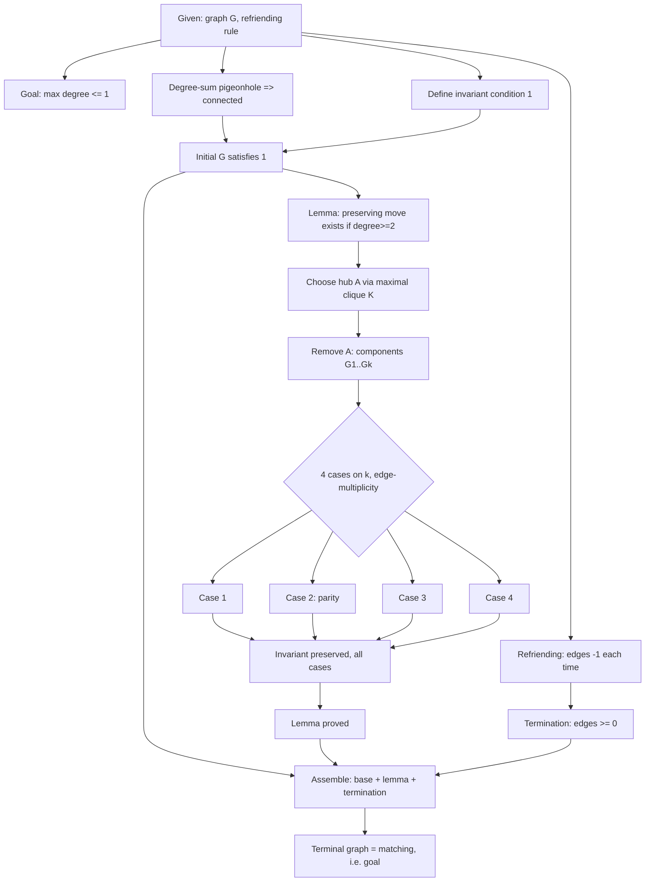
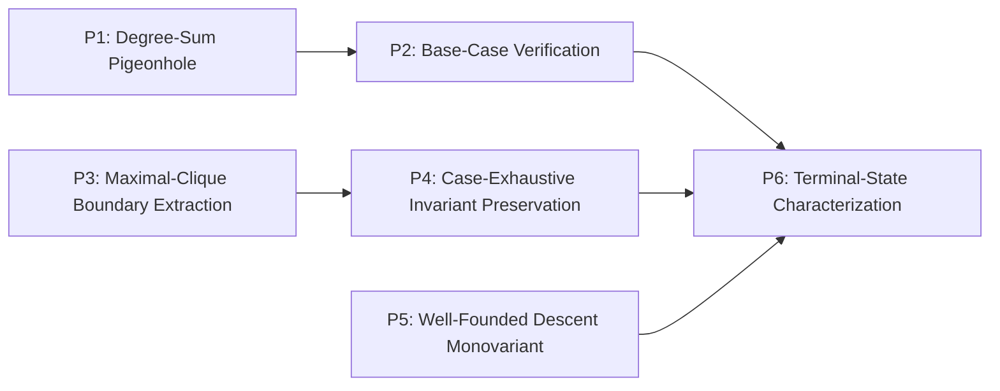

# DNA Extraction Report — IMO Shortlist 2019, Combinatorics C5

**Problem ID:** `IMO-SL-2019-C5`
**Source:** `data/raw/imo/IMO2019SL.pdf` — statement p. 6, Solution 1 pp. 39–40, Solution 2 pp. 41 (this is IMO 2019 Problem 3 on the actual contest paper).
**Test round:** "Test 2" — one of 6 randomly-drawn additions to the DNA pool (test 1: 2006-A3, 2007-A1, 2008-A1, 2009-A1). Report-only, no DB load.

---

## 0. Problem statement (verbatim, p. 6)

> On a certain social network, there are 2019 users, some pairs of which are friends,
> where friendship is a symmetric relation. Initially, there are 1010 people with 1009
> friends each and 1009 people with 1010 friends each. However, the friendships are
> rather unstable, so events of the following kind may happen repeatedly, one at a time:
>
> Let $A$, $B$, and $C$ be people such that $A$ is friends with both $B$ and $C$, but $B$
> and $C$ are not friends; then $B$ and $C$ become friends, but $A$ is no longer friends
> with them.
>
> Prove that, regardless of the initial friendships, there exists a sequence of such
> events after which each user is friends with at most one other user.

The official "Common remarks" immediately reformulate this as graph theory: $G$ has 2019
vertices (1010 of degree 1009, 1009 of degree 1010); a *refriending* removes edges $AB,
AC$ and adds edge $BC$ whenever $A\sim B$, $A\sim C$, $B\not\sim C$. Goal: reach, via
refriendings, a graph that is a disjoint union of single edges and isolated vertices
(max degree $\le 1$). Two official solutions are given; this report treats Solution 1 as
the primary Thinking Graph and summarizes Solution 2 separately (§8).

---

## 1. Problem DNA

| Field | Value |
|---|---|
| contest / year / round / problem_number | IMO Shortlist / 2019 / Shortlist / C5 |
| source | `data/raw/imo/IMO2019SL.pdf`, statement p. 6, solution pp. 39–40 |
| difficulty | null (not classified, consistent with the 4 existing problems) |
| objects_text | A graph $G$ on 2019 vertices with a near-regular degree sequence (1010 vertices of degree 1009, 1009 of degree 1010); a local rewriting rule ("refriending") on adjacent triples $A,B,C$. |
| hidden_structure | The refriending rule is a *degree-parity- and edge-count-monotone rewriting system*: it always strictly shrinks the edge set while a structural invariant (non-completeness + an odd-degree witness, per component) survives every legal move — the problem is really about finding an invariant robust enough to survive an adversarial-looking local rule, not about friendship at all. |
| expected_insight | Reformulate socially-phrased combinatorics as a graph rewriting system; find an invariant that (a) holds initially, (b) is preserved by *some* legal move whenever the process could still continue, and (c) forces the desired terminal shape once no move is possible — then let a strictly-decreasing edge count guarantee the process can't run forever. |
| problem_family / problem_template | null / null |
| topics | Combinatorics — Graph Theory; Combinatorics — Invariants/Monovariants |

---

## 2. Thinking Graph (Solution 1)

| id | node_type | statement | importance | source_span |
|---|---|---|---|---|
| N1 | given | Reformulate as graph $G$: 2019 vertices, 1010 of degree 1009, 1009 of degree 1010; refriending rule defined | critical | p.39, "Common remarks" |
| N2 | goal | Reach, via refriendings, a graph that is a disjoint union of single edges and isolated vertices | critical | p.6 / p.39 |
| N3 | inference | Any two vertices have degree sum $\ge 2018 = n-1$, forcing adjacency or a common neighbour (pigeonhole) $\Rightarrow$ $G$ is connected | critical | p.39, "the total degree of any two vertices is at least 2018..." |
| N4 | construction | Define condition (1): every connected component with $\ge 3$ vertices is *not complete* and *has a vertex of odd degree* | critical | p.39, "condition (1)" |
| N5 | inference | Initial $G$ satisfies (1): connected (N3), not complete (max degree $1010 < 2018$), has odd-degree vertices (degree 1009) | critical | p.39 |
| N6 | goal | Key lemma: if $G$ satisfies (1) and has a vertex of degree $\ge 2$, some refriending on $G$ preserves (1) | critical | p.39, "We will show that if a graph $G$..." |
| N7 | construction | Choose vertex $A$ of degree $\ge 2$ guaranteed to have two non-adjacent neighbours, via a maximal complete subgraph $K$: some vertex $A\in K$ has a neighbour $C$ outside $K$, non-adjacent (by maximality) to some $B\in K$ | important | p.40, "pick a maximal complete subgraph $K$..." |
| N8 | construction | Removing $A$ splits its component $G'$ into connected components $G_1,\dots,G_k$ ($k\ge1$), each attached to $A$ by $\ge1$ edge | important | p.40 |
| N9 | case_split | Four cases on $(k,$ edge-multiplicity $A\to G_i)$: (1) $k\ge2$, $\ge2$ edges to some $G_i$; (2) $k\ge2$, exactly one edge to each $G_i$; (3) $k=1$, $\ge3$ edges to $G_1$; (4) $k=1$, exactly 2 edges to $G_1$ | important | p.40, "Case 1"–"Case 4" |
| N10 | calculation | Case 1: $B\in G_i$, $C\in G_j$ ($i\ne j$) both adjacent to $A$ — automatically non-adjacent (different components); refriend $AB,AC\to BC$ | supporting | p.40 |
| N11 | inference | Case 2: handshake-lemma parity on $\{A\}\cup G_i$ forces $G_i$ to contain an odd-degree vertex; choose $B,C$ as $A$'s neighbours in two different $G_i$'s | supporting | p.40, "since the number of odd-degree vertices of a graph is always even" |
| N12 | inference | Case 3: reuse N7's guaranteed non-adjacent neighbour pair $B,C$, both inside $G_1$ | supporting | p.40, "By assumption, $A$ has two neighbours $B$ and $C$..." |
| N13 | calculation | Case 4: $B,C$ are $A$'s only two neighbours (non-adjacent by N7); if the resulting merged component would illegally be complete on $\ge3$ vertices, a further refriending via a third vertex $D$ resolves it, reducing to Case 1's pattern | supporting | p.40, "Case 4... We are then done as in Case 1" |
| N14 | conclusion | In every case, condition (1) is preserved by the exhibited refriending (merge of N10–N13) | important | p.40 |
| N15 | conclusion | Lemma (N6) established | critical | p.40 |
| N16 | calculation | Each refriending strictly decreases total edge count by exactly 1 (removes 2 edges, adds 1) | critical | p.39, "refriendings decrease the total number of edges" |
| N17 | inference | Edge count is a non-negative integer $\Rightarrow$ any sequence of refriendings terminates after finitely many steps | critical | p.39 |
| N18 | conclusion | Combining N5 (base case), N15 (a preserving move is always available while degree $\ge2$), N17 (forced termination): the process must terminate at a graph with max degree $\le1$ | critical | p.39, "we must reach a graph $G$ with maximal degree at most 1, so we are done" |
| N19 | conclusion | The terminal graph is a disjoint union of single edges and isolated vertices — exactly the goal (N2) | critical | p.39 |

`entry_nodes = [N1]`; `terminal_nodes = [N19]`. **19 nodes, 24 edges.**
`max_depth = 11` (N1→N4→N5→N6→N7→N8→N9→{N10..N13}→N14→N15→N18→N19).
`branch_count = 2` (N1 fans to 4: N2/N3/N4/N16; N9 fans to 4 cases).
`merge_count = 3` (N5 ← N3,N4; N14 ← N10..N13; N18 ← N5,N15,N17).
`has_cycle = false` (verified by inspection — every edge moves strictly forward through the argument, no back-references).

---

## 3. Strategy Layer

**S0 — Reformulate as graph rewriting** (`N1, N2`). Framing, not a proof move.

**S1 — Connectivity via degree-sum pigeonhole** (`N3`). Singleton: a global counting fact about the given degree sequence.

**S2 — Define the invariant and verify the base case** (`N4, N5`). Technique: state a two-part structural invariant, check it holds at the start.

**S3 — State the invariant-preservation lemma as the key sub-goal** (`N6`). A singleton framing/assertion node — contested status (framing vs. real strategy), same recurring ambiguity flagged in every prior validation (2006-A3 S0/S7, 2007-A1 S1/S5, 2008-A1 S1/S3, 2009-A1 S1/S5) at exactly this "state what's about to be proved" location.

**S4 — Extremal choice of a hub vertex via a maximal clique** (`N7`). Technique: take a maximal complete subgraph; maximality forces a witnessed non-edge at its boundary.

**S5 — Case-exhaustive invariant-preservation proof** (`N8–N15`). The largest strategy: one case split into 4 mutually exclusive configurations, each independently verified to preserve the invariant, then merged. Not split further — all four cases serve one technique (case-exhaustive verification of a single lemma), exactly the "sub-steps of one technique, not several techniques" pattern used to justify not over-splitting 2006-A3's S5.

**S6 — Monovariant: edge count strictly decreases** (`N16, N17`). Technique: a bounded-below, strictly-decreasing integer quantity forces termination.

**S7 — Assemble** (`N18, N19`). Bookkeeping: combine base case + preservation lemma + termination into the terminal-state conclusion.

Real strategies: **S1 → S2 → S3 → S4 → S5 → S6 → S7** (six technique-bearing strategies plus two framing/bookkeeping bookends, S0 and — arguably — S3/S7, mirroring 2006-A3's S0/S7 pattern almost exactly).

---

## 4. Mathematical Principles

**P1 (S1) — Degree-Sum Threshold Pigeonhole for Connectivity.**
*Generic form:* If every pair of elements in a finite ground set has combined "reach"
exceeding the number of remaining elements, any two elements must interact directly or
through a common intermediary. *Generality:* common_technique.
*Classification:* **problem-intrinsic**, high confidence — the fact that $G$ is
connected is forced by the given degree sequence itself (any graph with these exact
degrees is connected, regardless of which proof technique establishes it); pigeonhole
is the mechanism used here, not the reason it's true.

**P2 (S2) — Direct Verification of an Invariant's Base Case.**
*Generic form:* Check a proposed structural invariant against the problem's initial
data. *Generality:* universal. *Classification:* **problem-intrinsic** but flagged as a
weak/low-value DNA candidate (universal principles are poor discriminators, per the
project's own prior finding on Canonical Representation in 2006-A3).

**P3 (S4) — Maximal Substructure Boundary Extraction.**
*Generic form:* Take a maximal object satisfying a closure property (e.g. a maximal
clique); by maximality, anything just outside it fails to close back in, producing a
witnessed non-relation at the boundary. *Generality:* common_technique.
*Classification:* **mixed** — the underlying fact ("a non-complete graph has some vertex
with two non-adjacent neighbours") is intrinsic and trivial, but *using maximal-clique
machinery specifically* to exhibit it is this proof's choice; a more pedestrian
"since $G'$ isn't complete, pick any vertex with a non-neighbour in it" argument would
work equally well without invoking maximality at all. Same intrinsic-fact/
solution-specific-mechanism split found for 2006-A3's ideas #3 and #7.

**P4 (S5) — Case-Exhaustive Local-Move Invariant Preservation.**
*Generic form:* To preserve a structural invariant under a general local rewriting
rule, enumerate an exhaustive, mutually exclusive case decomposition of how the rule
can apply, and verify invariant preservation separately in each case.
*Generality:* common_technique. *Classification:* **solution-specific**, confirmed
directly (not just argued) by Solution 2 in the same source, which proves the identical
theorem via a completely different route (cycle-existence + tree-reduction, §8) that
never defines condition (1) or performs this case split at all — the strongest form of
evidence available, exactly the pattern that confirmed 2006-A3's idea #6 (Extremal
Principle) as solution-specific via its own Comment.

**P5 (S6) — Well-Founded Descent via a Strictly Decreasing Non-negative-Integer
Monovariant.**
*Generic form:* A quantity that strictly decreases with every step of a process, and is
bounded below, forces the process to terminate in finitely many steps.
*Generality:* universal. *Classification:* **problem-intrinsic**, high confidence — this
is a fact about the refriending *operation itself* (any legal refriending removes 2
edges and adds 1, unconditionally), not a choice this proof makes; every possible
sequence of refriendings, however chosen, must terminate. **Vocabulary note:** this is
a strong merge candidate against the existing `well_founded_descent_monovariant_induction`
principle_type (2006-A3 Comment) — see §5.

**P6 (S7) — Terminal-State Characterization via Invariant-Preservation-Until-Forced-
Termination.**
*Generic form:* If a structural invariant survives every step while some "progress"
condition holds, and the process is guaranteed to terminate, then the invariant plus the
failure of the progress condition together characterize the necessary shape of the final
state. *Generality:* common_technique. *Classification:* **problem-intrinsic**, high
confidence — this composite fact *is* the theorem's content; any correct proof, by any
route, ultimately asserts exactly this coincidence.

---

## 5. Principle Dependency Graph

| Source | Target | Type | Justification |
|---|---|---|---|
| P1 | P2 | requires | The base-case check (N5) explicitly cites connectedness (N3) as one of its three verified facts. |
| P3 | P4 | requires | Case 3 and Case 4 (N12, N13) directly consume the non-adjacent neighbour pair P3 supplies; Case 1/2 (N10, N11) get non-adjacency for free from being in different components, so this dependency is partial — P3 is load-bearing only for half of P4's case split, not all of it. |
| P1 | P6 | requires | (via P2) — the terminal-state argument's base case ultimately rests on connectivity. |
| P2 | P6 | requires | Assembly (N18) explicitly cites the base case (N5) as one of its three inputs. |
| P4 | P6 | requires | Assembly cites the preservation lemma (N15) as a second input. |
| P5 | P6 | requires | Assembly cites forced termination (N17) as a third input. |

A DAG: three independent chains (`P1→P2`, `P3→P4`, `P5`) converge on one sink `P6` — the
same "multiple sources converge on one terminal" shape independently found in 2007-A1
and 2009-A1's principle graphs; noted as a third occurrence, not claimed as new
evidence given it is drawn from a session that already holds those results.

Roots: P1, P3, P5. Terminal: P6.

---

## 6. Graph Features Summary

| Feature | Value |
|---|---|
| node_count | 19 |
| edge_count | 24 |
| max_depth | 11 |
| branch_count | 2 (fan-out nodes: N1, N9) |
| merge_count | 3 (N5, N14, N18) |
| has_cycle | false |
| proof_features | direct (assembly), construction (hub/clique choice), case_split (4-way), invariant (condition 1), monovariant (edge count) — **not** contradiction, extremal-in-the-minimal-representative sense, or recursive |

---

## 7. Deviations / Judgment Calls

- **Node granularity for the maximal-clique argument (N7).** The source text states the
  "not all neighbours pairwise adjacent" fact as a general remark, then justifies it
  parenthetically via the maximal-clique construction. This report compresses both into
  one node rather than splitting into "pick K" / "find boundary non-edge" — a defensible
  compression given the project's own stated position that node granularity is
  analyst-dependent, not a fixed invariant (per `docs/12_DNA_TABLE_v1.0.md` and the
  2009-A1 Deliverable 9 discussion).
- **S3 (N6) classified as contested framing**, consistent with the schema's deliberate
  `is_framing`/`is_bookkeeping` nullability (`docs/12_DNA_TABLE_v1.0.md` §3) rather than
  forced to one side.
- **`is_problem_intrinsic` confidence:** all six principles above are given `high`
  confidence rather than the schema's `low` default, because in every case a concrete
  citation is available — either from the given data (P1, P2), from a genuine
  alternative technique in Solution 2 confirming solution-specificity (P4), or from an
  argument about the operation itself rather than this proof's choices (P5, P6). P3 is
  the sole `mixed` classification, and is flagged with `low` confidence on the
  "mechanism" half specifically, since no alternate proof of *that* narrower fact was
  found in this source.

---

## 8. Solution 2 (brief, not given its own Thinking Graph)

Solution 2 (p. 41) proves the identical theorem by a different two-step route: **Step 1**
shows any graph satisfying condition (1) can be reduced, by a sequence of refriendings,
to a *tree* — via a different invariant (existence of a cycle with an adjacent
detachable vertex) and its own 2-way case split (triangle-containing vs. triangle-free,
using a largest complete subgraph in the first case and a smallest cycle in the second).
**Step 2** shows any tree reduces to a disjoint union of edges/vertices by induction on
the tree structure (a refriending is always available at a non-leaf-adjacent vertex of
degree $\ge2$; the process preserves acyclicity, terminating exactly at max degree
$\le1$). `is_primary = true` for Solution 1 (matches the paper's own "Solution 1"
labelling and is the more self-contained of the two); Solution 2 is a full independent
alternative, not a partial "Comment" — `is_complete = true`, `replaces_solution_id =
null`, unlike 2006-A3/2008-A1's partial Comments. Its main DNA-relevant contribution is
already captured in §4/§5: it is the direct evidence that confirms P4
(Case-Exhaustive Local-Move Invariant Preservation) as solution-specific rather than
problem-intrinsic, since it proves the same theorem while never using condition (1) or
this case split at all.

---

## 9. Vocabulary Reuse Check (against `scripts/load_dna_seed_v1.py` `PRINCIPLE_TYPES`)

Checked all 30 existing entries. One strong candidate, everything else kept separate on
conservative grounds:

- **P5 vs. `well_founded_descent_monovariant_induction`** ("A strictly decreasing
  integer measure along each recursive branch guarantees termination, proving existence
  by strong induction" — from 2006-A3's Comment). **Recommend merging.** Both principles
  are the identical fact — a strictly-decreasing, bounded-below integer quantity forces
  termination — differing only in surface application (recursive-descent existence proof
  vs. process-termination proof). This is the same substance test the project's only
  precedent merge (`two_sided_squeeze`, 2007-A1/2009-A1) was held to.
- **P3 vs. `extremal_principle_minimal_representative`** ("take an extremal member of a
  candidate set, show any defect contradicts extremality" — 2006-A3 S5). Considered and
  **rejected** as a merge: that principle's mechanism is *minimality forcing a
  contradiction from a defect*; P3's mechanism is *maximality forcing a witnessed
  non-edge at a boundary*, used constructively (to supply an object for the next step),
  never by contradiction. Related family (both "take an extremal instance"), but not the
  same generic_form under the project's conservative merge bar.
- No other entries (pigeonhole/degree arguments, case-split-invariant patterns,
  two-sided squeezes, coordinate/eigenbasis principles, etc.) have a matching
  generic_form; P1, P2, P4, P6 are recommended as new `principle_type` rows.

No files outside this report were created or modified. No JSON gold file was produced,
consistent with the report-only pattern used for 2007/2008/2009-A1.
