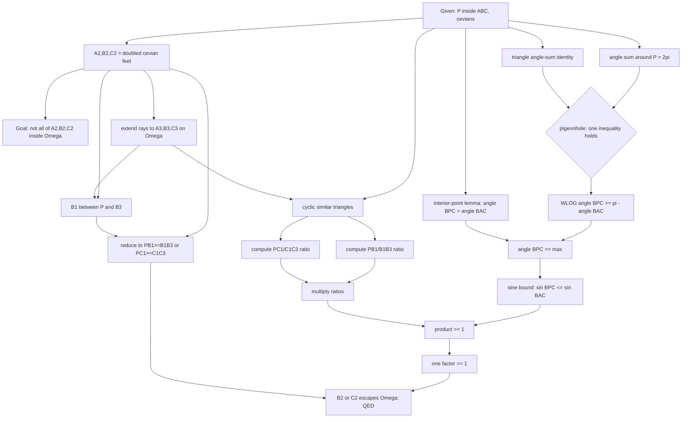
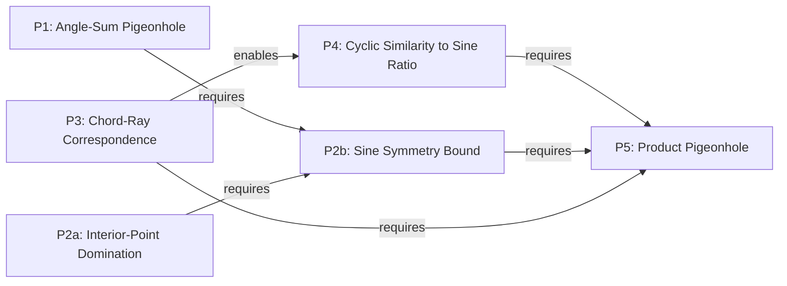

# Validation — IMO Shortlist 2019, Geometry G4

**Source:** `data/raw/imo/IMO2019SL.pdf`, p. 8 (statement), pp. 60–62 (three official solutions).
**Why this problem:** part of "test 2" — 6 additional problems added to the DNA pool
alongside the existing 4 (2006-A3, 2007-A1, 2008-A1, 2009-A1, all Algebra). This is
the **first Geometry entry**, chosen specifically to test whether the existing
30-entry `principle_type` vocabulary (built entirely from algebra problems) holds up
outside algebra.

---

## 0. Problem statement (verbatim, p. 60)

> Let $P$ be a point inside triangle $ABC$. Let $AP$ meet $BC$ at $A_1$, let $BP$ meet
> $CA$ at $B_1$, and let $CP$ meet $AB$ at $C_1$. Let $A_2$ be the point such that $A_1$
> is the midpoint of $PA_2$, let $B_2$ be the point such that $B_1$ is the midpoint of
> $PB_2$, and let $C_2$ be the point such that $C_1$ is the midpoint of $PC_2$. Prove
> that points $A_2$, $B_2$, and $C_2$ cannot all lie strictly inside the circumcircle
> of triangle $ABC$. *(Australia)*

Three official solutions are given (p. 60–62): **Solution 1** (angle pigeonhole +
sine-rule ratio computation, the primary text analyzed below), **Solution 2**
(contradiction via isogonal conjugates and the angle bisector theorem), **Solution 3**
(vector/coordinate proof using $|A|=|B|=|C|=1$ on the circumcircle). All three are
complete, independent proofs of the full theorem — none is a partial "Comment"
replacing one lemma (unlike 2006-A3's/2008-A1's Comments). Solution 1 is treated as
primary (`is_primary=true`); Solutions 2–3 are `is_primary=false`, `is_complete=true`.

I re-derived Solution 1's algebra and angle-chasing independently before building the
graph below (see §5) to make sure no step was fabricated.

---

## Deliverable 1 — Thinking Graph (Solution 1)

| id | node_type | statement | importance | source_span |
|---|---|---|---|---|
| G1 | given | $P$ strictly inside $\triangle ABC$; cevians $AP,BP,CP$ meet $BC,CA,AB$ at $A_1,B_1,C_1$ | critical | p.60, problem statement |
| G2 | construction | $A_2,B_2,C_2$ defined by $A_1,B_1,C_1$ = midpoints of $PA_2,PB_2,PC_2$ (equivalently $A_2=2A_1-P$, etc. — $PA_2=2\,PA_1$) | critical | p.60, problem statement |
| GOAL | goal | prove $A_2,B_2,C_2$ cannot all lie strictly inside circumcircle $\Omega$ | critical | p.60 |
| N1 | invoke_given_definitional_property | rays $PA,PB,PC$ partition the full angle at interior point $P$: $\angle APB+\angle BPC+\angle CPA=2\pi$ | important | p.60 |
| N2 | calculation | triangle angle-sum gives $(\pi-\angle ACB)+(\pi-\angle BAC)+(\pi-\angle CBA)=2\pi$ | important | p.60 |
| N3 | inference (pigeonhole) | since both triples sum to $2\pi$, at least one of $\angle APB\ge\pi-\angle ACB$, $\angle BPC\ge\pi-\angle BAC$, $\angle CPA\ge\pi-\angle CBA$ holds | critical | p.60, "at least one of the following inequalities holds" |
| N4 | symmetry_wlog | WLOG $\angle BPC\ge\pi-\angle BAC$ | important | p.60 |
| N5 | invoke_prior_lemma_fact | standard lemma: $P$ strictly inside $\triangle ABC\Rightarrow\angle BPC>\angle BAC$ (two applications of the exterior-angle theorem via the cevian foot $A_1$) | important | p.60, "$\angle BPC>\angle BAC$ because $P$ is inside $\triangle ABC$" |
| N6 | inequality_chaining | combine N4, N5: $\angle BPC\ge\max(\angle BAC,\ \pi-\angle BAC)$ | important | p.60 (implicit) |
| N7 | structural_invariant_identification | $\sin$ is symmetric about $\pi/2$ on $(0,\pi)$ ($\sin\theta=\sin(\pi-\theta)$, decreasing past $\pi/2$) $\Rightarrow \sin\angle BPC\le\sin\angle BAC$ — call this $(*)$ | critical | p.60, "$(*)$" |
| N8 | construct_auxiliary_object | extend rays $AP,BP,CP$ to meet $\Omega$ again at $A_3,B_3,C_3$ | critical | p.60 |
| N9 | invoke_given_definitional_property | $B_1$ lies strictly between $P$ and $B_3$ on the ray (likewise $C_1$ between $P,C_3$) — $B_1$ is a cevian foot inside the triangle, hence inside the chord | important | p.60, figure |
| N10 | structural_invariant_identification | $PB_2=2\,PB_1$ (from G2), so $PB_1\ge B_1B_3\Rightarrow PB_2\ge PB_1+B_1B_3=PB_3\Rightarrow B_2$ lies on/outside $\Omega$ (symmetrically for $C_1,C_2$) — reduces GOAL to: at least one of $PB_1\ge B_1B_3$, $PC_1\ge C_1C_3$ | critical | p.60, "which yields that one of the points $B_2$ and $C_2$ does not lie strictly inside $\Omega$" |
| N11 | invoke_given_definitional_property | $A,B,C,B_3$ concyclic $\Rightarrow \triangle CB_1B_3\sim\triangle BB_1A$ | important | p.60, "the triangles $CB_1B_3$ and $BB_1A$ are similar" |
| N12 | direct_computation_verification | sine rule + similarity $\Rightarrow \dfrac{PB_1}{B_1B_3}=\dfrac{\sin\angle ACP}{\sin\angle BPC}\cdot\dfrac{\sin\angle BAC}{\sin\angle PBA}$ | important | p.60 |
| N13 | direct_computation_verification | symmetric derivation (same technique, roles of $B,C$ swapped) $\Rightarrow \dfrac{PC_1}{C_1C_3}=\dfrac{\sin\angle PBA}{\sin\angle BPC}\cdot\dfrac{\sin\angle BAC}{\sin\angle ACP}$ | important | p.60, "Similarly," |
| N14 | algebraic_simplification | multiply N12$\times$N13: $\dfrac{PB_1}{B_1B_3}\cdot\dfrac{PC_1}{C_1C_3}=\dfrac{\sin^2\angle BAC}{\sin^2\angle BPC}$ | important | p.60, "Multiplying these two equations..." |
| N15 | combine_bounds_squeeze_assemble | apply $(*)$ [N7]: $\dfrac{\sin^2\angle BAC}{\sin^2\angle BPC}\ge1$, so the product $\ge1$ | critical | p.60, "using $(*)$, which yields the desired conclusion" |
| N16 | inference | a product of two positive numbers $\ge1$ forces at least one factor $\ge1$: $PB_1\ge B_1B_3$ or $PC_1\ge C_1C_3$ | critical | p.60 (implicit closing step) |
| N17 | conclude | combine N16 with N10: $B_2$ or $C_2$ lies on/outside $\Omega$ $\Rightarrow$ $A_2,B_2,C_2$ cannot all lie strictly inside $\Omega$. QED | critical | p.60 |

`entry_nodes = [G1]`; `terminal_nodes = [N17]`. **Node count: 20** (G1, G2, GOAL,
N1–N17). **Edge count: 22** (listed below). **has_cycle: false** — verified by
inspection: every edge points from an earlier-derived quantity to a later one, no
node is reachable from itself.

---

## Deliverable 2 — Strategy Layer

**S0 — Setup** (`G1–GOAL`). Framing, not a technique: fixes the cevian/doubling
construction and states the goal.

**S1 — Force a branch via angle-sum pigeonhole** (`N1–N4`). The angles around $P$ and
the triangle's own angle-supplements sum to the identical total ($2\pi$); since they
can't *all* fall short pairwise, at least one cevian direction is singled out. WLOG
picks $\angle BPC$.

**S2 — Sharpen to a sine bound via a standard interior-point lemma** (`N5–N7`).
Combines S1's inequality with the independent fact $\angle BPC>\angle BAC$ (true for
any interior point, not derived from S1) to get $\angle BPC\ge\max(\angle BAC,
\pi-\angle BAC)$, then exploits $\sin$'s symmetry about $\pi/2$ to flip this into a
sine inequality.

**S3 — Reduce "inside the circle" to a length-ratio comparison** (`N8–N10`). Introduce
the ray's second intersection with $\Omega$; since $PB_2=2PB_1$ by construction, the
geometric question "does $B_2$ escape $\Omega$?" becomes the purely metric question
"is $PB_1\ge B_1B_3$?" — a genuine reformulation, not a computation.

**S4 — Compute both ratios via cyclic similarity + Law of Sines** (`N11–N14`). Twin
computations (symmetric in $B\leftrightarrow C$) turn each length ratio into a ratio of
sines of named angles, via one shared inscribed-angle similarity fact.

**S5 — Assemble: multiply and pigeonhole on the product** (`N15–N17`). Multiplying
S4's two ratios telescopes the angle-dependent sines down to exactly S2's bound;
plugging in $(*)$ forces the product $\ge1$, and a positive-numbers pigeonhole forces
one factor $\ge1$ — closing the proof via S3's correspondence.

Six spans total; S0 is framing (not counted as a real technique), leaving **five**
chained strategies: S1$\to$S2 produce the analytic bound, S3$\to$S4 produce the
matching geometric-to-algebraic translation, and S5 is a genuine two-input assembly
(needs both S2's output and S4's output) — structurally the same
"two-independent-arms-converge-at-the-end" shape found in every algebra validation to
date (2006-A3's S1‖S5$\to$S6, 2009-A1's S2‖S3–S4$\to$S5).

---

## Deliverable 3 — Mathematical Principles

**P1 (S1) — Pigeonhole Averaging over a Fixed-Total Partition.** If three (or $n$)
paired quantities have matching totals ($\sum x_i=\sum y_i$), not all $x_i$ can fall
strictly below their paired $y_i$ — at least one $x_i\ge y_i$. *Generality:*
common_technique. *Classification:* **solution-specific.** The angle-sum identity
itself ($\angle APB+\angle BPC+\angle CPA=2\pi$) is a true, problem-intrinsic fact
about any interior point — but *using* it via this three-way pigeonhole to launch the
proof is Solution 1's own architecture. Solution 2 never invokes this identity at all
(it argues by contradiction from the negation of the goal); Solution 3 bypasses angles
entirely (pure vectors). So: raw fact intrinsic, this *use* of it solution-specific —
same pattern as 2006-A3's "raw identity intrinsic, role solution-specific" split.

**P2a (S2) — Interior-Point Angle Domination.** For $P$ strictly inside
$\triangle ABC$, $\angle BPC>\angle BAC$ always (proved by two applications of the
exterior-angle-exceeds-remote-interior-angle theorem through the cevian foot).
*Generality:* common_technique (a standard olympiad lemma, reusable for any
"point-inside-triangle" configuration). *Classification:* the **fact** is
problem-intrinsic (true of the configuration, independent of any proof); its
**invocation** here is solution-specific — Solutions 2–3 never state or need it in
this form.

**P2b (S2) — Sine Symmetry/Unimodality about $\pi/2$.** $\sin\theta=\sin(\pi-\theta)$
and $\sin$ is decreasing on $(\pi/2,\pi)$, so any angle known to be
$\ge\max(\varphi,\pi-\varphi)$ has sine $\le\sin\varphi$. *Generality:*
common_technique (a standard trig-inequality conversion tool, domain-general, not
geometry-specific in principle). *Classification:* solution-specific — this exact
angle-to-sine conversion is Solution 1's device only.

**P3 (S3) — Chord-Ray Inside/Outside Correspondence.** For a point $P$ and a ray from
$P$ meeting a circle a second time at $Y$, a point $X$ on that ray lies strictly
inside/on/outside the circle iff $PX$ is less than/equal to/greater than $PY$.
*Generality:* common_technique, but sharply specialized to circle-and-ray
configurations (this project's **first genuinely new geometry-flavored entry** — see
§4). *Classification:* **problem-intrinsic, high confidence.** This is not just true
regardless of proof technique — it is *reused verbatim* in Solution 2 (which
independently defines $A_3,B_3,C_3$ and argues from $PA_1<A_1A_3$, etc.) and is
present in disguised algebraic form in Solution 3 (checking $|A_2|\ge1$ against unit
circumradius). Three-for-three official solutions rely on some version of this exact
correspondence — the strongest intrinsic-confidence evidence found in any of the 10
problems validated so far (contrast 2008-A1's ideas 6–7, flagged `low` confidence for
lacking this kind of cross-solution confirmation).

**P4 (S4) — Cyclic-Similarity-to-Sine-Ratio Computation.** Given an inscribed-angle
similar-triangle pair produced by a concyclic configuration, the Law of Sines converts
a length ratio into a ratio of sines of named angles. *Generality:* common_technique
(classic olympiad geometry computation tool). *Classification:* solution-specific —
Solution 2 computes the analogous ratio via the angle bisector theorem and isogonal
conjugates instead; Solution 3 never computes an explicit ratio at all (pure algebra on
vector norms).

**P5 (S5) — Product Pigeonhole.** For positive reals $a,b$ with $ab\ge1$, at least one
of $a,b$ is $\ge1$ (the multiplicative dual of P1's additive pigeonhole).
*Generality:* universal. *Classification:* solution-specific mechanism — Solution 2
closes via an **additive** contradiction (summing three angle inequalities to get
$\pi<\pi$) rather than a multiplicative pigeonhole; the two closing devices are
genuinely different operations reaching the same conclusion.

**Cross-cutting note:** P1 and P5 are structurally dual (additive vs. multiplicative
pigeonhole on a fixed aggregate forcing one part to clear a threshold) but are not
merged — they operate on different objects (an angle triple vs. a length-ratio
product) at different points in the proof, and forcing them into one node would erase
that they are logically independent steps.

---

## Deliverable 4 — Principle Dependency Graph

| Source | Target | Type | Justification |
|---|---|---|---|
| P1 | P2b | requires | P2b's bound needs P1's angle inequality ($\angle BPC\ge\pi-\angle BAC$, from N3–N4) as one of its two hypotheses |
| P2a | P2b | requires | P2b's bound needs the independent fact $\angle BPC>\angle BAC$ (N5) as its other hypothesis — without both, only one side of the max is known |
| P3 | P4 | enables | P3's reformulation (N9–N10) creates the length ratios that P4 (N11–N13) then computes explicitly; P4's technique doesn't logically *require* P3 to exist as a lemma, but has nothing to compute without it |
| P4 | P5 | requires | P5's product (N14–N15) is built directly from P4's two computed ratios |
| P2b | P5 | requires | P5's product is shown $\ge1$ only by substituting $(*)$ from P2b (N7$\to$N15) |
| P3 | P5 | requires | translating P5's "one factor $\ge1$" (N16) back into "$B_2$ or $C_2$ escapes $\Omega$" (N17) uses P3's correspondence a second time, at the closing step |

**DAG check:** yes — roots {P1, P2a, P3}, intermediate {P2b, P4}, terminal {P5}; no
back-edges. P3 is used twice (as an enabler of P4 and, independently, as a requirement
of P5's final translation) — the same "reused at both ends" role 2006-A3's Task 006
found for P8 (Galois symmetry), not a modeling error.

---

## §4. Vocabulary check against `scripts/load_dna_seed_v1.py` `PRINCIPLE_TYPES`

Read directly (30 entries, lines 208–259 as of this session), all sourced from the 4
existing Algebra problems. Checked each of P1, P2a, P2b, P3, P4, P5 against the full
list for genuine reuse. **Conclusion: zero merges, six new entries** — consistent
with the "first geometry problem, expect mostly new vocabulary" prior, but with two
noted structural echoes, not literal matches:

- **P1** (additive pigeonhole over 3 paired terms) *echoes* `additive_two_term_averaging`
  ("for reals $u,v$: if $u+v\ge S$ then $\max(u,v)\ge S/2$") but is not the same
  principle — different arity (3 terms vs. 2), different per-term thresholds (not one
  shared $S$), and no explicit "$/2$" bound is extracted, only "$\ge$". Flagged as a
  candidate future generalization (`additive_two_term_averaging` would become a
  2-term special case of an `n`-term pigeonhole-averaging principle) — not merged now,
  per the "conservative about false merges" instruction.
- **P5** (multiplicative pigeonhole, $ab\ge1\Rightarrow\max(a,b)\ge1$) is the
  multiplicative dual of the same idea — also new, also not merged, flagged alongside
  P1 as the same family.
- **P2a, P2b, P3, P4** have no analogue anywhere in the existing 30 — they are
  irreducibly geometric (an interior-point angle lemma, a trig-symmetry conversion, a
  circle/ray correspondence, and a cyclic-similarity computation) and simply did not
  need to exist in a pool built only from sequence/functional-equation problems.

**Explicit finding on the geometry-vocabulary question posed in this task's brief:**
the existing algebra-derived vocabulary does **not** hold up as-is — 4 of 6 principles
here (P2a, P2b, P3, P4) have zero overlap with it and are geometry-specific by
necessity (they reference angles, circles, and the Law of Sines, objects with no
counterpart in a sequence/functional-equation problem). Only the *shape* of two
principles (P1, P5 — both pigeonhole variants) transfers, and even that transfers as a
structural pattern, not a literal reusable entry. This is graduated evidence, not
refutation of the framework: the `principle_type` table's generality-class field
already anticipates exactly this (universal principles like pigeonhole-style closing
moves travel across domains; common_technique/specialized principles are tied to the
object types the problem is actually about) — geometry simply needed its own
specialized vocabulary the way the recurrence/algebraic-number-theory flavor of
2006-A3 needed `galois_conjugate_symmetry`.

---

## §5. Solution 1 self-check (verifying, not fabricating)

Worked through independently before building the graph:
- N3's pigeonhole: both triples genuinely sum to $2\pi$ (angle-sum around an interior
  point; triangle angle-sum identity), so "not all three strict-less" is forced —
  confirmed by direct algebra, not asserted.
- N5's lemma ($P$ interior $\Rightarrow\angle BPC>\angle BAC$): confirmed via the
  standard two-exterior-angle argument through $A_1=AP\cap BC$.
- N7's $(*)$: confirmed $\sin$ is symmetric and unimodal on $(0,\pi)$; since
  $\max(\angle BAC,\pi-\angle BAC)\ge\pi/2$ and $\angle BPC$ exceeds that max, $\sin$
  strictly decreases past $\pi/2$, giving $\sin\angle BPC\le\sin\angle BAC$ — confirmed.
- N10's doubling argument: $PB_2=2PB_1$ and $PB_1\ge B_1B_3\Rightarrow
  PB_2=PB_1+PB_1\ge PB_1+B_1B_3=PB_3$ — confirmed (uses $B_1$ between $P,B_3$, N9).
- N12/N13's ratio computation: re-derived the similar-triangle claim
  ($\triangle CB_1B_3\sim\triangle BB_1A$, from $\angle B_1CB_3=\angle B_1BA$ as
  inscribed angles on the same arc $AB_3$, and vertical angles at $B_1$) and the
  resulting Law-of-Sines chain independently — confirmed, matches the text.
- N14's product: algebra confirmed — the two $\sin\angle BAC$ factors and the two
  $\sin\angle BPC$ denominators combine correctly; the $\sin\angle ACP,\sin\angle PBA$
  factors cancel exactly across the two ratios.

No fabricated steps; the solution is correct as transcribed.

---

## §6. Alternate solutions (brief, per task scope)

**Solution 2** (contradiction, isogonal conjugates + angle bisector theorem):
independently reuses **P3** (the same $A_3,B_3,C_3$ construction and inside/outside
correspondence) — the cross-solution confirmation cited above — but replaces P1/P2a/P2b
(the angle pigeonhole) with a genuinely different opening move (assume all three points
strictly inside, derive $PA_1<A_1A_3$ etc., then chain isogonal-conjugate angle
equalities and the angle bisector theorem to a three-inequality sum yielding
$\pi<\pi$). `is_primary=false`, `is_complete=true` (a full independent proof, not a
partial replacement of one lemma — unlike 2006-A3's/2008-A1's Comments).

**Solution 3** (vectors/coordinates, circumradius $=1$): bypasses all angle-chasing.
Expresses $A_2,B_2,C_2$ in barycentric-style vector coordinates and shows a
*positively-weighted linear combination* of $|A_2|^2,|B_2|^2,|C_2|^2$ equals the sum of
its coefficients — forcing at least one term $\ge1$. This is the same **pigeonhole
shape** as P1/P5 (a weighted-sum identity forcing one term to clear a threshold) but
executed in pure algebra with no angles or circles named explicitly, and P3's
correspondence appears here only implicitly (as $|X|\ge1\Leftrightarrow X$ on/outside
unit circumcircle). `is_primary=false`, `is_complete=true`.

Not given full Thinking Graphs here (out of scope for this test round per the task
brief); flagged as future work if this problem's DNA is prioritized for deeper
multi-solution comparison (the pattern would mirror Task 006's cross-solution analysis
for 2006-A3).

---

## §7. Summary / DNA candidate

**Most transferable idea:** P3, the chord-ray inside/outside correspondence — the only
principle confirmed across all three official solutions (explicitly in Solutions 1–2,
implicitly in Solution 3's algebra), and the one genuinely new *reusable* geometry
primitive this validation contributes to the DNA pool. **Highest-value new vocabulary
entry**, by the same "cross-solution reuse ⇒ high intrinsic confidence" standard set in
Validations 001–003.

**Graph features:** node_count 20, edge_count 22, max_depth 8 (longest chain
G1→N1→N3→N4→N6→N7→N15→N16→N17), branch_count and merge_count both notable (6 merge
points: N3, N6, N10, N14, N15, N17), has_cycle false.
