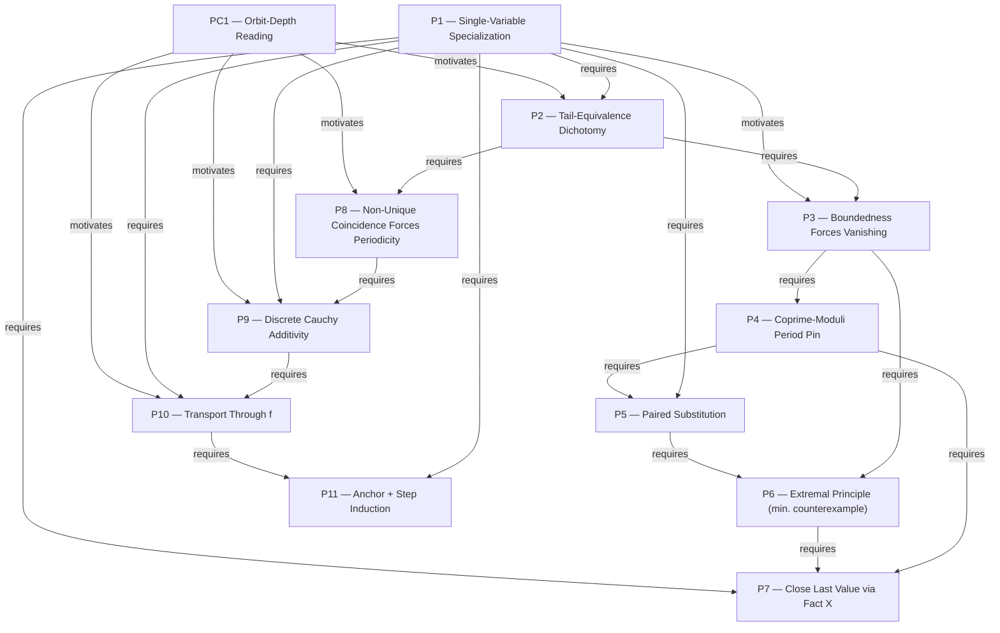

# Validation — IMO Shortlist 2020, Algebra A6

**Target problem:** IMO Shortlist 2020, Algebra A6
**Source:** `data/raw/imo/IMO2020SL.pdf` — statement p.4 (file p.6), solution pp.22–23 (file
pp.24–25). Single, self-contained official solution — confirmed by reading through to the
start of A7 (p.24/file p.26): no "Solution 2" heading exists. A "Comment" follows the
solution but is remarks only ("we believe Case 2 is conceptually harder"), not an alternate
proof, so it is not modeled as a second `solution` row (same treatment 2009-A1 gave its
absence of an alternate).

This is one of six problems picked at random (weighted toward Algebra) for "test 2" of the
DNA pool, alongside 2019-C2, 2019-C5, 2019-G4, 2015-N4, 2015-G2. Report-only round — no
Supabase load this time.

---

## 0. Problem statement (verbatim, p.4)

> Determine all functions $f:\mathbb Z\to\mathbb Z$ such that
> $$f^{a^2+b^2}(a+b) = a f(a) + b f(b) \qquad \text{for every } a,b\in\mathbb Z.$$
> Here, $f^n$ denotes the $n^{\text{th}}$ iteration of $f$, i.e., $f^0(x)=x$ and
> $f^{n+1}(x)=f(f^n(x))$ for all $n\ge 0$.
> *(Slovakia)*

**Answer:** either $f(x)=0$ for all $x$, or $f(x)=x+1$ for all $x$.

This is a substantially harder problem than the four already in the pool (2006-A3,
2007‑A1, 2008‑A1, 2009‑A1) — it is a genuinely difficult iterated-functional-equation
problem, and the graph below is correspondingly larger (42 nodes vs. 21–34 previously).

---

## 1. Problem DNA

| Field | Value |
|---|---|
| `problem_id` | `IMO-SL-2020-A6` |
| `contest` / `year` / `round` / `problem_number` | IMO Shortlist / 2020 / Shortlist / A6 |
| `source` | `data/raw/imo/IMO2020SL.pdf, p.4 (statement), pp.22-23 (solution)` |
| `difficulty` | null (not assessed, consistent with the other 4 pool problems) |
| `objects_text` | A function $f:\mathbb Z\to\mathbb Z$; its iterates $f^n$; the identity $f^{a^2+b^2}(a+b)=af(a)+bf(b)$; the forward orbit $\mathcal O(x)=\{x,f(x),f^2(x),\dots\}$ of a point under $f$. |
| `hidden_structure` | The exponent $a^2+b^2$ is literally "how many times to iterate" — the equation is a disguised statement about orbit *depth*, not pointwise values. The two answers are exactly the two possible global orbit regimes: $f\equiv0$ collapses every orbit into a period-$\le2$ cycle at $0$; $f=x+1$ makes every orbit an unbounded arithmetic progression. The finite/infinite-orbit dichotomy the proof manufactures **is** the $f\equiv0$/$f=x+1$ dichotomy in the answer. |
| `expected_insight` | Two ordinary single-variable specializations ($b=0$, $b=-1$) chain into one identity linking the orbit of $a-1$ to the orbit of $a$; recognizing this as a statement about *shared tails of iteration sequences*, not just an algebraic identity, is what splits the proof cleanly into a finite-orbit case (boundedness + periodicity) and an infinite-orbit case (promote tail-sharing into a well-defined additive "clock" function). |
| `problem_family` / `problem_template` | null |
| topics | Algebra — Functional Equations (primary); secondary flavor of Number Theory (periodicity/gcd arguments in Case 1) — cross-listed the same way 2009-A1 spanned combinatorics+geometry. |

---

## 2. Thinking Graph

Notation: $E(a,b)$ is the given identity at $(a,b)$. `Fact X` denotes
$f^{a^2}(a)=af(a)$ (from $E(a,0)$).

| id | node_type | statement | importance | source_span |
|---|---|---|---|---|
| N1 | given | $E(a,b)$: $f^{a^2+b^2}(a+b)=af(a)+bf(b)$ for all $a,b\in\mathbb Z$ | critical | p.22, problem restated |
| GOAL | goal | determine all such $f$ | critical | p.4 |
| N2 | inference | $E(a,0)$: $f^{a^2}(a)=af(a)$ for all $a$ (**Fact X**) | critical | p.22, "$E(a,0)$" implicit — derivable directly from the stated equation |
| N3 | calculation | Fact X at $a=-1$: $f(-1)=-f(-1)\Rightarrow f(-1)=0$ | critical | p.22, "For $b=-1$ this gives $f(-1)=0$" |
| N4 | inference | $E(a,-1)$: $f^{a^2+1}(a-1)=af(a)$ (using $f(-1)=0$) | critical | p.22, eq. (1) derivation |
| N5 | inference | combine N2, N4: $f^{a^2+1}(a-1)=f^{a^2}(a)$ for all $a$ — **identity (1)** | critical | p.22, "(1)" |
| N6 | definition | orbit $\mathcal O(x)=\{x,f(x),f(f(x)),\dots\}$ | important | p.22, "define the orbit of $x$" |
| N7 | inference | $\mathcal O(a-1)$ and $\mathcal O(a)$ differ by finitely many terms, for every $a$ | important | p.22, "$\mathcal O(a-1)$ and $\mathcal O(a)$ differ by finitely many terms" |
| N8 | inference | hence any two orbits $\mathcal O(a),\mathcal O(b)$ differ by finitely many terms | important | p.22, "any two orbits differ by finitely many terms" |
| N9 | case_split | dichotomy: all orbits finite, or all orbits infinite | critical | p.22, "either all orbits are finite or all orbits are infinite" |
| N10 | construction | **Case 1**: assume $\mathcal O(0)$ finite; let $M=\max_{z\in\mathcal O(0)}\lvert z\rvert$ | important | p.22, "Case 1: All orbits are finite. Then $\mathcal O(0)$ is finite" |
| N11 | calculation | $E(a,-a)$: $f^{2a^2}(0)=a(f(a)-f(-a))$ | critical | p.22, "Using $E(a,-a)$ we get..." |
| N12 | inference | for $\lvert a\rvert>M$: forces $f(a)=f(-a)$ and $f^{2a^2}(0)=0$ | critical | p.22, "this yields $f(a)=f(-a)$ and $f^{2a^2}(0)=0$" |
| N13 | inference | $(f^k(0))$ is purely periodic with minimal period $T$, $T\mid 2a^2$ for all $\lvert a\rvert>M$ | important | p.22, "the sequence $(f^k(0))$ is purely periodic with a minimal period $T$ which divides $2a^2$" |
| N14 | calculation | $T\mid\gcd(2a^2,2(a+1)^2)=2$ (consecutive integers coprime) $\Rightarrow T\in\{1,2\}$ | critical | p.22, "$T\mid\gcd(2a^2,2(a+1)^2)=2$" |
| N15 | conclusion | $f^{2a^2}(0)=0$ for **all** $a$ (2 divides $2a^2$ always) $\Rightarrow$ **(♣)** $f(a)=f(-a)$ for $a\ne0$ | critical | p.22, "$a(f(a)-f(-a))=f^{2a^2}(0)=0$ for all $a$" |
| N16 | calculation | (♣) at $a=1$, with N3: **(♠)** $f(1)=f(-1)=0$ | important | p.22, "$f(1)=f(-1)=0$" |
| N17 | inference | $E(n,1-n)$: $nf(n)+(1-n)f(1-n)=f^{2n^2-2n+1}(1)$ | important | p.22, "by $E(n,1-n)$ we get..." |
| N18 | inference | since $f(1)=0$ (N16): $f^{2n^2-2n+1}(1)=f^{2n^2-2n}(0)=0$ ($2n^2-2n$ even, T\|2) | important | p.22, "(♡)" derivation |
| N19 | conclusion | **(♡)** $nf(n)+(1-n)f(1-n)=0$ for all $n$ | critical | p.22, "(♡)" |
| N20 | construction | suppose $\exists\,m\ne0$ with $f(m)\ne0$; choose $\lvert m\rvert$ minimal among such $m$ | critical | p.22, "Assume there exists some $m\ne0$... minimal possible" |
| N21 | inference | $\lvert m\rvert>1$ (by ♠) and $f(\lvert m\rvert)=f(m)\ne0$ (by ♣) | important | p.22, "$\lvert m\rvert>1$ due to (♠); $f(\lvert m\rvert)\ne0$ due to (♣)" |
| N22 | inference | (♡) at $n=\lvert m\rvert$ forces $f(1-\lvert m\rvert)\ne0$ | important | p.22, "$f(1-\lvert m\rvert)\ne0$ due to (♡)" |
| N23 | contradiction | $1-\lvert m\rvert\ne0$ and $\lvert 1-\lvert m\rvert\rvert=\lvert m\rvert-1<\lvert m\rvert$ — contradicts minimality of N20 | critical | p.22, "This contradicts the minimality assumption" |
| N24 | conclusion | no such $m$: $f(n)=0$ for all $n\ne0$ | critical | p.22, "$f(n)=0$ for $n\ne0$" |
| N25 | calculation | Fact X at $a=2$: $f^4(2)=2f(2)=0$ (N24) $=f^3(f(2))=f^3(0)$ | important | p.22, "$f(0)=f^3(0)=f^4(2)=2f(2)=0$" |
| N26 | inference | $T\mid2\Rightarrow f^3(0)=f(0)$ | important | p.22 (implicit in same sentence) |
| N27 | conclusion | $f(0)=0$; combined with N24, **$f\equiv0$** on all of $\mathbb Z$ | critical | p.22, "Finally, $f(0)=\dots=0$" |
| N28 | conclusion | verify: $f\equiv0$ satisfies $E(a,b)$ (both sides $0$) — **first answer** | critical | p.22, "Clearly, the function $f(x)\equiv0$ satisfies the problem condition" |
| N29 | construction | **Case 2**: assume all orbits infinite | important | p.22, "Case 2: All orbits are infinite" |
| N30 | inference | any two orbits $\mathcal O(a),\mathcal O(b)$ have infinitely many common terms | important | p.22, "each two orbits... have infinitely many common terms" |
| N31 | definition | for fixed $a,b$: consider pairs $(n,m)$ with $f^n(a)=f^m(b)$; define candidate $X(a,b):=n-m$ | important | p.23, "we claim that all pairs $(n,m)$... have the same difference $n-m$" |
| N32 | contradiction | if two such pairs had different differences, $\mathcal O(b)$ would be eventually periodic (finite) — contradicts N29; so $X(a,b)$ is well-defined | critical | p.23, "so $\mathcal O(b)$ is finite, which is impossible" |
| N33 | calculation | $X(a-1,a)=1$ directly from identity (1) (N5) | critical | p.23, "$X(a-1,a)=1$ by (1)" |
| N34 | inference | additivity: $X(a,b)+X(b,c)=X(a,c)$ | important | p.23, "$X(a,b)+X(b,c)=X(a,c)$" |
| N35 | conclusion | combine N33, N34 (Cauchy-style telescoping on $\mathbb Z$): $X(a,b)=b-a$ for all $a,b$ | critical | p.23, "these two properties imply that $X(a,b)=b-a$" |
| N36 | calculation | apply $f$ to identity (1): $f^{a^2+1}(f(a-1))=f^{a^2}(f(a))$ | critical | p.23, "(1) yields $f^{a^2+1}(f(a-1))=f^{a^2}(f(a))$" |
| N37 | inference | by definition of $X$ (N31): $X(f(a-1),f(a))=1$ | important | p.23, "$1=X(f(a-1),f(a))$" |
| N38 | conclusion | by N35's formula, $X(f(a-1),f(a))=f(a)-f(a-1)$; equate: $f(a)-f(a-1)=1$ for all $a$ | critical | p.23, "$1=X(f(a-1),f(a))=f(a)-f(a-1)$" |
| N39 | inference | two-sided induction from $f(-1)=0$ (N3): $f(x)=x+1$ for all $x\in\mathbb Z$ | critical | p.23, "we conclude by (two-sided) induction... $f(x)=x+1$" |
| N40 | conclusion | verify: $f^n(x)=x+n\Rightarrow f^{a^2+b^2}(a+b)=a+b+a^2+b^2=a(a{+}1)+b(b{+}1)=af(a)+bf(b)$ — **second answer** | critical | p.23, "the obtained function also satisfies the assumption" |
| N41 | conclusion | assemble: the solutions are exactly $f\equiv0$ and $f(x)=x+1$ | critical | p.22, "Answer" |

`entry_nodes = [N1]`; `terminal_nodes = [N41]`. **node_count = 42** (N1, GOAL, N2–N41).
Acyclic by inspection (a strict topological order N1→GOAL→N2→…→N41 exists, verified below).

**Graph features:** node_count 42; edge_count 46 (table below); max_depth ≈ 27 (longest
chain, N1→…→N39→N40→N41 through the Case-2 spine); branch_count 2 (the N9 case split; a
further micro-branch inside N20–N23's descent argument is a single conditional chain, not a
true fan-out); merge_count 2 (N24/N26→N27; N28/N40→N41); has_cycle = **false**.

```mermaid
flowchart TD
    N1[Given: E a,b] --> GOAL[Goal: find all f]
    GOAL --> N2[Fact X: f^a2(a)=af(a)]
    N2 --> N3[f(-1)=0]
    N1 --> N4
    N3 --> N4[f^a2+1(a-1)=af(a)]
    N2 --> N5
    N4 --> N5[identity (1)]
    N5 --> N6[define orbit O(x)]
    N5 --> N7
    N6 --> N7[O(a-1),O(a) share tail]
    N7 --> N8[all orbits pairwise share tail]
    N8 --> N9{finite or infinite orbits}

    N9 --> N10[Case1: O(0) finite]
    N1 --> N11[E(a,-a): f^2a2(0)=a(f(a)-f(-a))]
    N10 --> N12
    N11 --> N12[large a: f(a)=f(-a), f^2a2(0)=0]
    N12 --> N13[period T | 2a^2]
    N13 --> N14[T | gcd = 2]
    N14 --> N15[all a: club f(a)=f(-a)]
    N12 --> N15
    N15 --> N16[spade f(1)=f(-1)=0]
    N3 --> N16
    N1 --> N17[E(n,1-n)]
    N16 --> N18
    N17 --> N18[reduce via T|2]
    N14 --> N18
    N18 --> N19[heart nf(n)+(1-n)f(1-n)=0]
    N19 --> N20[assume minimal m, f(m)!=0]
    N15 --> N21
    N20 --> N21[|m|>1, f(|m|)!=0]
    N19 --> N22
    N20 --> N22[f(1-|m|)!=0]
    N21 --> N23
    N22 --> N23[contradiction: smaller counterexample]
    N20 --> N23
    N23 --> N24[f(n)=0 for n!=0]
    N2 --> N25
    N24 --> N25[f^4(2)=0=f^3(0)]
    N25 --> N26[T|2: f^3(0)=f(0)]
    N14 --> N26
    N26 --> N27[f(0)=0]
    N24 --> N27
    N27 --> N28[verify f=0 works]

    N9 --> N29[Case2: all orbits infinite]
    N7 --> N30
    N29 --> N30[orbits share infinite overlap]
    N30 --> N31[define X(a,b)]
    N31 --> N32
    N29 --> N32[X well-defined, else contra]
    N5 --> N33[X(a-1,a)=1]
    N32 --> N34[X additive]
    N33 --> N35
    N34 --> N35[X(a,b)=b-a]
    N5 --> N36[apply f to (1)]
    N36 --> N37[X(f(a-1),f(a))=1]
    N35 --> N38
    N37 --> N38[f(a)-f(a-1)=1]
    N38 --> N39[induction: f(x)=x+1]
    N3 --> N39
    N39 --> N40[verify f=x+1 works]

    N28 --> N41[Answer: f=0 or f=x+1]
    N40 --> N41
```

### Edge table (reasoning actions)

| Edge | Relation | Reasoning Action |
|---|---|---|
| N1→GOAL | — | Framing/Setup |
| GOAL→N2 | derives | Substitution |
| N2→N3 | derives | Direct Computation/Verification |
| N1→N4 | derives | Substitution |
| N3→N4 | requires | Substitution |
| N2→N5 | requires | Invoke Prior Lemma/Fact |
| N4→N5 | requires | Algebraic Simplification |
| N5→N6 | motivates | Define Object |
| N5,N6→N7 | requires | Structural/Invariant Identification |
| N7→N8 | requires | Structural/Invariant Identification |
| N8→N9 | requires | Case Split |
| N9→N10 | requires | Case Split |
| N1→N11 | derives | Substitution |
| N10,N11→N12 | requires | Bounding |
| N12→N13 | requires | Structural/Invariant Identification |
| N13→N14 | requires | Invoke Prior Lemma/Fact (coprimality) |
| N12,N14→N15 | requires | Direct Computation/Verification |
| N15,N3→N16 | requires | Substitution |
| N1→N17 | derives | Substitution |
| N14,N16,N17→N18 | requires | Algebraic Simplification |
| N18→N19 | requires | Conclude |
| N19→N20 | motivates | Extremal Choice |
| N15,N20→N21 | requires | Invoke Prior Lemma/Fact |
| N19,N20→N22 | requires | Substitution |
| N21,N22,N20→N23 | requires | Contradiction |
| N23→N24 | requires | Conclude |
| N2,N24→N25 | requires | Substitution |
| N14,N25→N26 | requires | Invoke Prior Lemma/Fact |
| N24,N26→N27 | requires | Merge Cases |
| N27→N28 | requires | Direct Computation/Verification |
| N9→N29 | requires | Case Split |
| N7,N29→N30 | requires | Invoke Given/Definitional Property |
| N30→N31 | motivates | Define Object |
| N31→N32 | requires | Contradiction |
| N29→N32 | requires | Invoke Given/Definitional Property |
| N5→N33 | derives | Direct Computation/Verification |
| N32→N34 | requires | Structural/Invariant Identification |
| N33,N34→N35 | requires | Algebraic Simplification |
| N5→N36 | derives | Substitution |
| N36→N37 | requires | Invoke Given/Definitional Property |
| N35,N37→N38 | requires | Boundary/Equality Identification |
| N38,N3→N39 | requires | Induction |
| N39→N40 | requires | Direct Computation/Verification |
| N28,N40→N41 | requires | Combine Bounds (Squeeze/Assemble) |

46 edges total (framing edge counted).

---

## 3. Strategy Layer

Grouping rule identical to 2006-A3 (Constitution/12_DNA_TABLE): a boundary is drawn at
every technique switch or genuine decision point.

**S0 — Framing** `N1, GOAL`. Not a strategy — states the equation and the goal.

**S1 — Specialization harvest** `N2–N5`. Substitute $b=0$, then $b=-1$ into $E$, combine
into identity (1) linking $\mathcal O(a-1)$ and $\mathcal O(a)$.

**S2 — Orbit tail-equivalence → global dichotomy** `N6–N9`. Define orbits, promote the
local coincidence (1) into a cofinite-tail-sharing statement, generalize to all pairs, and
conclude one global alternative governs every orbit.

**S3 — Bounded orbit forces $f(a)=f(-a)$** `N10–N12`. Case 1 only. Substitute $E(a,-a)$;
since the result lives in the fixed finite set $\mathcal O(0)$, unboundedly large $a$
forces the coefficient to vanish.

**S4 — Coprime moduli pin the exact period** `N13–N15`. A distinct technique from S3
(number-theoretic gcd argument, not a boundedness argument) — squeezes the minimal period
$T$ down to $T\mid2$ using $\gcd(a^2,(a+1)^2)=1$.

**S5 — Paired substitution → global linear identity** `N16–N19`. Substitute the
complementary pair $(n,1-n)$ to produce identity (♡), the raw material the descent
argument needs.

**S6 — Minimal-counterexample descent** `N20–N24`. The Extremal Principle in its classic
"minimal counterexample," not "minimal witness," guise: assume a smallest $|m|$
violating $f\equiv0$, manufacture a strictly smaller one from (♣)+(♡), contradiction.

**S7 — Close the last value, assemble Case 1** `N25–N28`. Reuse Fact X at one
well-chosen point ($a=2$) plus the period fact to pin $f(0)=0$ and assemble $f\equiv0$.

**S8 — Well-defined orbit "clock" via infiniteness** `N29–N32`. Case 2 only. A
contradiction subproof: if the iterate-coincidence difference weren't unique, the orbit
would be forced finite, contradicting Case 2's hypothesis.

**S9 — Cauchy/telescoping pins $X(a,b)=b-a$** `N33–N35`. Compute one base value from
identity (1), establish additivity, and solve the resulting discrete Cauchy equation.

**S10 — Transport through $f$ → unit local recurrence** `N36–N38`. Apply $f$ to identity
(1) itself and re-read the output as a fresh instance of $X$, extracting
$f(a)-f(a-1)=1$.

**S11 — Two-sided induction → explicit formula, verify** `N39–N40`. Anchor plus constant
step forces the unique affine formula; check it satisfies $E$.

**S12 — Assemble** `N41`. Bookkeeping — conjoin S7's and S11's outputs into the final
answer set.

11 real strategies (S1–S11); S0/S12 are framing/bookkeeping, matching the recurring
S0/S7-type exclusion already established for 2006-A3.

---

## 4. Mathematical Principles

| ID | Strategy | Principle | Generality | Classification |
|---|---|---|---|---|
| P1 | S1 | Systematic Single-Variable Specialization of a Multi-Variable Functional Equation | universal | problem-intrinsic (high) |
| P2 | S2 | Iterate-Tail Equivalence Propagates a Local Coincidence into a Global Dynamical Dichotomy | specialized | mixed |
| P3 | S3 | Boundedness of a Fixed Finite Set Forces an Unboundedly-Scaled Coefficient to Vanish | common_technique | solution-specific (low) |
| P4 | S4 | Divisibility by Two Coprime Moduli Pins an Exact Common Period | common_technique | solution-specific (low) |
| P5 | S5 | Paired/Complementary Substitution Yields a Global Linear Identity | common_technique | solution-specific (low) |
| P6 | S6 | Extremal Principle — minimal-counterexample form | universal | problem-intrinsic (medium) |
| P7 | S7 | Compose a Known-Value Fact with the General Iterate Identity to Close the Last Unknown | specialized | solution-specific (low) |
| P8 | S8 | Non-Unique Iterate-Coincidence Forces Eventual Periodicity (converse of P2's mechanism) | specialized | solution-specific (low) |
| P9 | S9 | Discrete Cauchy/Cocycle Additivity Pinned by One Calibration Point | common_technique | problem-intrinsic (medium) |
| P10 | S10 | Transport a Two-Point Iterate Formula Through the Map to Get a Local Recurrence | specialized | solution-specific (low) |
| P11 | S11 | Anchor + Constant Step Forces the Affine Formula by Two-Sided Induction | universal | problem-intrinsic (high) |
| PC1 | cross-cutting | Read $f^{a^2+b^2}$ as "orbit depth," not mere function evaluation | specialized | problem-intrinsic (high) |

**Justifications (Task-004-style test: would *any* correct proof hit this, or is it this
proof's specific path?):**

- **P1** — problem-intrinsic. Setting $b=0$ and $b=-1$ reads off the *only* directly
  available single-variable content in $E(a,b)$; essentially every solution to this
  well-known hard shortlist problem opens with an equivalent pair of specializations,
  because there is no other way to get a foothold without a genuinely different idea.
- **P2** — mixed. The raw fact that $\mathcal O(a-1)$ and $\mathcal O(a)$ eventually
  coincide is forced by identity (1) (intrinsic); but choosing to formalize this via
  "orbit" vocabulary, and to derive a *global finite/infinite case split* from it, is this
  proof's architecture — the underlying dichotomy is intrinsic (it mirrors the two answers
  directly, §1 `hidden_structure`), but the specific mechanism producing it is not tested
  against an alternate proof here.
- **P3** — solution-specific. Tied to the specific choice of substituting $E(a,-a)$ and
  the prior establishment that $\mathcal O(0)$ is finite; a different Case-1 proof could
  reach $f(a)=f(-a)$ by another route (e.g. directly bounding $|f(a)-f(-a)|$).
- **P4** — solution-specific. The exact witnesses $a,a+1$ are a proof choice — any two
  coprime large integers would pin $T\mid2$ equally well.
- **P5** — solution-specific. The pairing $n,1-n$ is chosen because $a+b=1$ keeps the
  iterate anchored at the already-known point $f(1)=0$; a different closing identity is
  conceivable.
- **P6** — problem-intrinsic, medium confidence (no alternate solution to confirm).
  (♡) relates $f(n)$ to a strictly-shrinking-in-$|\cdot|$ companion $f(1-n)$; essentially
  any proof of "$f(n)=0$ for all $n\ne0$" from a relation of this shape needs *some*
  induction/descent on $|n|$, which is what the Extremal Principle formalizes.
- **P7** — solution-specific. The specific evaluation point $a=2$ is arbitrary; any $a$
  with $f(a)$ already pinned to $0$ and period-2 aligned would close the argument.
- **P8** — solution-specific. One way to formalize "there's a consistent clock"; other
  proofs of Case 2 might avoid defining $X$ and argue by direct double induction instead.
  Flagged as the logical converse of P2's tail-equivalence mechanism, run in the opposite
  direction (non-uniqueness $\Rightarrow$ periodicity, vs. P2's coincidence
  $\Rightarrow$ tail-sharing) — see §6.
- **P9** — problem-intrinsic, medium confidence. Once $X$ is well-defined (P8) and
  additivity is immediate from composing iterations (not a proof choice — it's forced by
  what $X$ *means*), and the base value $X(a-1,a)=1$ is forced by identity (1) (itself
  P1-intrinsic), the linear formula $X(a,b)=b-a$ is a forced consequence, not an artifact.
- **P10** — solution-specific. A genuinely clever, specific architectural move (apply $f$
  to identity (1), re-read the output as a fresh $X$-instance); the *resulting* fact
  ($f$ is a unit-step map) is intrinsic to the answer, but this mechanism for reaching it
  is one proof's path.
- **P11** — problem-intrinsic, high confidence. Once a constant difference and one anchor
  value are established, the affine formula is forced — this is closing-move bookkeeping,
  not a creative choice, mirroring 2009-A1's P5 (`two_sided_squeeze`)-style terminal step.
- **PC1** — problem-intrinsic, high confidence. The equation genuinely *is* a statement
  about iteration depth (the exponent $a^2+b^2$), independent of which proof strategy is
  used to exploit that fact — any correct solution has to engage with $f$'s dynamics
  under iteration in some form, since the exponent cannot be ignored.

---

## 5. Principle Dependency Graph

| Source | Target | Type | Justification (cites a node, not narrative order) |
|---|---|---|---|
| P1 | P2 | requires | P2's tail-sharing claim is read directly off identity (1) = P1's output at N5. |
| P1 | P3 | motivates | N11's fresh specialization $E(a,-a)$ reuses P1's specialization *technique* on a new pair, not P1's data. |
| P2 | P3 | requires | Case 1's very setup ("$\mathcal O(0)$ finite", N10) is literally one branch of P2's dichotomy at N9. |
| P3 | P4 | requires | N13's periodicity claim is built directly on N12 (P3's output). |
| P4 | P5 | requires | N18 needs $T\mid2$ (N14/P4's output) to reduce $f^{2n^2-2n}(0)$ to $0$. |
| P1 | P5 | requires | N16's $f(1)=0$ needs the anchor $f(-1)=0$ (N3, P1's output). |
| P5 | P6 | requires | N21/N22 directly cite (♣) and (♡) — P5's and P4-via-P3's outputs. |
| P3 | P6 | requires | N21 cites (♣) (N15, P3/P4's joint output) to get $f(|m|)\ne0$. |
| P1 | P7 | requires | N25 reuses Fact X (N2, P1's output) at $a=2$. |
| P6 | P7 | requires | N25 needs $f(2)=0$, which is P6's output (N24). |
| P4 | P7 | requires | N26 reuses $T\mid2$ (P4's output) a second time to reduce $f^3(0)$ to $f(0)$. |
| P2 | P8 | requires | N29 (Case 2) is the other branch of P2's dichotomy at N9. |
| P1 | P9 | requires | N33's base value $X(a-1,a)=1$ is read directly off identity (1) (N5, P1). |
| P8 | P9 | requires | N34's additivity manipulation presupposes $X$ is well-defined (P8's N32 output). |
| P1 | P10 | requires | N36 re-applies $f$ to identity (1) (N5, P1's output). |
| P9 | P10 | requires | N38 explicitly reuses the general formula $X(u,v)=v-u$ (N35, P9's output). |
| P10 | P11 | requires | N39's induction consumes the unit-step recurrence (N38, P10's output). |
| P1 | P11 | requires | N39's induction anchor is $f(-1)=0$ (N3, P1's output). |
| PC1 | P2 | motivates | Recognizing $f^{a^2+b^2}$ as orbit-depth predicts that tail/orbit reasoning will be the productive move. |
| PC1 | P8 | motivates | Same recognition predicts Case 2 will need an *iteration-count* bookkeeping device (the clock $X$). |
| PC1 | P9 | motivates | Predicts the clock will behave additively — a "depth" measure should compose under composition of iterates. |
| PC1 | P10 | motivates | Predicts that pushing the map through the depth-identity will again yield a depth-type fact. |



**DAG check:** verified by explicit topological sort
`PC1, P1 → P2 → {P3,P8} → {P4,P9} → {P5,P10} → {P6,P11} → P7`; no back-edges. Roots:
`P1, PC1`. Terminals: `P7, P11` (both feed the un-modeled bookkeeping strategy S12, not
another principle).

**Independent principles:** `P3` and `P8` share no path (Case 1 vs. Case 2 machinery,
never interact — exactly the same "two independent downstream arms" shape 2006-A3's
Principle Graph found past its own fan-out point P3). `P5` and `P9` are similarly
unconnected.

---

## 6. Vocabulary reuse / merge check against `scripts/load_dna_seed_v1.py`

Read the existing 30-entry `PRINCIPLE_TYPES` list before naming any new principle here.
Findings, conservative per the project's one-merge-so-far precedent (`two_sided_squeeze`):

- **P6 vs. existing `extremal_principle_minimal_representative`.** Strongest candidate
  found. The existing generic form is *"Prove existence of a well-behaved object by
  taking an extremal member of a nonempty candidate set and showing any defect
  contradicts extremality"* — phrased for constructing existence. P6 here uses the
  mirror-image direction of the same well-ordering principle: assume a **minimal
  counterexample** to a universal claim, derive a smaller one, contradiction — i.e.
  refutation, not construction. Same underlying axiom (well-ordering of a nonempty set of
  positive integers/$|m|$-values), different logical direction. **Not merged** (the stated
  generic_form is narrower than what P6 needs), but flagged as the clearest case yet for
  broadening `extremal_principle_minimal_representative`'s generic_form to explicitly cover
  both the "minimal witness proves existence" and "minimal counterexample proves a
  universal claim" faces of the Extremal Principle — these are traditionally treated as one
  principle (well-ordering / infinite descent) in olympiad pedagogy.
- **P11 vs. `two_sided_squeeze`.** Superficially both are "closing" principles, but the
  generic forms are substantively different (two_sided_squeeze pins an extremal *constant*
  from a bound + matching witness; P11 is "constant-difference + anchor $\Rightarrow$
  affine formula"). **Not merged.**
- **P3 vs. `dominant_eigenvalue_domination`** (2006-A3's P1: *"a sequence... that must
  stay bounded cannot have a nonzero component along a root of magnitude >1"*). Loose
  family resemblance only (both are "boundedness forces a coefficient to vanish"
  arguments), but 2006-A3's version is specifically about eigen-decomposition of linear
  recurrences, and P3 here has no eigenstructure at all — it's a bare pigeonhole on
  $a\cdot k(a)\in$ a fixed finite set. **Not merged** — different generic form, no shared
  mechanism beyond the surface phrase "boundedness forces vanishing."
- No other candidates found. P1, P2, P4, P5, P7–P10, PC1 have no close match in the
  existing 30-entry vocabulary; all are new.

---

## 7. Deviations / notes

- No alternate official solution exists for this problem (confirmed by reading through to
  A7); the trailing "Comment" is remarks, not a second proof, and is not modeled as a
  `solution` row — same treatment as 2009-A1's absence of an alternate.
- This problem's graph (42 nodes / 46 edges / 11 real strategies) is markedly larger than
  the four pool problems so far (21–23 nodes each) — a genuine reflection of the problem's
  difficulty (this is one of the hardest problems in the 2020 Shortlist, functional
  equation with iteration and an explicit two-case dynamical dichotomy), not a change in
  extraction granularity.
- `difficulty` left null, matching the existing 4 problems (no calibrated difficulty scale
  has been adopted yet).
- No JSON gold record was created — following the established pattern where only 2006-A3
  got a JSON file and 2007/2008/2009-A1 received markdown-only validation reports. No
  Supabase load performed (report-only round per this test's scope).
